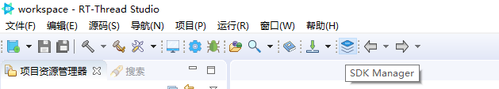
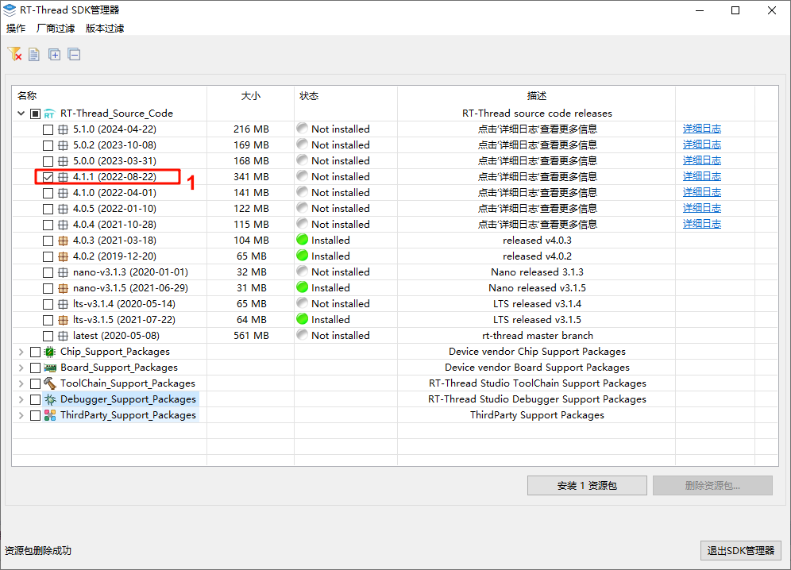
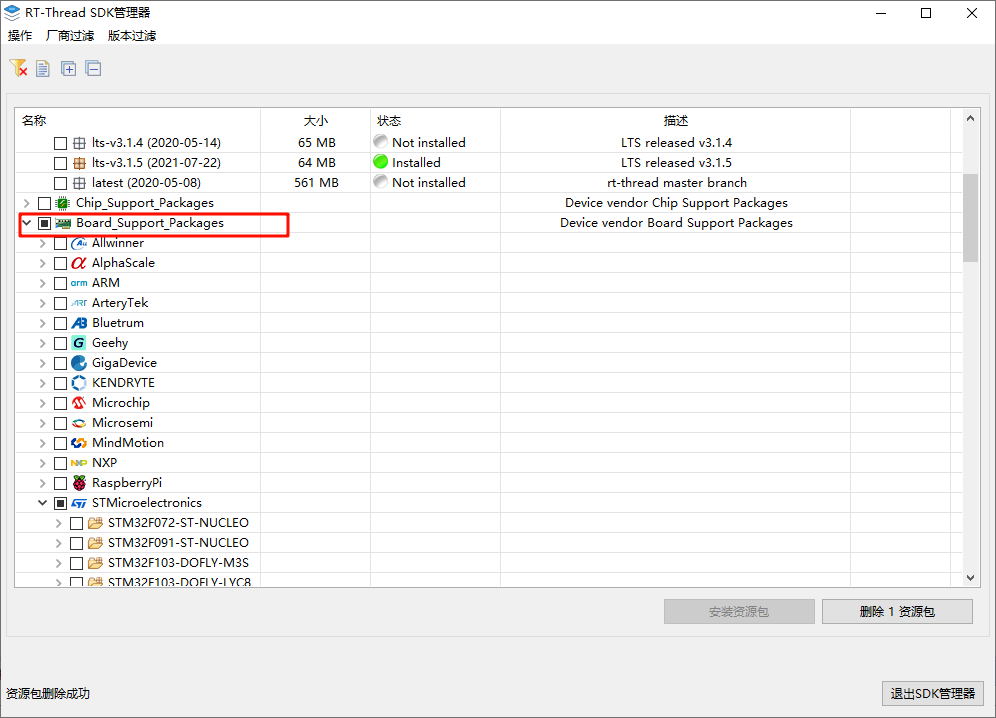
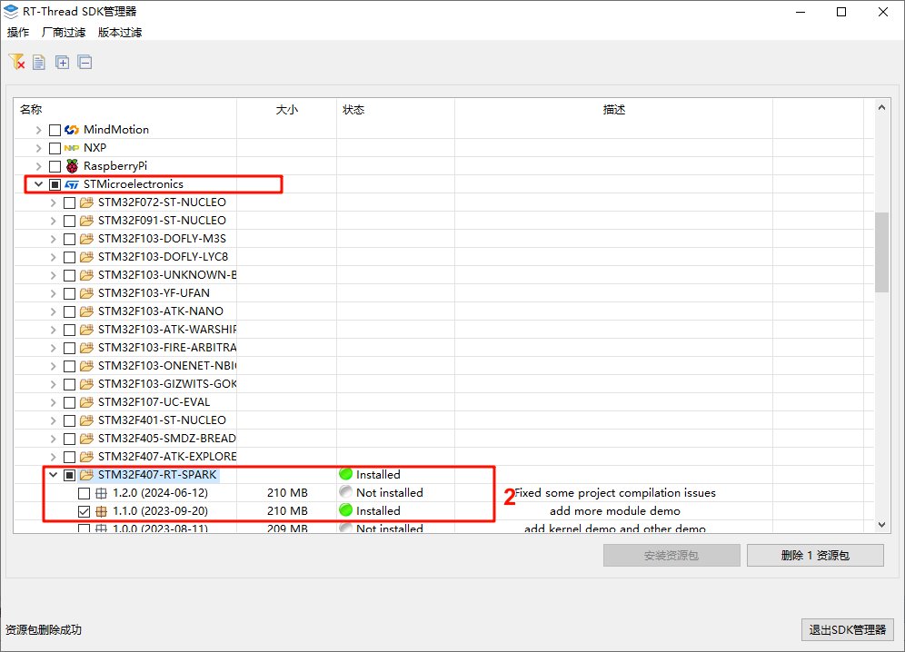
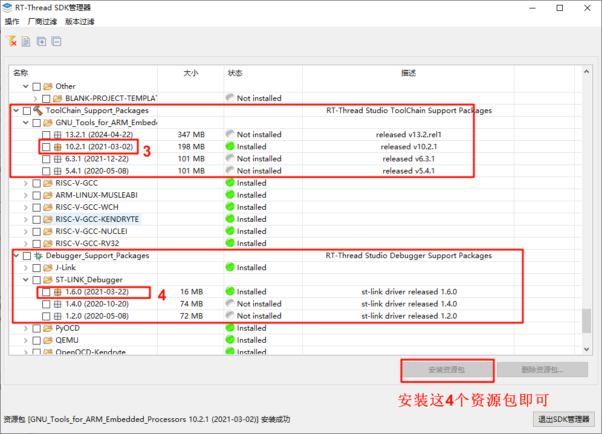
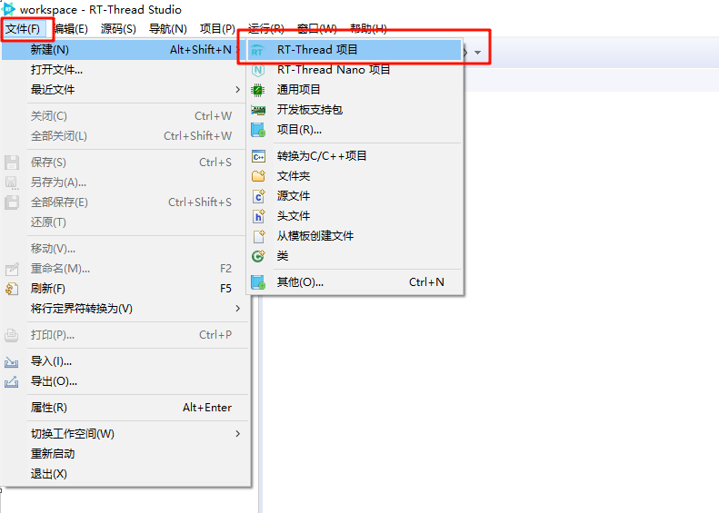
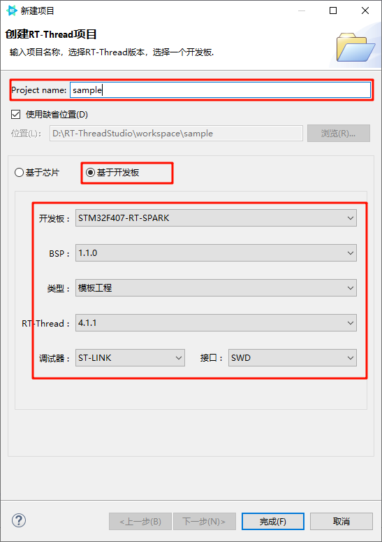
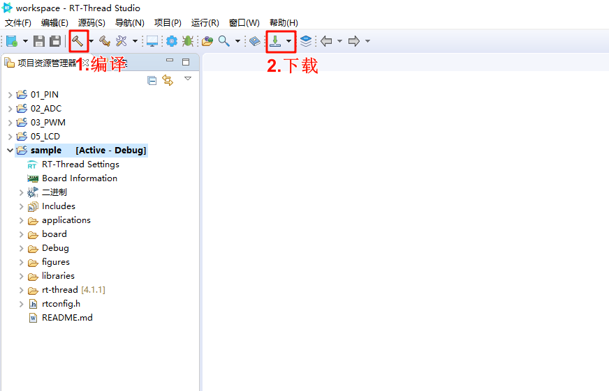

# 开发配置
## 开发文档
1. RT-Thread文档中心 [RT-Thread文档中心](https://www.rt-thread.org/document/site/#/rt-thread-version/rt-thread-standard/README)
2. RT-Thread API参考手册[RT-Thread API参考手册](https://www.rt-thread.org/document/api/index.html) 
3. 开发板仓库地址[开发板仓库地址](https://github.com/RT-Thread-Studio/sdk-bsp-stm32f407-spark)
4. 开发文档[开发文档](https://github.com/LZerro/RT_STM32F407_RT_Spark)
5. RT-Thread Studio下载网站[RT-Thread Studio](https://www.rt-thread.org/download.html#download-rt-thread-studio)
## RT-Thread Studio 配置
1. 安装好了RT-Thread Studio之后我们需要安装SDK
 
2.打开SDK管理 下载我们需要的工具
 
 
 
 
2. 新建项目基于星火1号的项目
 
 
3. 编译并下载项目
 