> 本章将一下KConfig跟SCons的作用，加深我们对RTT如何进行配置与编译的理解。

我们新建一个工程项目，在项目中我们打开文件所在位置，看看文件组成的结构。

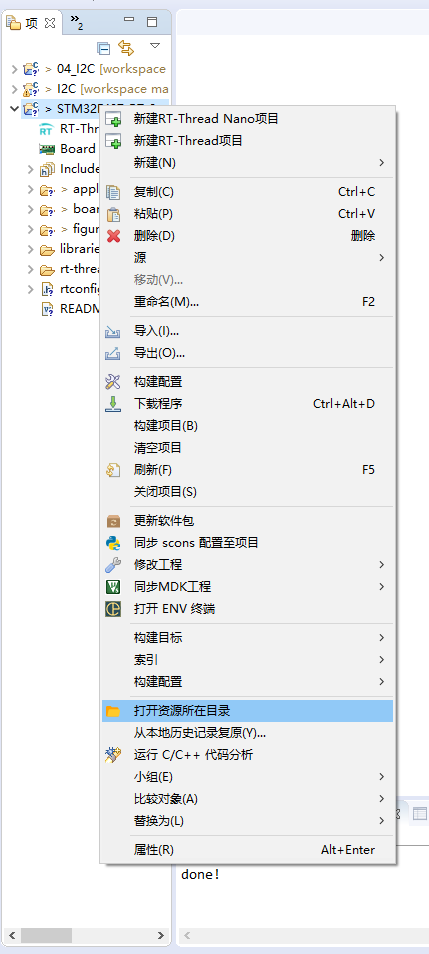

翻看一下文件夹，会发现KConfig跟SConscript文件会遍布在各个地方，本章主要来看看这几个文件有何作用。

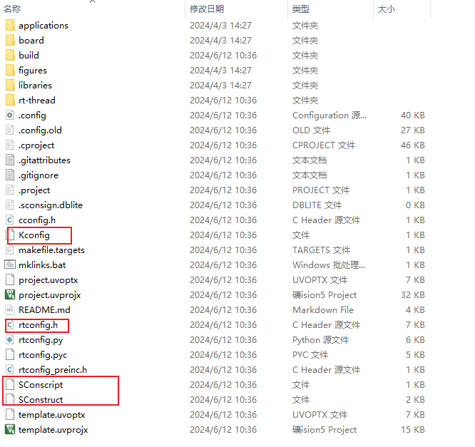

# KConfig

RTT官网上已经有了十分详细的KConfig语法的[教程](https://www.rt-thread.org/document/site/#/development-tools/build-config-system/Kconfig)，这里不再赘述KConfig的语法问题。

## 1. KConfig内容

我们先来看一下主文件夹下的KConfig。

```c
mainmenu "RT-Thread Configuration"	//主菜单名称

config BSP_DIR					  //给BSP_DIR赋值为“.”（这个值后续未使用到）
    string
    option env="BSP_ROOT"
    default "."

config RTT_DIR					  //给RTT_DIR赋值为“rt-thread”
    string
    option env="RTT_ROOT"
    default "rt-thread"

config PKGS_DIR					  //给PKGS_DIR赋值为“packages”
    string
    option env="PKGS_ROOT"
    default "packages"

//连接上其它菜单
source "$RTT_DIR/Kconfig"				//拼接目录,将RTT_DIR的值拼接并索引
    								  //可以理解为打开:rt-thread/Kconfig目录
source "$PKGS_DIR/Kconfig"				//打开:packages/Kconfig目录
source "$RTT_DIR/../libraries/Kconfig"	 //打开:rt-thread/../libraries/Kconfig目录,(../)为当前目录的上一级

```

我们打开当前目录下的`rt-thread`文件夹，里面果然有一个Kconfig文件。

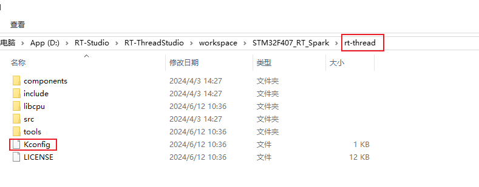

打开其观察，发现这个文件也是起到一个连接的作用。

```c
source "$RTT_DIR/src/Kconfig"
source "$RTT_DIR/libcpu/Kconfig"
source "$RTT_DIR/components/Kconfig"
```

我们顺着这个连接再一步步往下去查找KConfig。

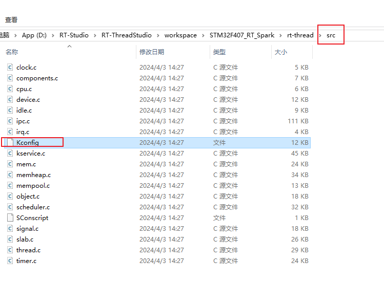

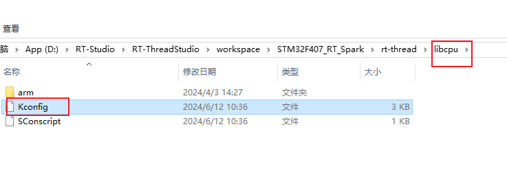

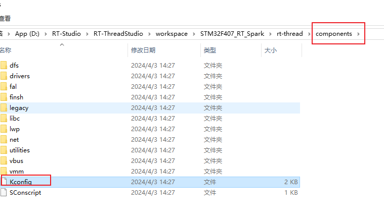

打开`Src/Kconfig`的时候，看一下里面的内容，我们是不是有点熟悉。

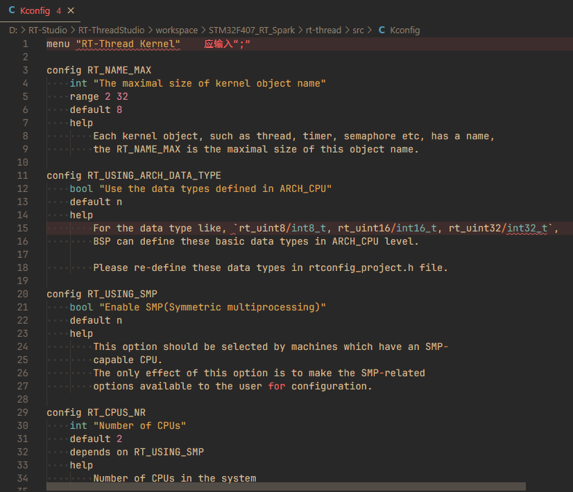

要是暂时没想起来没事，我们再看一下其它的。`libcpu/Kconfig`下全是配置，没有菜单，我们忽略这个。我们再看一下`component/Kconfig`。

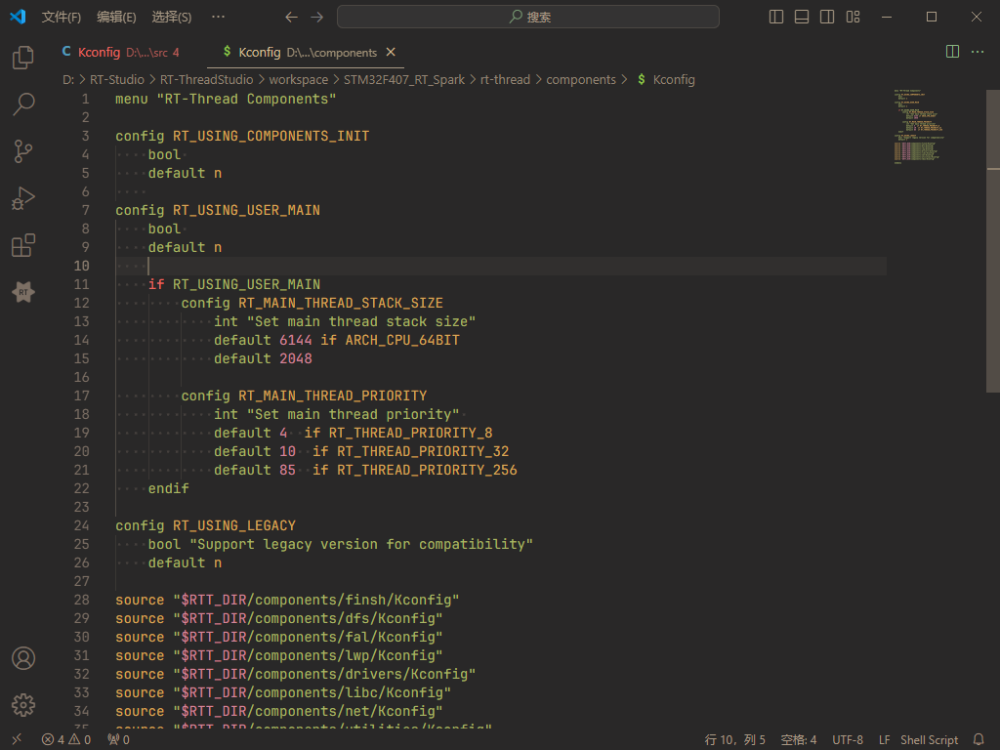

要是还没想起来也没事，可能大家使用RTT对于内核组件的内容配置得比较少，我们再看一个最明显的。`rt-thread/../libraries/Kconfig`（即我们主目录下的`libraries/Kconfig`）。

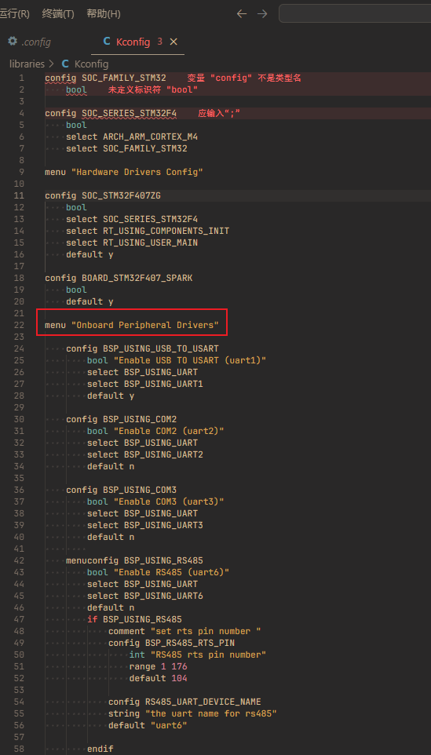


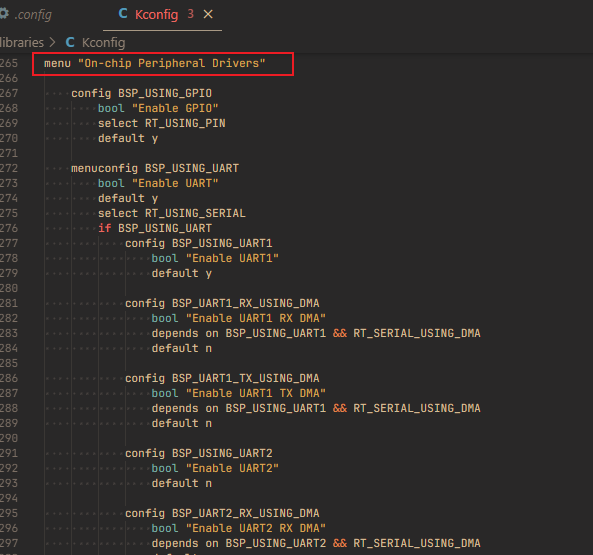

实际上，它对应的就是Studio里的RTT_Settings，还有ENV环境下打开的menuconfig。而我们配置完成的信息都将保存在`rtconfig.h`里，我们打开相应的开关，就会使能相应的宏，这些宏会被各个文件识别从而打开相应的功能配置。

1. 内核配置上的

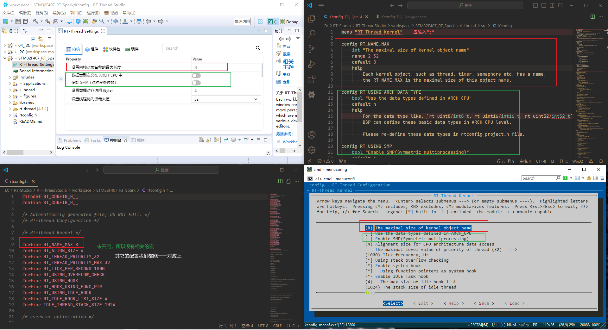

2. 硬件配置上的

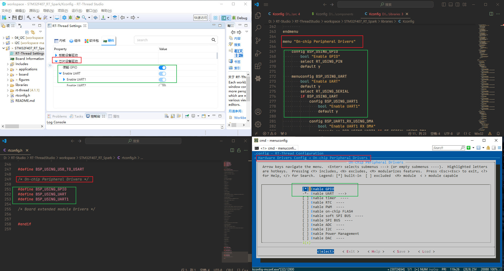


这下是不是恍然大悟了，我们所用配置的流程是：`Studio/ENV_menuconfig`-->调用`Kconfig`生成选择界面-->根据`rtconfig.h`里面的值填充选项-->生成特定的宏-->使能相关操作。 

## 2.修改Kconfig

我们尝试修改一下Kconfig里面的内容，看一下会发生什么结果。

在这里模拟一个场景，发现I2C总线不够用了，需要添加一条`I2C0`。原本的配置如下。

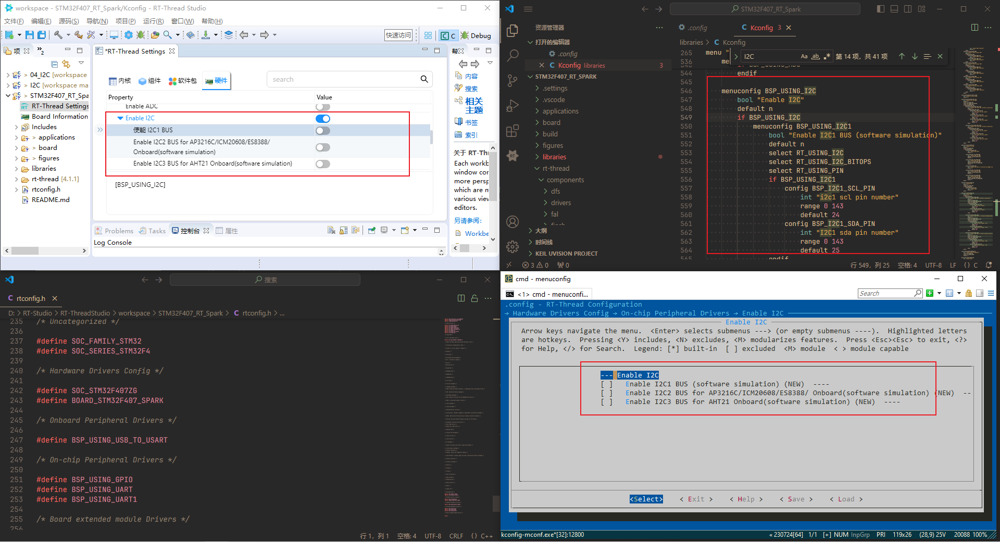

我们修改Kconfig，添加上一条新的I2C总线——`I2C0`。

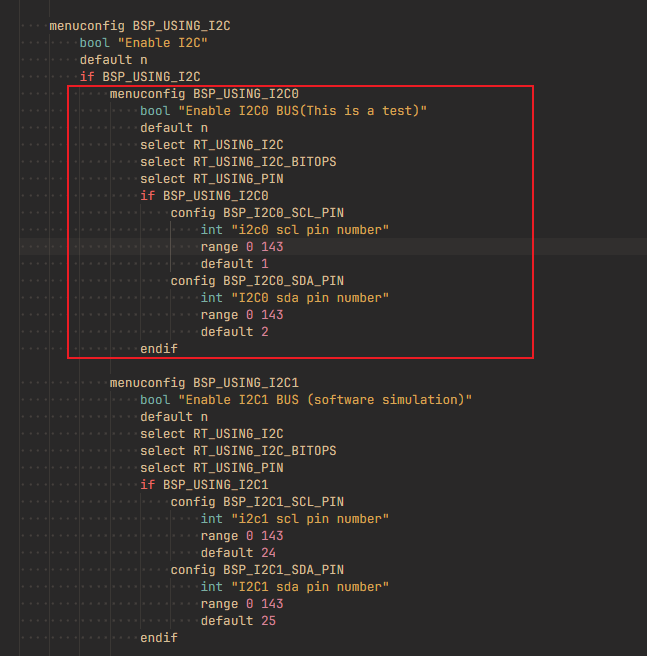

这时候我们重新打开一下`menuconfig`和`RTT_Settings`，这时候就可以看到I2C多了一个选项：`I2C0`，这就是我们刚刚添加的总线。使能完成后保存一下更新配置，我们就能够在`rtconfig.h`，里面去看到这个总线的配置了。

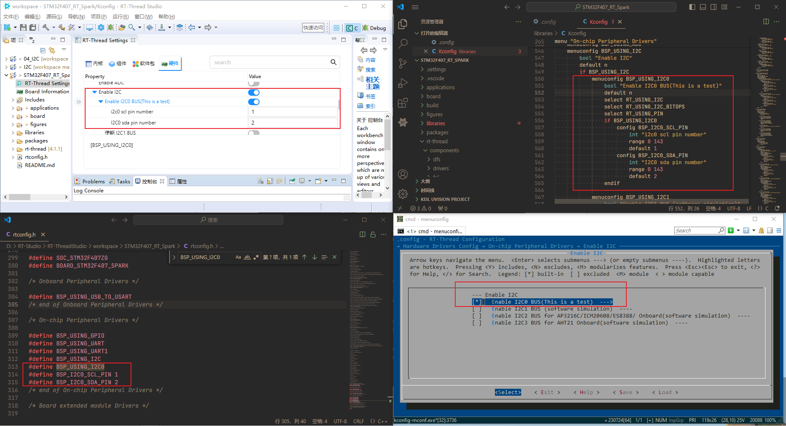

到这里我们就完成了Kconfig里面添加一条I2C总线的任务了，但这条总线还不能真正使用起来。因为在驱动文件中原本并没有这条I2C总线，我们需要进入到`libraries/SConscript`里面增加一些代码（这块后面会将到），以及在`drv_soft_i2c.c`和`drv_soft_i2c.h`，可以参照其它总线的格式。

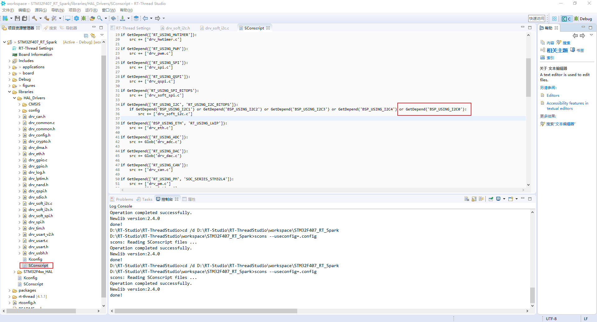

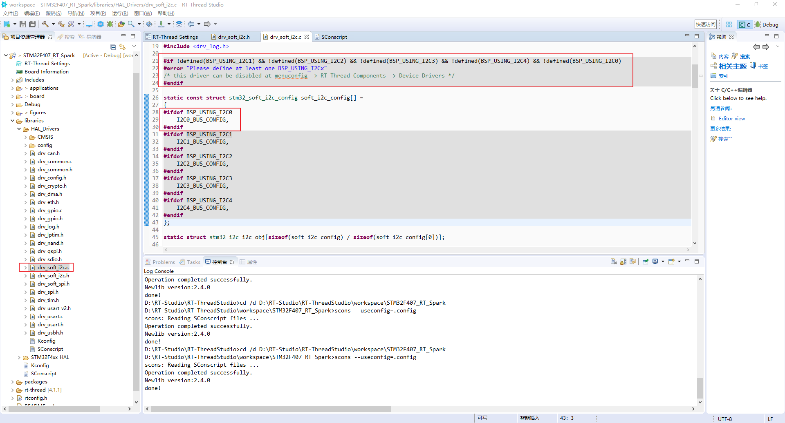

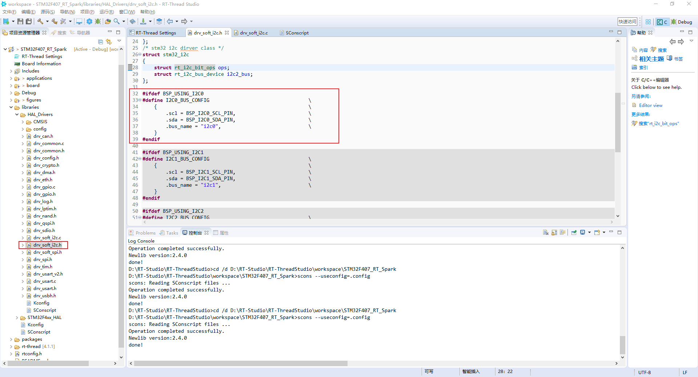

在两个驱动里面我们也能看到宏的使用，配置完成后在`rtconfig. h`生成的宏就是运用到这里。

完成了上述的操作以后，我们就能够正常使用上`i2c0`总线了。

# SCons

## 1.SConscript内容

Scons在RTT上也有相应的[教程](https://www.rt-thread.org/document/site/#/development-tools/build-config-system/SCons?id=_1-%e6%9e%84%e5%bb%ba%e5%b7%a5%e5%85%b7%ef%bc%88%e7%b3%bb%e7%bb%9f%ef%bc%89)，新手使用的话不需要这么深入的了解，只需要了解如何将我们新编写的代码加入编译就行了。每一个工程只有一个`SConstruct`，但是有多个`SConscript`，通过`SConscript`，我们就能够把所编写的代码加入编译从而能够正常使用。本章主要来讲解一下这个SConscrip是怎么运用的。

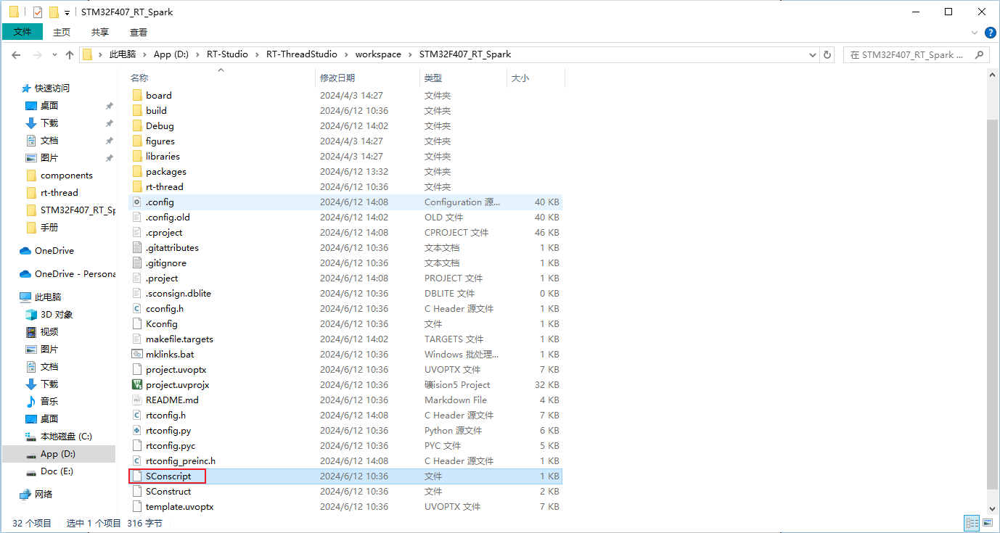


我们先来看一下主目录下的`SConscript` ，它的作用为寻找各个文件下（其实是寻找文件夹下）是否存在其它`SConscript`文件，如果纯在，则将其加入到编译中。

```python
# for module compiling
import os				# 引入 Python 标准库中的 os 模块，用于进行操作系统相关的操作，例如文件和目录操作
Import('RTT_ROOT')		 # 导入一个名为 RTT_ROOT 的变量，其定义在SConstruct中
from building import *	 # 从 building 模块导入所有内容，这通常包括一些构建过程中的工具函数或对象。

cwd = GetCurrentDir()	# 获取当前目录，即 D:\RT-Studio\RT-ThreadStudio\workspace\STM32F407_RT_Spark
objs = []			   # 记录需要增加的SConscript
list = os.listdir(cwd)	# 获取当前目录的列表，可以理解为list[0]=board,list[1]=build,list[2]=Debug....

for d in list:				   # 在列表中循环
    path = os.path.join(cwd, d)	# 进行目录拼接，例如当'd'为'board'时，此时的'path'为'cwd(前面所获取的路径)\board'
    if os.path.isfile(os.path.join(path, 'SConscript')):
        					  # 再对'path'进行拼接,得到'cwd\board\SConscript',然后查看是否存在这个'SConscrpt'文件
        objs = objs + SConscript(os.path.join(d, 'SConscript'))
							 # 如果存在则将这个'cwd\board\SConscript'加入到编译中
Return('objs')

```


我们再来看一下`board\SConscript`，它的作用时把`board.c`， `CubeMX_Config/Src/stm32f4xx_hal_msp.c`加入到编译中。然后将`board`和`/CubeMX_Config/Inc`添加到路径下，这样子`board`和`/CubeMX_Config/Inc`里面的头文件就能被找到了。

```python
import os
import rtconfig
from building import *

Import('SDK_LIB')

cwd = GetCurrentDir()

# add general drivers
# Split() 将字符串 str 分割成一个列表，下面的就等同于：src = ['board.c', CubeMX_Config/Src/stm32f4xx_hal_msp.c']
src = Split('''				
board.c
CubeMX_Config/Src/stm32f4xx_hal_msp.c
''')
path =  [cwd]							# 将当前目录添加到头文件路径，寻找头文件的时候会根据这个路径来找
path += [cwd + '/CubeMX_Config/Inc']

CPPDEFINES = ['STM32F407xx']			 # 编译时加上全局宏定义，即编译时会默认帮我们开启  'STM32F407xx' 这个宏
group = DefineGroup('Drivers', src, depend = [''], CPPPATH = path, CPPDEFINES = CPPDEFINES)

Return('group')

```


我们再来看一下`libraries\HAL_Drivers`下的`SConscript`（节选）,`GetDepend（）`会检索我们在`rtconfig.h`里是否启用了这个宏，然后我们根据开启的内容去选择是否将这个文件进行编译，避免了编译一些用不上的代码影响效率。

```c
Import('RTT_ROOT')
Import('rtconfig')
from building import *

cwd = GetCurrentDir()

# add the general drivers.
src = []

//查看是否定义了宏依赖，即我们在rtconfig里面的宏配置，会影响到这里
if GetDepend(['RT_USING_PIN']):
    src += ['drv_gpio.c']

if GetDepend(['RT_USING_SERIAL']):
    if GetDepend(['RT_USING_SERIAL_V2']):
        src += ['drv_usart_v2.c']
    else:
        src += ['drv_usart.c']

...
        
if GetDepend(['RT_USING_I2C', 'RT_USING_I2C_BITOPS']):
    if GetDepend('BSP_USING_I2C1') or GetDepend('BSP_USING_I2C2') or GetDepend('BSP_USING_I2C3') or GetDepend('BSP_USING_I2C4') or GetDepend('BSP_USING_I2C0'):
        src += ['drv_soft_i2c.c']
        
...

group = DefineGroup('Drivers', src, depend = [''], CPPPATH = path)

Return('group')

        
```


## 2. SConscript编写

我们来模拟一个场景，现在我新建了一个文件夹`Hello_Test`，往里面添加了`hello.h`与`hello.c`文件，并在main函数中调用。如果不编写SConscript我们看看会发生什么。

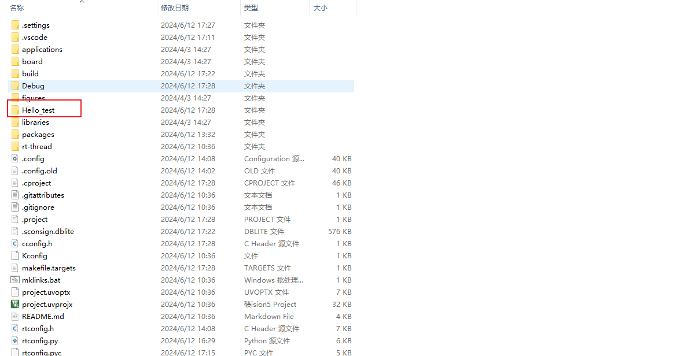

```c
//hello.h
#ifndef HELLO_H
#define HELLO_H

#include <rtthread.h>

void Print_Hello_World(void);

#endif

//hello.c
#include "hello.h"

void Print_Hello_World(void)
{
    rt_kprintf("Hello World\n");
}

//main.c
#include <rtthread.h>
#include "hello.h"

int main(void)
{
    while (1)
    {
        Print_Hello_World();    //调用Hello.c里的函数
        rt_thread_mdelay(1000);
    }

    return 0;
}

```

此时我们使用ENV里输入`scons -j16`进行编译，发现会报以下错误：找不到头文件。

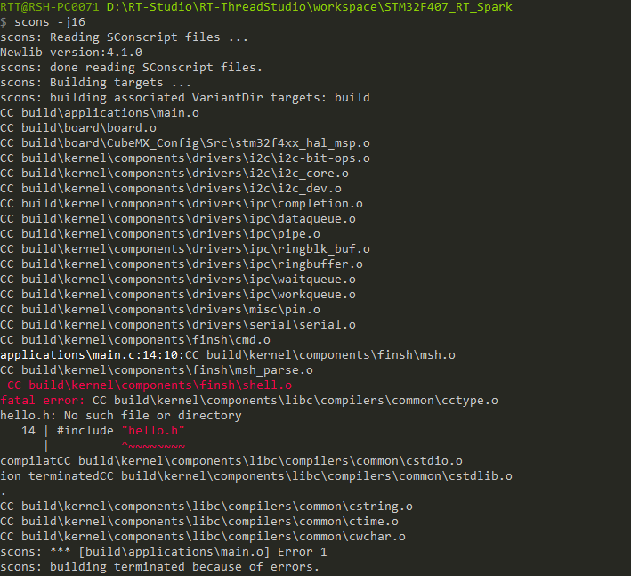

如果我们这时候到Studio中编译的话会发现报错是一样的，但是`hello.c`文件被编译进去了。这是因为在Studio中，会把资源管理器下的`.c文件`都编译进去（我们新增的文件都会添加到资源管理器下），所以会出现这种情形。我们这时候编写一个`SConscript`，但是`src`参数不给`hello.c`文件，只给出头文件路径，验证一下我们的想法。

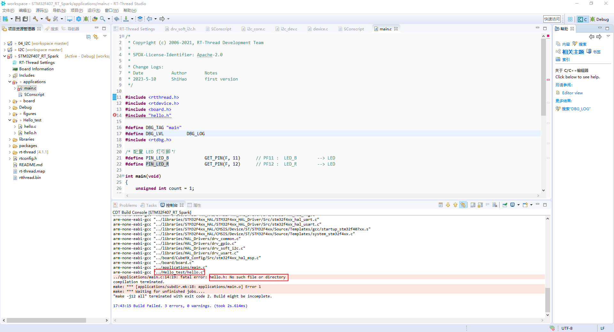

```python
from building import *
import os

cwd     = GetCurrentDir()
CPPPATH = [cwd]
src = [] 	#此处为空

group = DefineGroup('Hello_Test', src, depend = [''], CPPPATH = CPPPATH)

Return('group')

```

编写完成后需要右击鼠标然后点击一下`同步SCons`，更新一下。

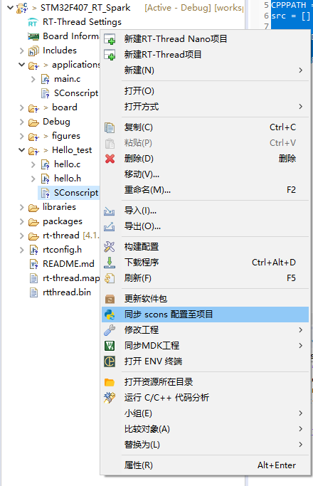

这样果然能通过Studio的编译，代码烧录下来，现象跟预期的一样。

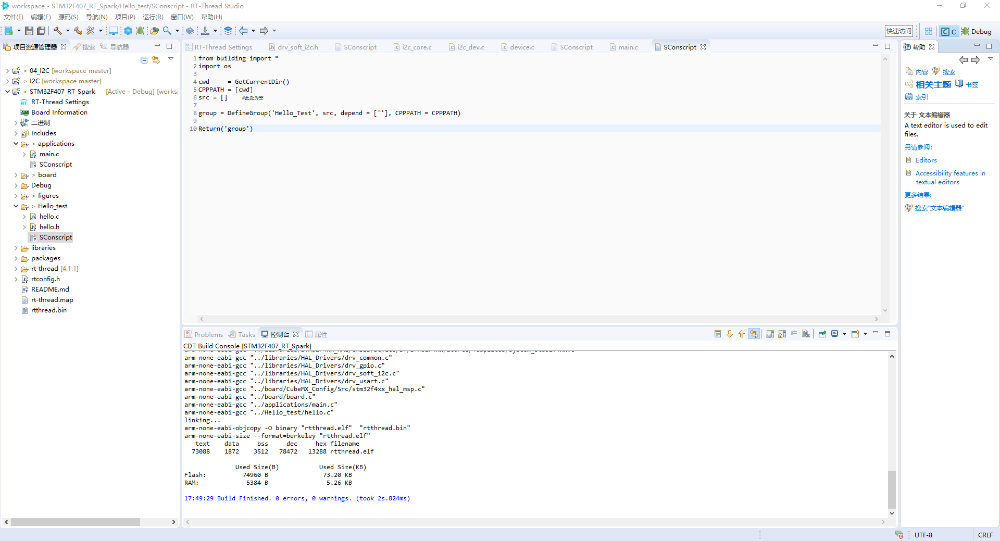

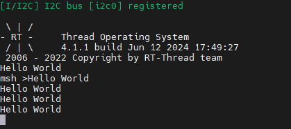

我们再用ENV环境试一下。这时候编译没有问题了，但是链接的时候除了报错，这是因为我们没把`hello.c`文件编译进来所以导致找不到`Print_Hello_World()`这个函数的定义。

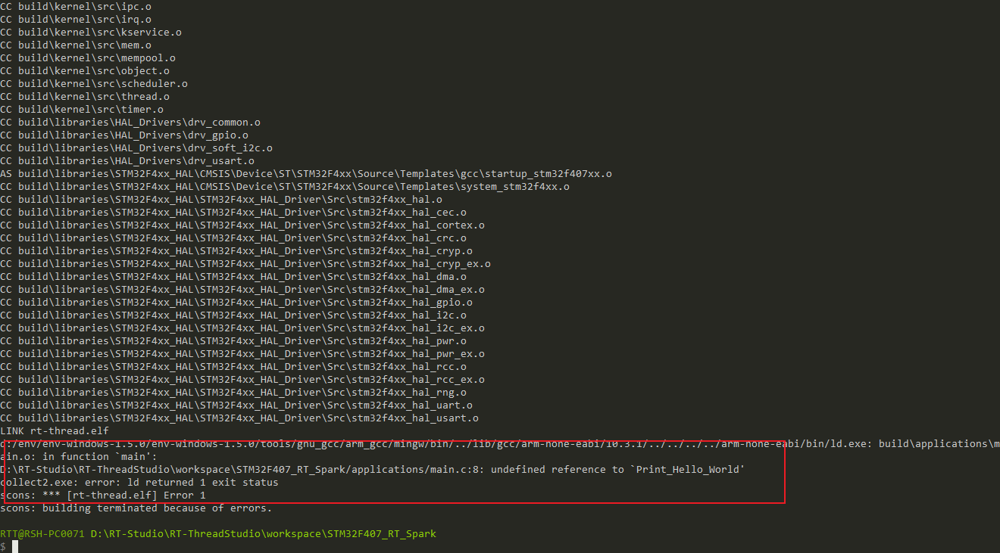

这时候我们在`SConscript`的`src`中加入我们的`hello.c`文件，此时再进行编译。在Studio和ENV上都没有问题。

```python
from building import *
import os

cwd     = GetCurrentDir()
CPPPATH = [cwd]
src = ['hello.c'] 	#补上hello.c

group = DefineGroup('Hello_Test', src, depend = [''], CPPPATH = CPPPATH)

Return('group')
```

到这里我们基本的Kconfig跟SCons的使用都没问题了，我们可以借助这些工具更快速的进行开发吧


