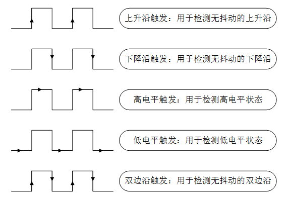
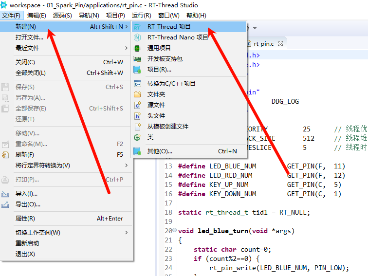
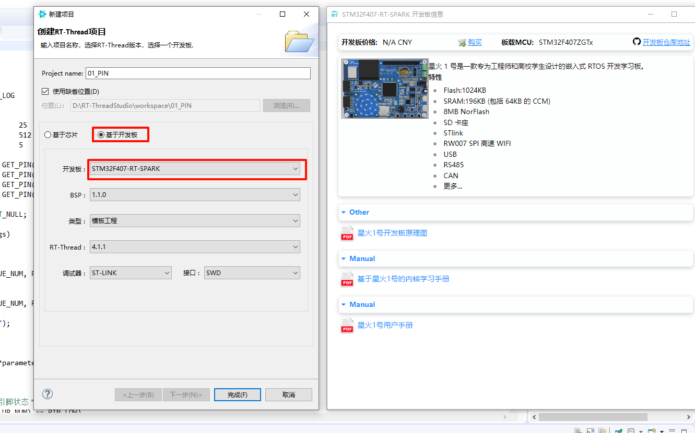
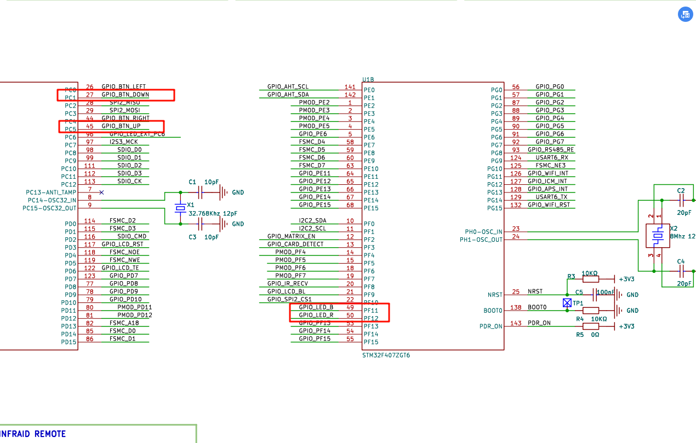
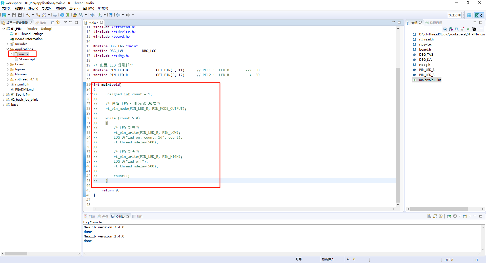
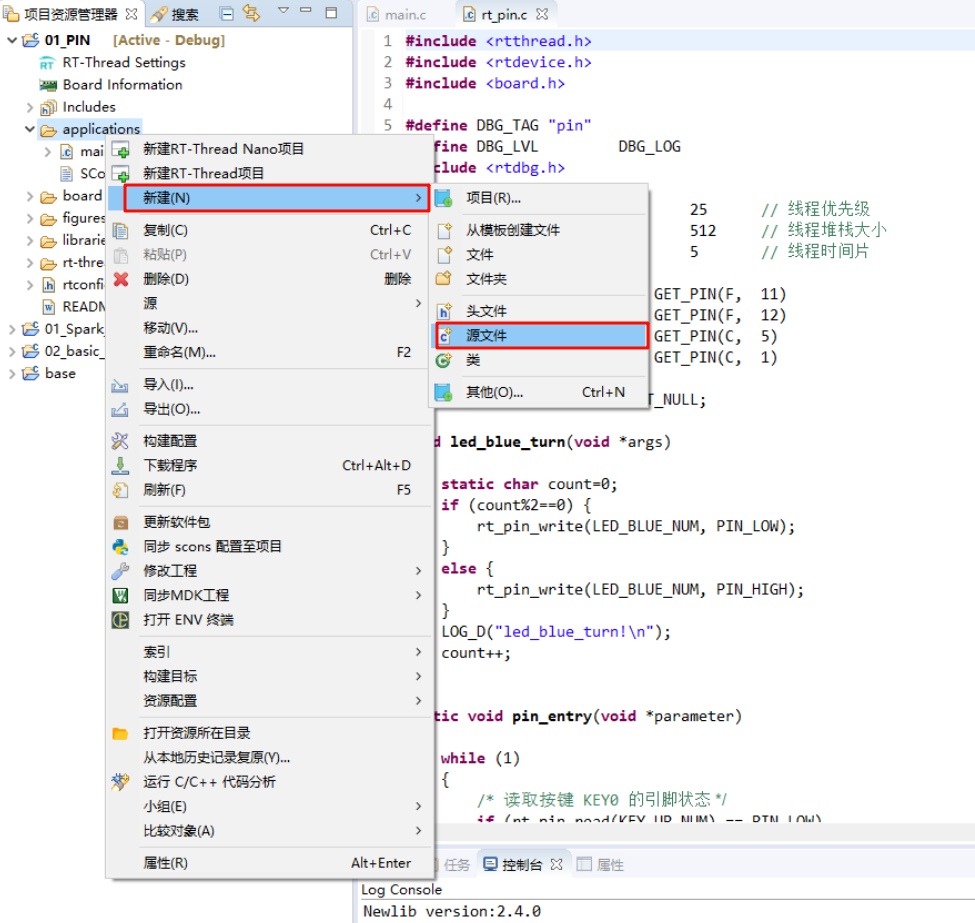
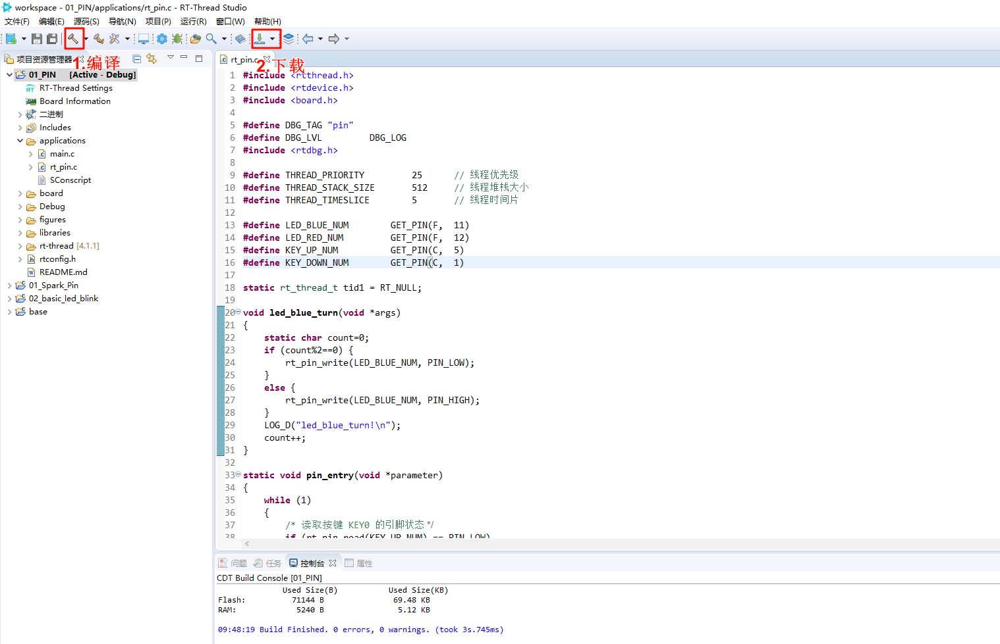
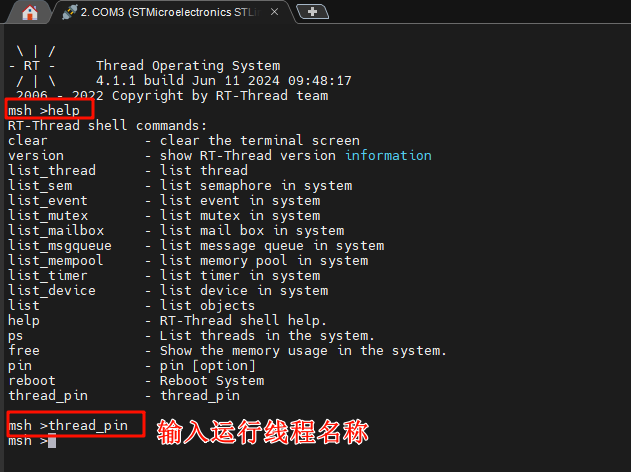
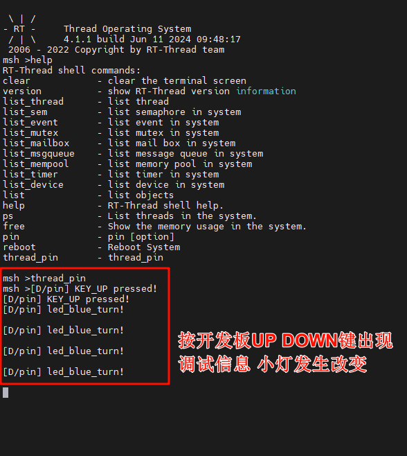

# PIN设备
## 1. 引脚简介
> 芯片上的引脚一般分为 4 类：电源、时钟、控制与 I/O，I/O 口在使用模式上又分为 General Purpose Input Output（通用输入 / 输出），简称 GPIO，与功能复用 I/O（如 SPI/I2C/UART 等）。大多数 MCU 的引脚都不止一个功能。不同引脚内部结构不一样，拥有的功能也不一样。可以通过不同的配置，切换引脚的实际功能。通用 I/O 口主要特性如下：可编程控制中断：中断触发模式可配置，一般有下图所示 5 种中断触发模式：  
  
输入输出模式可控制。  
输出模式一般包括：推挽、开漏、上拉、下拉。引脚为输出模式时，可以通过配置引脚输出的电平状态为高电平或低电平来控制连接的外围设备。  
输入模式一般包括：浮空、上拉、下拉、模拟。引脚为输入模式时，可以读取引脚的电平状态，即高电平或低电平
## 2. 基于Spark项目 按键控制LED
> ### 2.1创建项目


> ### 2.2查找需要的PIN

> ### 2.3注释main代码

> ### 2.4编写新的线程代码

```C
#include <rtthread.h>
#include <rtdevice.h>
#include <board.h>

#define DBG_TAG "pin"
#define DBG_LVL         DBG_LOG
#include <rtdbg.h>

#define THREAD_PRIORITY         25      // 线程优先级
#define THREAD_STACK_SIZE       512     // 线程堆栈大小
#define THREAD_TIMESLICE        5       // 线程时间片

#define LED_BLUE_NUM        GET_PIN(F,  11)
#define LED_RED_NUM         GET_PIN(F,  12)
#define KEY_UP_NUM          GET_PIN(C,  5)
#define KEY_DOWN_NUM        GET_PIN(C,  1)

static rt_thread_t tid1 = RT_NULL;

void led_blue_turn(void *args)
{
    static char count=0;
    if (count%2==0) {
        rt_pin_write(LED_BLUE_NUM, PIN_LOW);
    }
    else {
        rt_pin_write(LED_BLUE_NUM, PIN_HIGH);
    }
    LOG_D("led_blue_turn!\n");
    count++;
}

static void pin_entry(void *parameter)
{
    while (1)
    {
        /* 读取按键 KEY0 的引脚状态 */
        if (rt_pin_read(KEY_UP_NUM) == PIN_LOW)
        {
            rt_thread_mdelay(50);
            if (rt_pin_read(KEY_UP_NUM) == PIN_LOW)
            {
                /* 按键已被按下，输出 log，点亮 LED 灯 */
                LOG_D("KEY_UP pressed!");
                rt_pin_write(LED_RED_NUM, PIN_LOW);
            }
        }
        else
        {
            /* 按键没被按下，熄灭 LED 灯 */
            rt_pin_write(LED_RED_NUM, PIN_HIGH);
        }
        rt_thread_mdelay(10);
    }
}

/* 线程示例 */
int thread_pin(void)
{
    /*设置LED引脚为输出模式 */
//    rt_base_t LED_RED_NUM= rt_pin_get("PF.12");
    rt_pin_mode(LED_RED_NUM, PIN_MODE_OUTPUT);
    rt_pin_mode(LED_BLUE_NUM, PIN_MODE_OUTPUT);
    /*设置按键引脚为输入模式*/
    rt_pin_mode(KEY_UP_NUM, PIN_MODE_INPUT_PULLUP);
    rt_pin_mode(KEY_DOWN_NUM, PIN_MODE_INPUT_PULLUP);

    /* 绑定中断，下降沿模式，回调函数名为led_blue_on */
    rt_pin_attach_irq(KEY_DOWN_NUM, PIN_IRQ_MODE_FALLING, led_blue_turn, RT_NULL);
    /* 使能中断 */
    rt_pin_irq_enable(KEY_DOWN_NUM, PIN_IRQ_ENABLE);

    tid1 = rt_thread_create("pin",
                            pin_entry, RT_NULL,
                            THREAD_STACK_SIZE,
                            THREAD_PRIORITY, THREAD_TIMESLICE);

    /* 如果获得线程控制块，启动这个线程 */
    if (tid1 != RT_NULL)
        rt_thread_startup(tid1);

    return 0;
}

/* 导出到 msh 命令列表中 */
MSH_CMD_EXPORT(thread_pin, thread_pin);
```
> ### 3.编译下载

> ### 4.运行

> ### 5.运行结果
