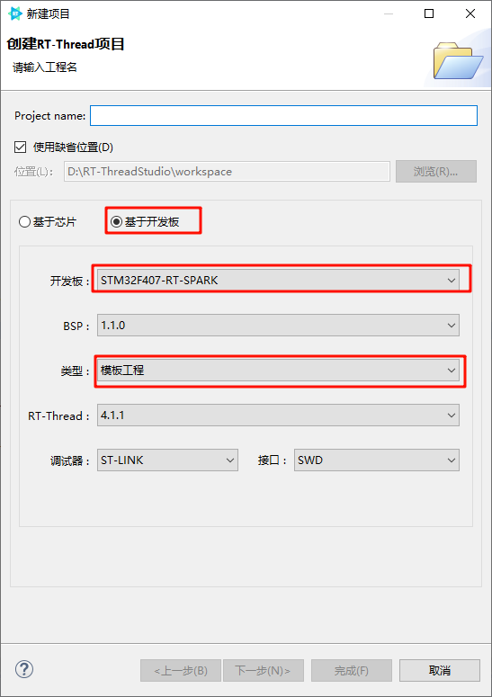

# ADC 设备
## ADC 简介
> ADC(Analog-to-Digital Converter) 指模数转换器。是指将连续变化的模拟信号转换为离散的数字信号的器件。真实世界的模拟信号，例如温度、压力、声音或者图像等，需要转换成更容易储存、处理和发射的数字形式。模数转换器可以实现这个功能，在各种不同的产品中都可以找到它的身影。与之相对应的 DAC(Digital-to-Analog Converter)，它是 ADC 模数转换的逆向过程。ADC 最早用于对无线信号向数字信号转换。如电视信号，长短播电台发射接收等。
## 1.转换过程
> 如下图所示模数转换一般要经过采样、保持和量化、编码这几个步骤。在实际电路中，有些过程是合并进行的，如采样和保持，量化和编码在转换过程中是同时实现的。  
   
采样是将时间上连续变化的模拟信号转换为时间上离散的模拟信号。采样取得的模拟信号转换为数字信号都需要一定时间，为了给后续的量化编码过程提供一个稳定的值，在采样电路后要求将所采样的模拟信号保持一段时间。  
将数值连续的模拟量转换为数字量的过程称为量化。数字信号在数值上是离散的。采样保持电路的输出电压还需要按照某种近似方式归化到与之相应的离散电平上，任何数字量只能是某个最小数量单位的整数倍。量化后的数值最后还需要编码过程，也就是 A/D 转换器输出的数字量。
## 2.分辨率
> 分辨率以二进制（或十进制）数的位数来表示，一般有8位、10位、12位、16位等，它说明模数转换器对输入信号的分辨能力，位数越多，表示分辨率越高，恢复模拟信号时会更精确。
## 3.精度
> 精度表示 ADC 器件在所有的数值点上对应的模拟值和真实值之间的最大误差值，也就是输出数值偏离线性最大的距离。
## 4.转换速率 
> 转换速率是指 A/D 转换器完成一次从模拟到数字的 AD 转换所需时间的倒数。例如，某 A/D 转换器的转换速率为 1MHz，则表示完成一次 AD 转换时间为 1 微秒。
## 5. 基于Spark项目 ADC采集并打印到串口
### 1.创建工程
 
### 2.打开RTT_Settings 进行配置 打开ADC
 
 
### 3.CubeMX配置ADC 打开ADC1 通道0
 
 
 
### 4.注释main函数 编写新的adc采集线程

```c
#include <rtthread.h>
#include <rtdevice.h>
#include <rtdbg.h>

#define THREAD_PRIORITY         25      // 线程优先级
#define THREAD_STACK_SIZE       512     // 线程堆栈大小
#define THREAD_TIMESLICE        5       // 线程时间片

#define ADC_DEV_NAME        "adc1"      /* ADC 设备名称 */
#define ADC_DEV_CHANNEL     0           /* ADC 通道 */
#define REFER_VOLTAGE       330         /* 参考电压 3.3V,数据精度乘以100保留2位小数*/
#define CONVERT_BITS        (1 << 12)   /* 转换位数为12位 */

static rt_thread_t tid1 = RT_NULL;
static rt_adc_device_t adc_dev;

static void adc_entry(void *parameter)
{
    rt_uint32_t value, vol;
    while (1)
    {
        /* 读取采样值 */
        value = rt_adc_read(adc_dev, ADC_DEV_CHANNEL);
        rt_kprintf("the value is :%d \n", value);
        /* 转换为对应电压值 */
        vol = value * REFER_VOLTAGE / CONVERT_BITS;
        rt_kprintf("the voltage is :%d.%02d \n", vol / 100, vol % 100);
        rt_thread_mdelay(500);
    }
}


/* 线程示例 */
int thread_adc(void)
{
    rt_err_t ret = RT_EOK;
    /* 查找设备 */
    adc_dev = (rt_adc_device_t)rt_device_find(ADC_DEV_NAME);
    if (adc_dev == RT_NULL)
    {
        rt_kprintf("adc sample run failed! can't find %s device!\n", ADC_DEV_NAME);
        return RT_ERROR;
    }

    /* 使能设备 */
    ret=rt_adc_enable(adc_dev, ADC_DEV_CHANNEL);
    if (ret != RT_EOK)
    {
        rt_kprintf("adc enable failed ");
        return RT_ERROR;
    }
    tid1 = rt_thread_create("adc_vol_sample",
                            adc_entry, RT_NULL,
                            THREAD_STACK_SIZE,
                            THREAD_PRIORITY, THREAD_TIMESLICE);

    /* 如果获得线程控制块，启动这个线程 */
    if (tid1 != RT_NULL)
        rt_thread_startup(tid1);
    return 0;
}


/* 导出到 msh 命令列表中 */
MSH_CMD_EXPORT(thread_adc, adc voltage convert sample);
```
### 5.编译下载

### 6.运行测试
