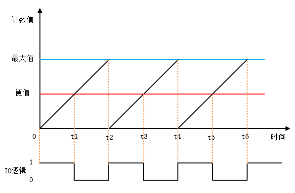
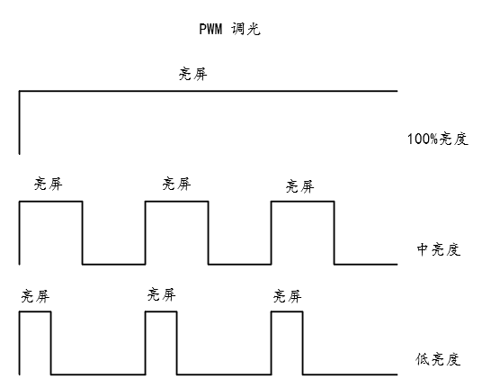
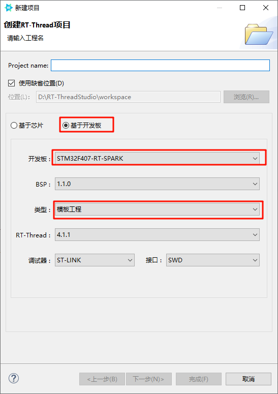
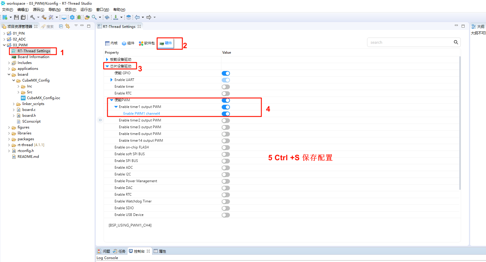
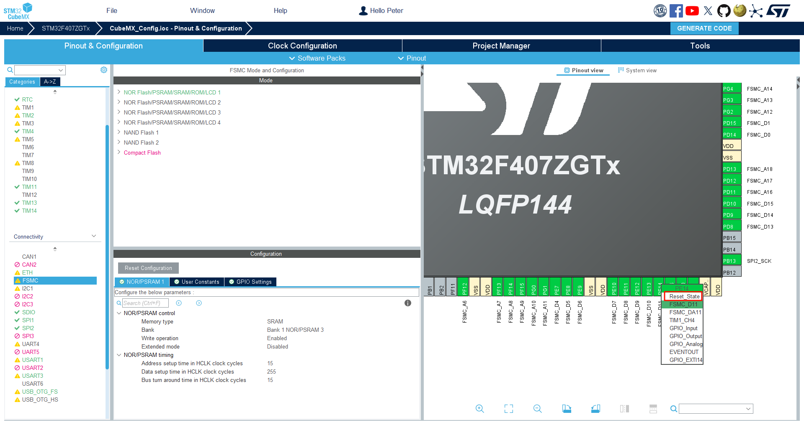
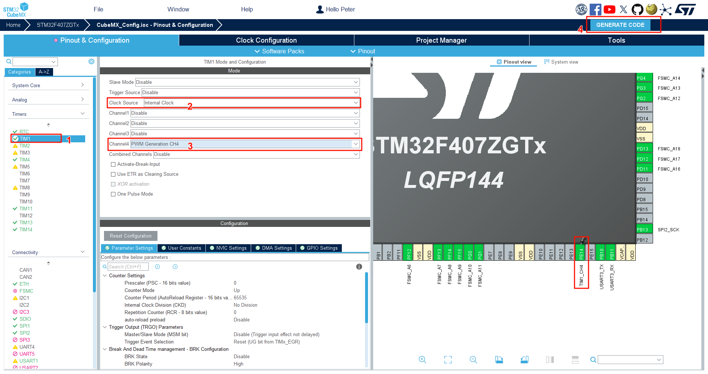
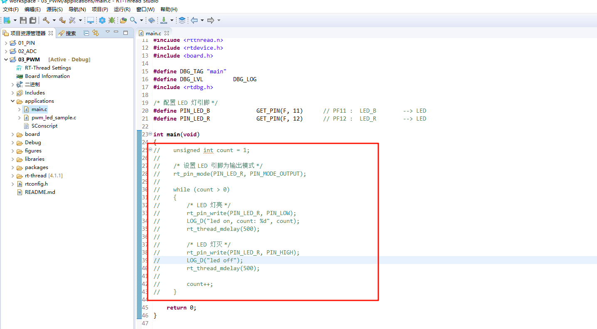
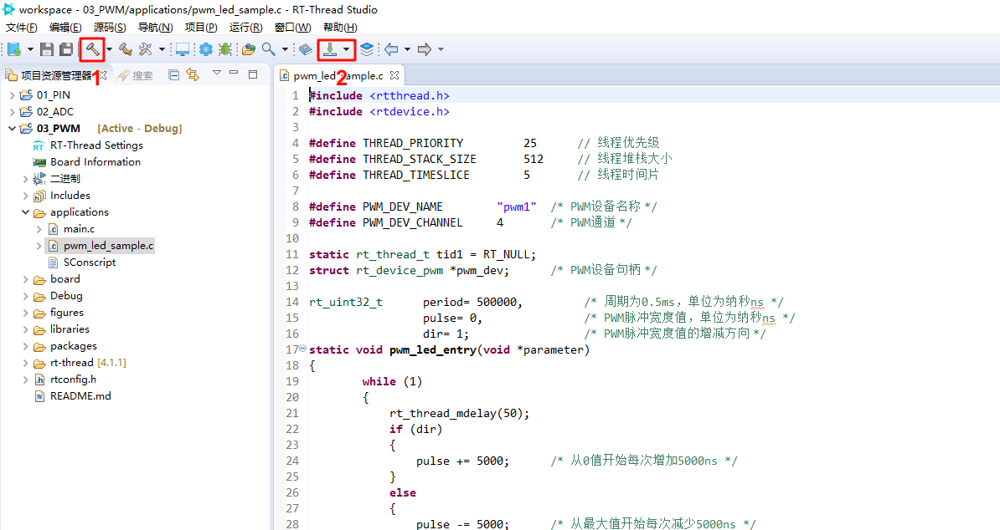
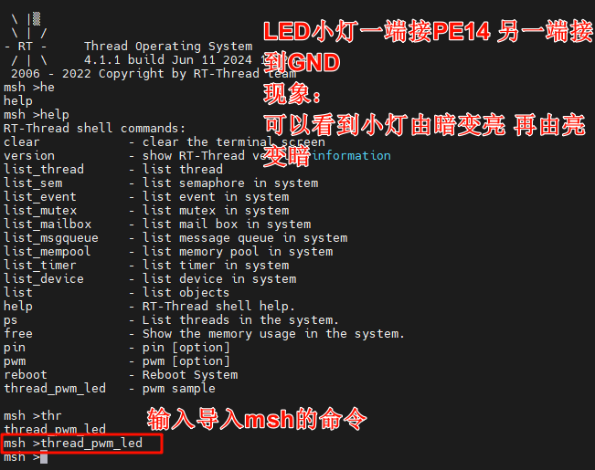

# PWM 设备
## PWM 简介
> PWM(Pulse Width Modulation , 脉冲宽度调制) 是一种对模拟信号电平进行数字编码的方法，通过不同频率的脉冲使用方波的占空比用来对一个具体模拟信号的电平进行编码，使输出端得到一系列幅值相等的脉冲，用这些脉冲来代替所需要波形的设备。  
  
上图是一个简单的 PWM 原理示意图，假定定时器工作模式为向上计数，当计数值小于阈值时，则输出一种电平状态，比如高电平，当计数值大于阈值时则输出相反的电平状态，比如低电平。当计数值达到最大值是，计数器从0开始重新计数，又回到最初的电平状态。高电平持续时间（脉冲宽度）和周期时间的比值就是占空比，范围为0~100%。上图高电平的持续时间刚好是周期时间的一半，所以占空比为50%。  
一个比较常用的pwm控制情景就是用来调节灯或者屏幕的亮度，根据占空比的不同，就可以完成亮度的调节。PWM调节亮度并不是持续发光的，而是在不停地点亮、熄灭屏幕。当亮、灭交替够快时，肉眼就会认为一直在亮。在亮、灭的过程中，灭的状态持续时间越长，屏幕给肉眼的观感就是亮度越低。亮的时间越长，灭的时间就相应减少，屏幕就会变亮。

## 2. 基于Spark项目 PWM调节LED
### 1.创建工程

### 2.打开RTT_Settings 进行配置 打开PWM1 timer1  channel4

### 3.CubeMX配置PWM1 timer1  channel4
#### 先将PE14引脚释放  
  
#### 配置PWM1 timer1  channel4

### 4.注释main函数 编写新的PWM LED程序

```c
#include <rtthread.h>
#include <rtdevice.h>

#define THREAD_PRIORITY         25      // 线程优先级
#define THREAD_STACK_SIZE       512     // 线程堆栈大小
#define THREAD_TIMESLICE        5       // 线程时间片

#define PWM_DEV_NAME        "pwm1"  /* PWM设备名称 */
#define PWM_DEV_CHANNEL     4       /* PWM通道 */

static rt_thread_t tid1 = RT_NULL;
struct rt_device_pwm *pwm_dev;      /* PWM设备句柄 */

rt_uint32_t      period= 500000,         /* 周期为0.5ms，单位为纳秒ns */
                 pulse= 0,               /* PWM脉冲宽度值，单位为纳秒ns */
                 dir= 1;                 /* PWM脉冲宽度值的增减方向 */
static void pwm_led_entry(void *parameter)
{
        while (1)
        {
            rt_thread_mdelay(50);
            if (dir)
            {
                pulse += 5000;      /* 从0值开始每次增加5000ns */
            }
            else
            {
                pulse -= 5000;      /* 从最大值开始每次减少5000ns */
            }
            if (pulse >= period)
            {
                dir = 0;
            }
            if (0 == pulse)
            {
                dir = 1;
            }

            /* 设置PWM周期和脉冲宽度 */
            rt_pwm_set(pwm_dev, PWM_DEV_CHANNEL, period, pulse);
        }
}

/* 线程示例 */
int thread_pwm_led(void)
{
    /* 查找设备 */
    pwm_dev = (struct rt_device_pwm *)rt_device_find(PWM_DEV_NAME);
    if (pwm_dev == RT_NULL)
    {
        rt_kprintf("pwm sample run failed! can't find %s device!\n", PWM_DEV_NAME);
        return RT_ERROR;
    }
    /* 设置PWM周期和脉冲宽度默认值 */
    rt_pwm_set(pwm_dev, PWM_DEV_CHANNEL, period, pulse);
    /* 使能设备 */
    rt_pwm_enable(pwm_dev, PWM_DEV_CHANNEL);
    tid1 = rt_thread_create("pwm_led",
                            pwm_led_entry, RT_NULL,
                            THREAD_STACK_SIZE,
                            THREAD_PRIORITY, THREAD_TIMESLICE);
    /* 如果获得线程控制块，启动这个线程 */
    if (tid1 != RT_NULL)
        rt_thread_startup(tid1);
    return 0;
}
/* 导出到 msh 命令列表中 */
MSH_CMD_EXPORT(thread_pwm_led, pwm sample);
```
### 5.编译下载

### 6.运行测试
