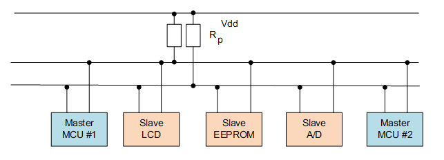

# I2C设备

## 1. I2C介绍

I2C（Inter Integrated Circuit）总线是 PHILIPS 公司开发的一种半双工、双向二线制同步串行总线。I2C 总线传输数据时只需两根信号线，一根是双向数据线 SDA（serial data），另一根是双向时钟线 SCL（serial clock）。SPI 总线有两根线分别用于主从设备之间接收数据和发送数据，而 I2C 总线只使用一根线进行数据收发。

I2C 和 SPI 一样以主从的方式工作，不同于 SPI 一主多从的结构，它允许同时有多个主设备存在，每个连接到总线上的器件都有唯一的地址，主设备启动数据传输并产生时钟信号，从设备被主设备寻址，同一时刻只允许有一个主设备。如下图所示：



如下图所示为 I2C 总线主要的数据传输格式：


当总线空闲时，SDA 和 SCL 都处于高电平状态，当主机要和某个从机通讯时，会先发送一个开始条件，然后发送从机地址和读写控制位，接下来传输数据（主机发送或者接收数据），数据传输结束时主机会发送停止条件。传输的每个字节为8位，高位在前，低位在后。数据传输过程中的不同名词详解如下所示：

- **开始条件：** SCL 为高电平时，主机将 SDA 拉低，表示数据传输即将开始

- **从机地址：** 主机发送的第一个字节为从机地址，高 7 位为地址，最低位为 R/W 读写控制位，1 表示读操作，0 表示写操作。一般从机地址有 7 位地址模式和 10 位地址模式两种，如果是 10 位地址模式，第一个字节的头 7 位 是 11110XX 的组合，其中最后两位（XX）是 10 位地址的两个最高位，第二个字节为 10 位从机地址的剩下8位，如下图所示：

  

- **应答信号：** 每传输完成一个字节的数据，接收方就需要回复一个 ACK（acknowledge）。写数据时由从机发送 ACK，读数据时由主机发送 ACK。当主机读到最后一个字节数据时，可发送 NACK（Not acknowledge）然后跟停止条件。

- **数据：** 从机地址发送完后可能会发送一些指令，依从机而定，然后开始传输数据，由主机或者从机发送，每个数据为 8 位，数据的字节数没有限制。

- **重复开始条件：** 在一次通信过程中，主机可能需要和不同的从机传输数据或者需要切换读写操作时，主机可以再发送一个开始条件。

- **停止条件：** 在 SDA 为低电平时，主机将 SCL 拉高并保持高电平，然后在将 SDA 拉高，表示传输结束。


## 2. 创建工程——基于开发板

在这里我们使用板载的AHT21温湿度传感器为例。

### 2.1 创建工程


### 2.3 不使用软件包

在不使用软件包的情况下，相当于全新使用一个I2C设备，会教大家如何进行I2C的配置，I2C的数据传输...此过程也适用于外接的I2C设备。

#### 2.3.1 打开RTT_Settings进行配置


在这里我们可以看到原本的我们已经将AHT21设定为了I2C3这条总线，为了模拟新设备场景，这里我们不使用它，使用的是一条未经设计的I2C1总线。


在使能了I2C1后，我们可以看到这里还需要我们配置一下I2C的两个引脚号码，通过查询星火一号开发板原理图我们得知AHT的I2C引脚是连接到PE0（SCL），PE1（SDA）上的。这里还需要进行一次引脚换算，以这个为例：`PE0 =（E-A）*16 + 0 = （5 - 1）* 16 = 64`、`PE0 =（E-A）*16 + 1 = （5 - 1）* 16 + 1 = 65`。


#### 2.3.2 编写代码

我们可以新建一个`.c`文件来放置我们的代码。


这里取名为I2C_Test.c。

在文件里面我们需要完成以下功能：

1. 写函数（能够让主机向从机发送命令）
2. 读函数（能够让主机从从机读取数据）
3. 设备的初始化函数

```c
//不使用软件包的情况下
#include <rtthread.h>
#include <rtdevice.h>
#include <board.h>

#define DBG_TAG "main"
#define DBG_LVL         DBG_LOG
#include <rtdbg.h>

#define AHT_I2C_BUS_NAME    "i2c1"  //AHT20 挂载的I2C总线
#define AHT_ADDR            0x38    //AHT20 I2C地址
#define AHT_CALIBRATION_CMD 0xBE    //AHT20 初始化命令
#define AHT_NORMAL_CMD      0xA8    //AHT20 正常工作模式命令
#define AHT_GET_DATA_CMD    0xAC    //AHT20 获取结果命令

//I2C_BUS设备指针，用于等会寻找与记录AHT挂载的I2C总线
struct rt_i2c_bus_device *i2c_bus = RT_NULL;

//AHT命令的空参数
rt_uint8_t Parm_Null[2]={0,0};

//写命令（主机向从机传输数据）
rt_err_t write_reg(struct rt_i2c_bus_device *Device, rt_uint8_t reg, rt_uint8_t* data)
{
    //代写入的数据
    //数组大小为3的原因：buf[0]--命令（即上面的AHT_CALIBRATION_CMD、AHT_NORMAL_CMD、AHT_GET_DATA_CMD
    //                  buf[1]/buf[2]为命令后跟的参数，AHT有些命令后面需要加上参数，具体可查看数据手册
    rt_uint8_t buf[3];

    //记录数组大小
    rt_uint8_t buf_size;

    //I2C传输的数据结构体
    struct rt_i2c_msg msgs;

    buf[0] = reg;
    if(data != RT_NULL)
    {
        buf[1] = data[0];
        buf[2] = data[1];
        buf_size = 3;
    }
    else
    {
        buf_size = 1;
    }

    msgs.addr = AHT_ADDR;   //消息要发送的地址：即AHT地址
    msgs.flags = RT_I2C_WR; //消息的标志位：读还是写，是否需要忽视ACK回应，是否需要发送停止位，是否需要发送开始位(用于拼接数据使用)...
    msgs.buf = buf;         //消息的缓冲区：待发送/接收的数组
    msgs.len = buf_size;    //消息的缓冲区大小：待发送/接收的数组的大小

    //传输信息
    //这里i2c.core层提供给我们三个API去进行I2C的数据传递：
    /*
     * 1.发送API
     * rt_size_t rt_i2c_master_send(struct rt_i2c_bus_device *bus,
                             rt_uint16_t               addr,
                             rt_uint16_t               flags,
                             const rt_uint8_t         *buf,
                             rt_uint32_t               count)

       2.接收API
       rt_size_t rt_i2c_master_recv(struct rt_i2c_bus_device *bus,
                             rt_uint16_t               addr,
                             rt_uint16_t               flags,
                             rt_uint8_t               *buf,
                             rt_uint32_t               count)
       3.传输API
       rt_size_t rt_i2c_transfer(struct rt_i2c_bus_device *bus,
                          struct rt_i2c_msg         msgs[],
                          rt_uint32_t               num)
      * 实际上1跟2最后都会调用回3，大家可以按照自己需求进行调用
    */
    if(rt_i2c_transfer(Device, &msgs, 1) == 1)
    {
        return RT_EOK;
    }
    else
    {
        return RT_ERROR;
    }
}

//读数据（从机向主机返回数据）
rt_err_t read_reg(struct rt_i2c_bus_device *Device, rt_uint8_t len, rt_uint8_t* buf)
{
    struct rt_i2c_msg msgs;

    msgs.addr = AHT_ADDR;       //消息要发送的地址：即AHT地址
    msgs.flags = RT_I2C_RD;     //消息的标志位：读还是写，是否需要忽视ACK回应，是否需要发送停止位，是否需要发送开始位(用于拼接数据使用)...
    msgs.buf = buf;             //消息的缓冲区：待发送/接收的数组
    msgs.len = len;             //消息的缓冲区大小：待发送/接收的数组的大小

    //传输函数，上面有介绍
    if(rt_i2c_transfer(Device, &msgs, 1) == 1)
    {
        return RT_EOK;
    }
    else
    {
        return RT_ERROR;
    }
}

//读取AHT的温湿度数据
void read_temp_humi(float* Temp_Data, float* Humi_Data)
{
    //根据数据手册我们可以看到要读取一次数据需要使用到的数组大小为6
    rt_uint8_t Data[6];


    write_reg(i2c_bus, AHT_GET_DATA_CMD, Parm_Null);      //发送一个读取命令，让AHT进行一次数据采集
    rt_thread_mdelay(500);                          //等待采集
    read_reg(i2c_bus, 6, Data);                     //读取数据

    //根据数据手册进行数据处理
    *Humi_Data = (Data[1] << 12 | Data[2] << 4 | (Data[3] & 0xf0) >> 4) * 100.0 / (1 << 20);
    *Temp_Data = ((Data[3] & 0x0f) << 16 | Data[4] << 8 | Data[5]) * 200.0 / (1 << 20) - 50;
}

//AHT进行初始化
void AHT_Init(const char* name)
{
    //寻找AHT的总线设备
    i2c_bus = rt_i2c_bus_device_find(name);

    if(i2c_bus == RT_NULL)
    {
        rt_kprintf("Can't Find I2C_BUS Device");    //找不到总线设备
    }
    else
    {
        write_reg(i2c_bus, AHT_NORMAL_CMD, Parm_Null);    //设置为正常工作模式
        rt_thread_mdelay(400);

        rt_uint8_t Temp[2];     //AHT_CALIBRATION_CMD需要的参数
        Temp[0] = 0x08;
        Temp[1] = 0x00;
        write_reg(i2c_bus, AHT_CALIBRATION_CMD, Temp);
        rt_thread_mdelay(400);
    }

}

//AHT设备测试线程
void AHT_test(void)
{
    float humidity, temperature;

    AHT_Init(AHT_I2C_BUS_NAME);     //进行设备初始化

    while(1)
    {
        read_temp_humi(&temperature, &humidity);    //读取数据
        rt_kprintf("humidity   : %d.%d %%\n", (int)humidity, (int)(humidity * 10) % 10);
        rt_kprintf("temperature: %d.%d\n", (int)temperature, (int)(temperature * 10) % 10);
        rt_thread_mdelay(1000);
    }
}
MSH_CMD_EXPORT(AHT_test, AHT_test);     //将命令到出到MSH列表

```

#### 2.3.3 烧录运行

我们写完代码后进行编译并烧录。


使用help命令就能查看到我们刚刚写的AHT_test了。


查看运行结果：


这样我们就把AHT设备给用起来了。

### 2.4 使用软件包

因为RTT已经给我们配置好了AHT的软件包配置了，我们可以直接使用。

#### 2.4.1 打开RTT_settings进行配置


这里我们使用回安排好的`i2c3`总线。完成上面的配置以后，Ctrl+S把软件包下载下来。


#### 2.4.1 编写代码

查看一下aht10.h我们就可以看到其提供给我们的API。


可以看到其跟我们刚刚自己编写的思路是一样的，里面提供给我们的有一个设备结构体`aht10_device`、初始化函数、读取数据函数。使用软件包就可以省去自己编写的时间，增加我们的效率。

我们在`main.c`文件中进行操作。

```c
/*
 * Copyright (c) 2006-2021, RT-Thread Development Team
 *
 * SPDX-License-Identifier: Apache-2.0
 *
 * Change Logs:
 * Date           Author       Notes
 * 2023-5-10      ShiHao       first version
 */

#include <rtthread.h>
#include <rtdevice.h>
#include <board.h>
#include <aht10.h>

#define DBG_TAG "main"
#define DBG_LVL         DBG_LOG
#include <rtdbg.h>

/* 配置 LED 灯引脚 */
//#define PIN_LED_B              GET_PIN(F, 11)      // PF11 :  LED_B        --> LED
//#define PIN_LED_R              GET_PIN(F, 12)      // PF12 :  LED_R        --> LED

#define AHT_I2C_BUS_NAME "i2c3"

int main(void)
{
    unsigned int count = 1;
    /* 设置 LED 引脚为输出模式 */
//    rt_pin_mode(PIN_LED_R, PIN_MODE_OUTPUT);

    aht10_device_t AHT = aht10_init(AHT_I2C_BUS_NAME);

    float Temp, Humi;

    while (count > 0)
    {
//        /* LED 灯亮 */
//        rt_pin_write(PIN_LED_R, PIN_LOW);
//        LOG_D("led on, count: %d", count);
//        rt_thread_mdelay(500);
//
//        /* LED 灯灭 */
//        rt_pin_write(PIN_LED_R, PIN_HIGH);
//        LOG_D("led off");
//        rt_thread_mdelay(500);

        Humi = aht10_read_humidity(AHT);
        Temp = aht10_read_temperature(AHT);

        rt_kprintf("Tem: %d.%d\n",(int)Temp,(int)Temp*10%10);
        rt_kprintf("Humi: %d.%d \%\n",(int)Humi,(int)Humi*10%10);
        count++;
    }

    return 0;
}

```

可以看到，在使用软件包的情况下只需要用到几句API操作就能获取到AHT的数据了，十分的方便快捷。

#### 2.4.2 烧录运行


AHT正常工作，收集到温湿度信息。