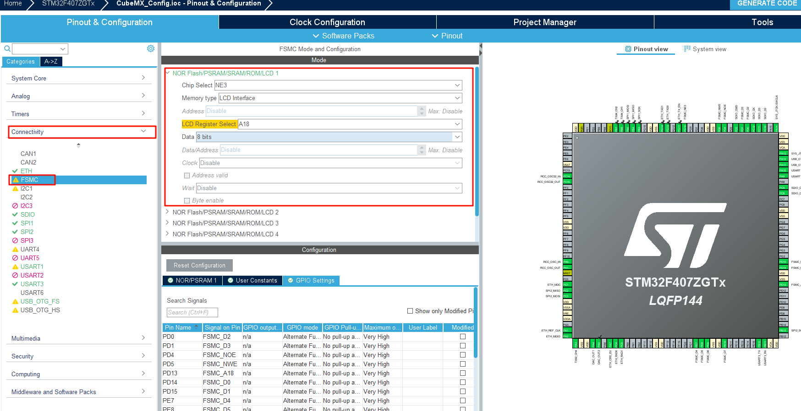
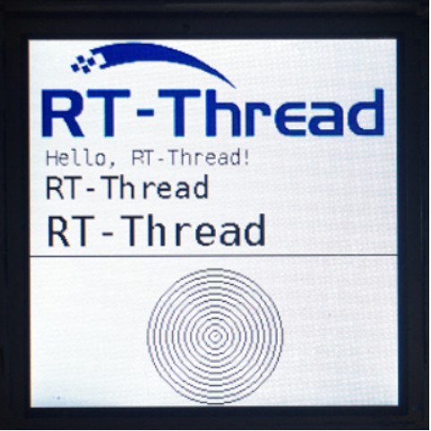

# LCD 显示
## 基于Spark项目  LCD上显示文字和图片。
> 星火 1 号开发板板载的是一块 1.3 寸，分辨率为 240x240 的 LCD 显示屏，显示效果十分细腻。显示屏的驱动芯片是 ST7789 v3, 通信接口使用的是 8080 并口，通过 fsmc 模拟出驱动时序和单片机进行通讯。使用了 8 根数据线传输数据，一根地址选择线作为芯片的使能信号。  
  
### 1.创建工程
  
### 2.打开RTT_Settings 进行配置 打开LCD 以及PWM   
  
### 3.CubeMX配置FSMC PWM
  
  
  
  
### 4.创建LCD示例工程
  
### 5.将示例工程中的main和rttlogo移动到自己工程中
  
### 6.编译下载
  
### 7.项目结果
  
