# UART设备
## 1.UART介绍
> UART（Universal Asynchronous Receiver/Transmitter）通用异步收发传输器，UART 作为异步串口通信协议的一种，工作原理是将传输数据的每个字符一位接一位地传输。是在应用程序开发过程中使用频率最高的数据总线。
UART 串口的特点是将数据一位一位地顺序传送，只要 2 根传输线就可以实现双向通信，一根线发送数据的同时用另一根线接收数据。UART 串口通信有几个重要的参数，分别是波特率、起始位、数据位、停止位和奇偶检验位，对于两个使用 UART 串口通信的端口，这些参数必须匹配，否则通信将无法正常完成。UART 串口传输的数据格式如下图所示：
>     
**起始位**：表示数据传输的开始，电平逻辑为 “0” 。  
**数据位**：可能值有 5、6、7、8、9，表示传输这几个 bit 位数据。一般取值为 8，因为一个 ASCII 字符值为 8 位。  
**奇偶校验位**：用于接收方对接收到的数据进行校验，校验 “1” 的位数为偶数(偶校验)或奇数(奇校验)，以此来校验数据传送的正确性，使用时不需要此位也可以。  
**停止位**： 表示一帧数据的结束。电平逻辑为 “1”。  
**波特率**：串口通信时的速率，它用单位时间内传输的二进制代码的有效位(bit)数来表示，其单位为每秒比特数 bit/s(bps)。常见的波特率值有 4800、9600、14400、38400、115200等，数值越大数据传输的越快，波特率为 115200 表示每秒钟传输 115200 位数据。  
## 2. 基于Spark项目 UART 中断接收及轮询发送 使用
### 2.1创建项目
> 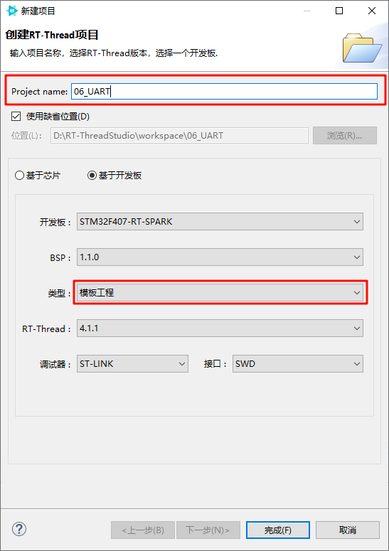
### 2.2打开RTT_Settings 进行配置
> 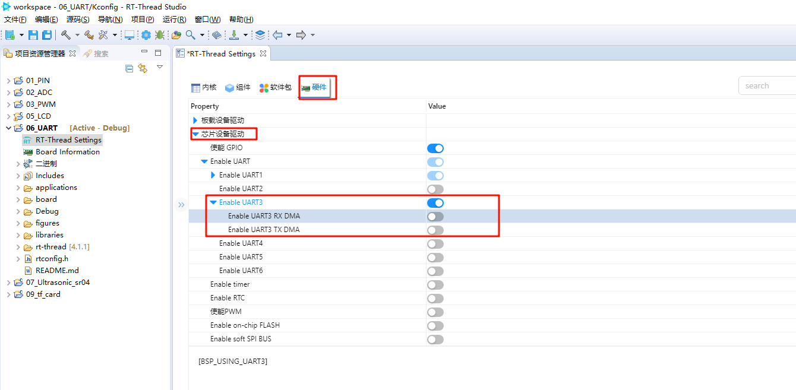 
### 2.3CubeMX配置
> 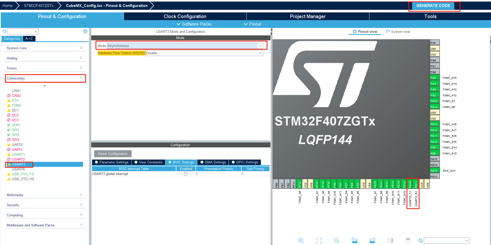
> 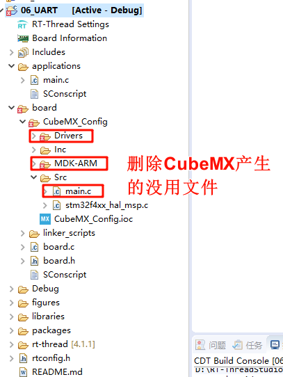
> 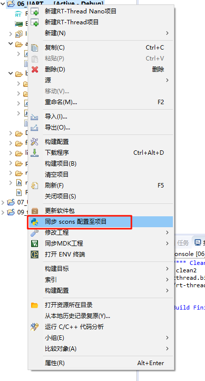
### 2.4注释main函数 编写新的UART代码
> 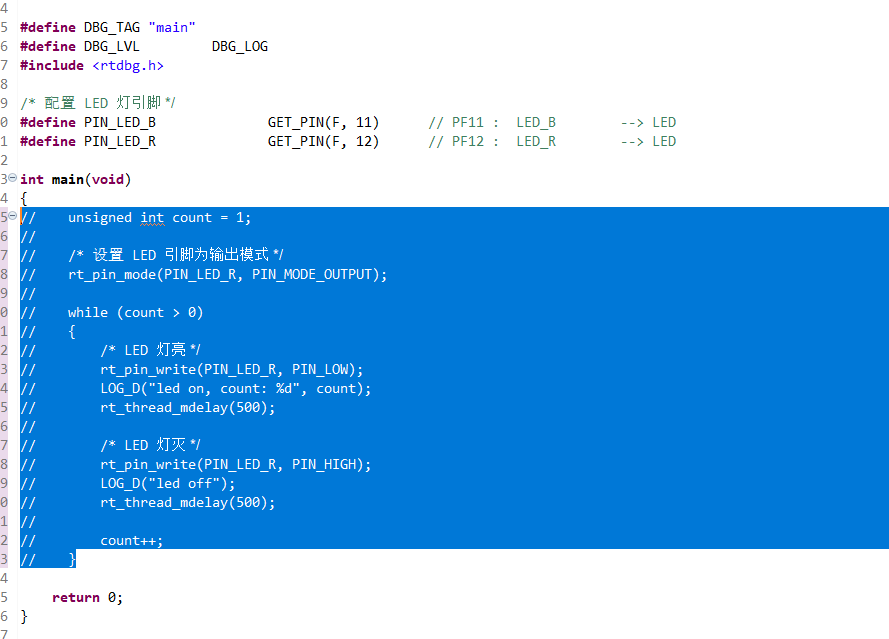
> 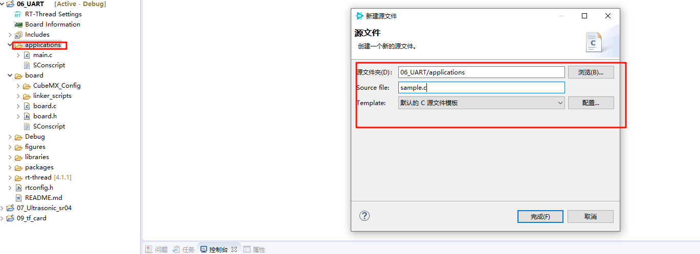
```c
/*
 * 程序清单：这是一个 串口 设备使用例程
 * 例程导出了 uart_sample 命令到控制终端
 * 命令调用格式：uart_sample uart3
 * 命令解释：命令第二个参数是要使用的串口设备名称，为空则使用默认的串口设备
 * 程序功能：通过串口输出字符串"hello RT-Thread!"，然后错位输出输入的字符
*/

#include <rtthread.h>

#define SAMPLE_UART_NAME       "uart3"

/* 用于接收消息的信号量 */
static struct rt_semaphore rx_sem;
static rt_device_t serial;

/* 接收数据回调函数 */
static rt_err_t uart_input(rt_device_t dev, rt_size_t size)
{
    /* 串口接收到数据后产生中断，调用此回调函数，然后发送接收信号量 */
    rt_sem_release(&rx_sem);

    return RT_EOK;
}

static void serial_thread_entry(void *parameter)
{
    char ch;

    while (1)
    {
        /* 从串口读取一个字节的数据，没有读取到则等待接收信号量 */
        while (rt_device_read(serial, -1, &ch, 1) != 1)
        {
            /* 阻塞等待接收信号量，等到信号量后再次读取数据 */
            rt_sem_take(&rx_sem, RT_WAITING_FOREVER);
        }
        /* 读取到的数据通过串口错位输出 */
        ch = ch + 1;
        rt_device_write(serial, 0, &ch, 1);
    }
}

static int uart_sample(int argc, char *argv[])
{
    rt_err_t ret = RT_EOK;
    char uart_name[RT_NAME_MAX];
    char str[] = "hello RT-Thread!\r\n";

    if (argc == 2)
    {
        rt_strncpy(uart_name, argv[1], RT_NAME_MAX);
    }
    else
    {
        rt_strncpy(uart_name, SAMPLE_UART_NAME, RT_NAME_MAX);
    }

    /* 查找系统中的串口设备 */
    serial = rt_device_find(uart_name);
    if (!serial)
    {
        rt_kprintf("find %s failed!\n", uart_name);
        return RT_ERROR;
    }

    /* 初始化信号量 */
    rt_sem_init(&rx_sem, "rx_sem", 0, RT_IPC_FLAG_FIFO);
    /* 以中断接收及轮询发送模式打开串口设备 */
    rt_device_open(serial, RT_DEVICE_FLAG_INT_RX);
    /* 设置接收回调函数 */
    rt_device_set_rx_indicate(serial, uart_input);
    /* 发送字符串 */
    rt_device_write(serial, 0, str, (sizeof(str) - 1));

    /* 创建 serial 线程 */
    rt_thread_t thread = rt_thread_create("serial", serial_thread_entry, RT_NULL, 1024, 25, 10);
    /* 创建成功则启动线程 */
    if (thread != RT_NULL)
    {
        rt_thread_startup(thread);
    }
    else
    {
        ret = RT_ERROR;
    }

    return ret;
}
/* 导出到 msh 命令列表中 */
MSH_CMD_EXPORT(uart_sample, uart device sample);
```
## 3.编译下载
> 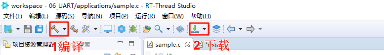
## 4.运行测试
> 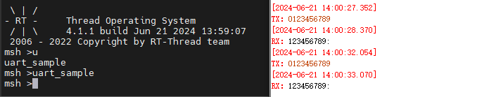
## 5. 基于Spark项目 UART DMA接收及轮询发送 使用
### 5.1创建项目
> 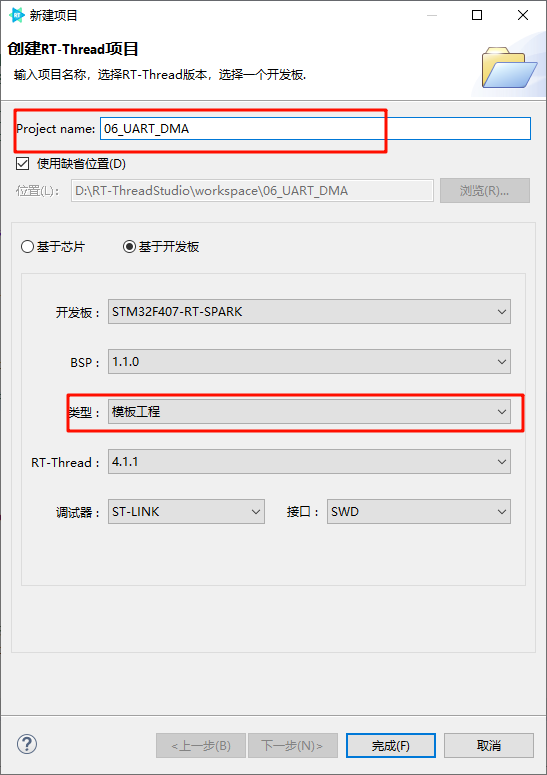
### 5.2打开RTT_Settings 进行配置
> 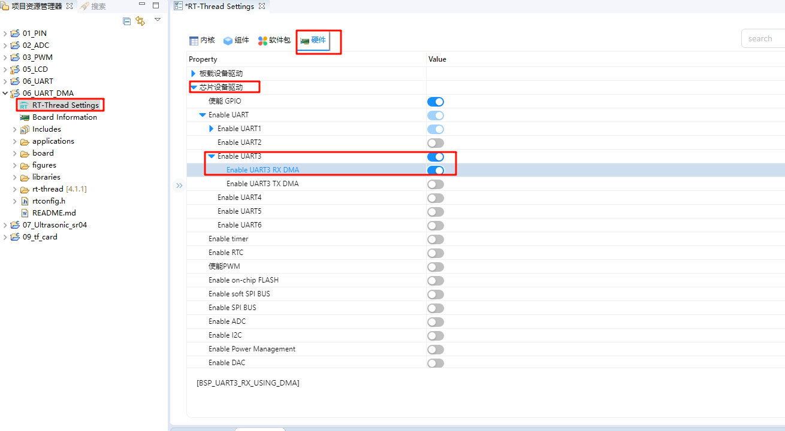 
### 5.3CubeMX配置
> 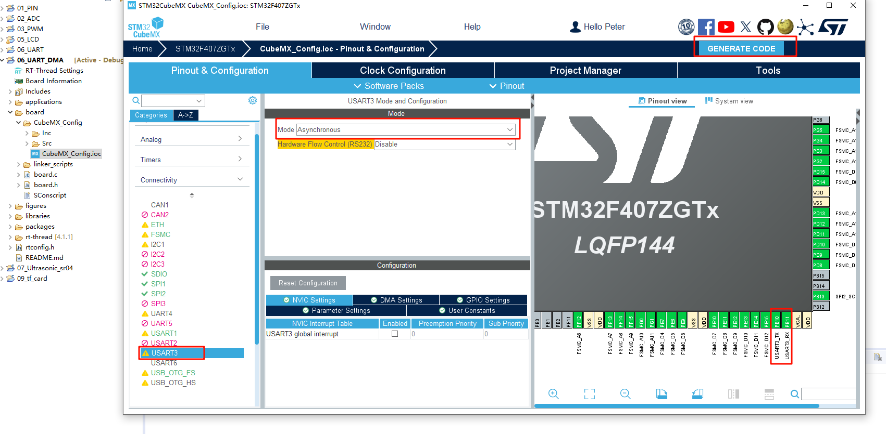
> 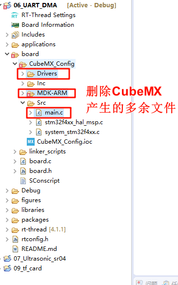
### 5.4注释main函数 编写新的UART代码
> 
> 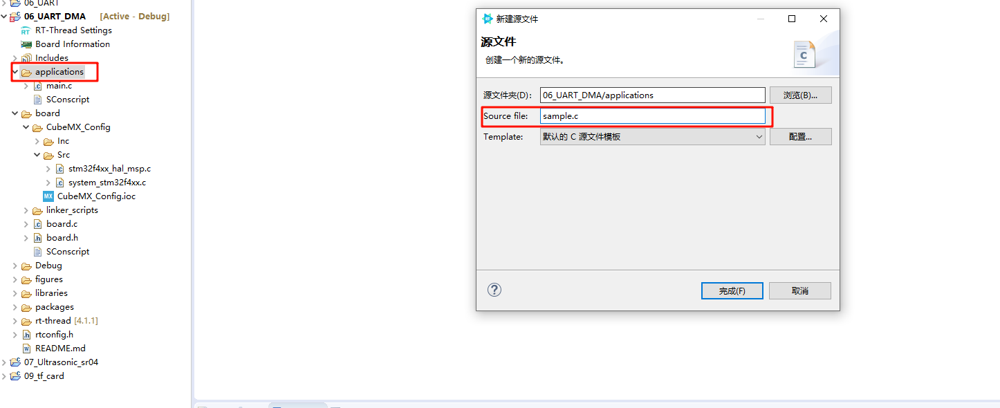
```c
/*
 * 程序清单：这是一个串口设备 DMA 接收使用例程
 * 例程导出了 uart_dma_sample 命令到控制终端
 * 命令调用格式：uart_dma_sample uart3
 * 命令解释：命令第二个参数是要使用的串口设备名称，为空则使用默认的串口设备
 * 程序功能：通过串口输出字符串"hello RT-Thread!"，并通过串口输出接收到的数据，然后打印接收到的数据。
*/

#include <rtthread.h>

#define SAMPLE_UART_NAME       "uart3"      /* 串口设备名称 */

/* 串口接收消息结构*/
struct rx_msg
{
    rt_device_t dev;
    rt_size_t size;
};
/* 串口设备句柄 */
static rt_device_t serial;
/* 消息队列控制块 */
static struct rt_messagequeue rx_mq;

/* 接收数据回调函数 */
static rt_err_t uart_input(rt_device_t dev, rt_size_t size)
{
    struct rx_msg msg;
    rt_err_t result;
    msg.dev = dev;
    msg.size = size;

    result = rt_mq_send(&rx_mq, &msg, sizeof(msg));
    if ( result == -RT_EFULL)
    {
        /* 消息队列满 */
        rt_kprintf("message queue full！\n");
    }
    return result;
}

static void serial_thread_entry(void *parameter)
{
    struct rx_msg msg;
    rt_err_t result;
    rt_uint32_t rx_length;
    static char rx_buffer[RT_SERIAL_RB_BUFSZ + 1];

    while (1)
    {
        rt_memset(&msg, 0, sizeof(msg));
        /* 从消息队列中读取消息*/
        result = rt_mq_recv(&rx_mq, &msg, sizeof(msg), RT_WAITING_FOREVER);
        if (result == RT_EOK)
        {
            /* 从串口读取数据*/
            rx_length = rt_device_read(msg.dev, 0, rx_buffer, msg.size);
            rx_buffer[rx_length] = '\0';
            /* 通过串口设备 serial 输出读取到的消息 */
            rt_device_write(serial, 0, rx_buffer, rx_length);
            /* 打印数据 */
            rt_kprintf("%s\n",rx_buffer);
        }
    }
}

static int uart_dma_sample(int argc, char *argv[])
{
    rt_err_t ret = RT_EOK;
    char uart_name[RT_NAME_MAX];
    static char msg_pool[256];
    char str[] = "hello RT-Thread!\r\n";

    if (argc == 2)
    {
        rt_strncpy(uart_name, argv[1], RT_NAME_MAX);
    }
    else
    {
        rt_strncpy(uart_name, SAMPLE_UART_NAME, RT_NAME_MAX);
    }

    /* 查找串口设备 */
    serial = rt_device_find(uart_name);
    if (!serial)
    {
        rt_kprintf("find %s failed!\n", uart_name);
        return RT_ERROR;
    }

    /* 初始化消息队列 */
    rt_mq_init(&rx_mq, "rx_mq",
               msg_pool,                 /* 存放消息的缓冲区 */
               sizeof(struct rx_msg),    /* 一条消息的最大长度 */
               sizeof(msg_pool),         /* 存放消息的缓冲区大小 */
               RT_IPC_FLAG_FIFO);        /* 如果有多个线程等待，按照先来先得到的方法分配消息 */

    /* 以 DMA 接收及轮询发送方式打开串口设备 */
    rt_device_open(serial, RT_DEVICE_FLAG_DMA_RX);
    /* 设置接收回调函数 */
    rt_device_set_rx_indicate(serial, uart_input);
    /* 发送字符串 */
    rt_device_write(serial, 0, str, (sizeof(str) - 1));

    /* 创建 serial 线程 */
    rt_thread_t thread = rt_thread_create("serial", serial_thread_entry, RT_NULL, 1024, 25, 10);
    /* 创建成功则启动线程 */
    if (thread != RT_NULL)
    {
        rt_thread_startup(thread);
    }
    else
    {
        ret = RT_ERROR;
    }

    return ret;
}
/* 导出到 msh 命令列表中 */
MSH_CMD_EXPORT(uart_dma_sample, uart device dma sample);
```
### 5.35修改驱动库中 DMA的小BUG
>  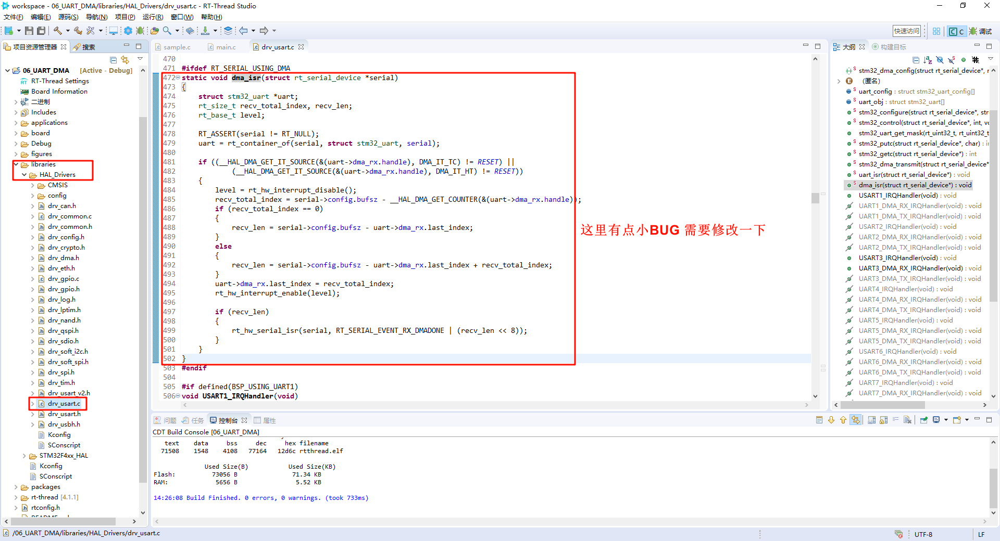
```c
static void dma_isr(struct rt_serial_device *serial)
{
    struct stm32_uart *uart;
    rt_size_t recv_total_index, recv_len;
    rt_base_t level;

    RT_ASSERT(serial != RT_NULL);
    uart = rt_container_of(serial, struct stm32_uart, serial);

    if ((__HAL_DMA_GET_IT_SOURCE(&(uart->dma_rx.handle), DMA_IT_TC) != RESET) ||
            (__HAL_DMA_GET_IT_SOURCE(&(uart->dma_rx.handle), DMA_IT_HT) != RESET))
    {
        level = rt_hw_interrupt_disable();
        recv_total_index = serial->config.bufsz - __HAL_DMA_GET_COUNTER(&(uart->dma_rx.handle));
        if (recv_total_index == 0)
        {
            recv_len = serial->config.bufsz - uart->dma_rx.last_index;
        }
        else
        {
            if(recv_total_index>uart->dma_rx.last_index)
            {
                recv_len = recv_total_index - uart->dma_rx.last_index;
            }
            else
            {
                recv_len = serial->config.bufsz - uart->dma_rx.last_index + recv_total_index;
            }
        }
        uart->dma_rx.last_index = recv_total_index;
        rt_hw_interrupt_enable(level);

        if (recv_len)
        {
            rt_hw_serial_isr(serial, RT_SERIAL_EVENT_RX_DMADONE | (recv_len << 8));
        }
    }
}
```
## 6.编译下载
> 
## 7.运行测试
> 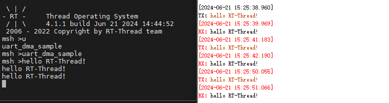
