# 07_Ultrasonic_sr04 超声波测距
## 1. 超声波模块
### 1.1超声波模块介绍
> 超声波模块是现实生活中常见的模块，该HC-SR04模块可以提供2cm-400cm的非接触式距离感测功能，测量精度可以达到3mm。该模块包含超声波发射器、接收器与控制电路。  
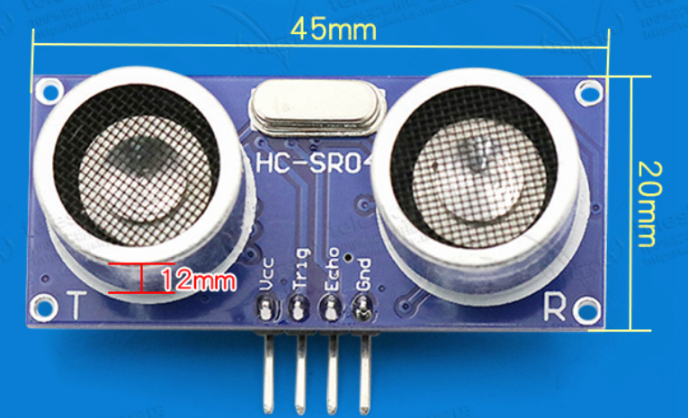
### 1.2超声波模块原理
> 1. 采用 IO 口 TRIG 触发测距，给最少 10us 的高电平信呈。
> 2. 模块自动发送 8 个 40khz 的方波，自动检测是否有信号返回；
> 3. 有信号返回，通过 IO 口 ECHO 输出一个高电平，高电平持续的时间就是超声
波从发射到返回的时间。测试距离=(高电平时间*声速(340M/S))/2;
### 1.3接线图
> 通过杜邦线将超声波模块接于PMOD1接口，Trig引脚对应PA5，Echo引脚对应PA6。  
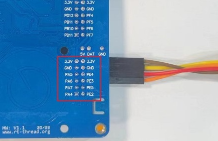
## 2. 基于Spark项目 超声波测距并输出结果
### 2.1创建工程
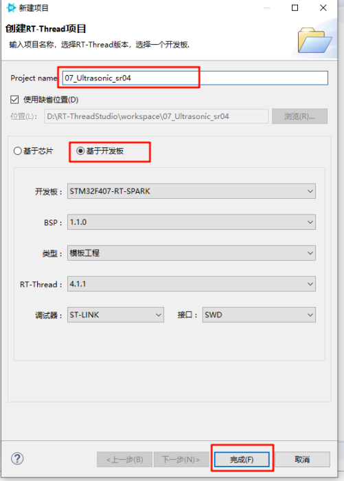
### 2.2打开RTT_Settings 进行配置
> 2.2.1 由于本次项目运用到了定时器3,但BSP没有将定时器3添加到RTT_Settings，我们需要手动通过Kconfig将定时器3添加到RTT_Settings  
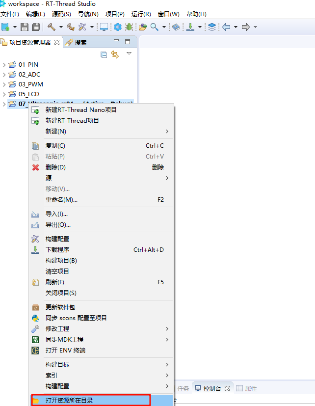  
2.2.2 找到Kconfig文件并用记事本打开  
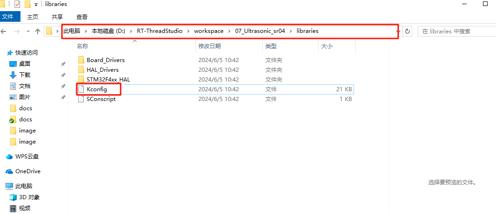 
2.2.3 找到定时器相关的配置文件  
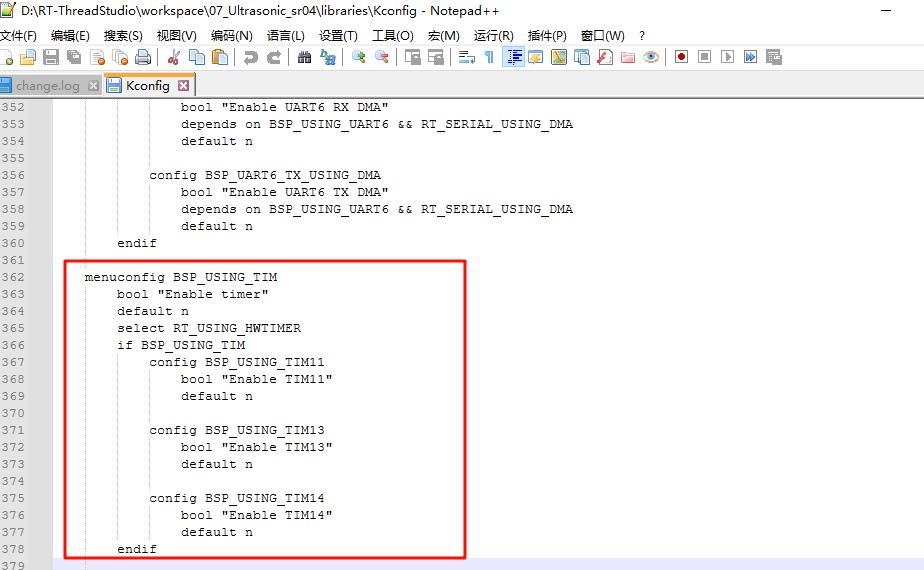 
2.3.4 添加定时器3保存并关闭  
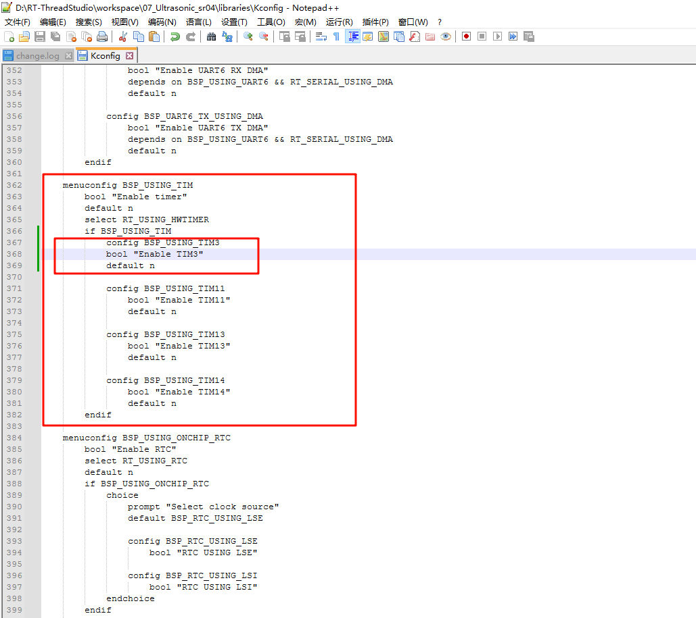 
2.2.4 打开RTT_Settings将定时器3打开 保存并关闭
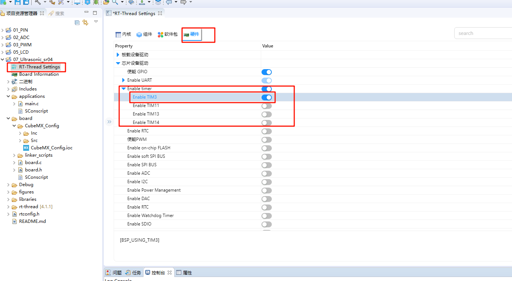
### 2.3CubeMX配置
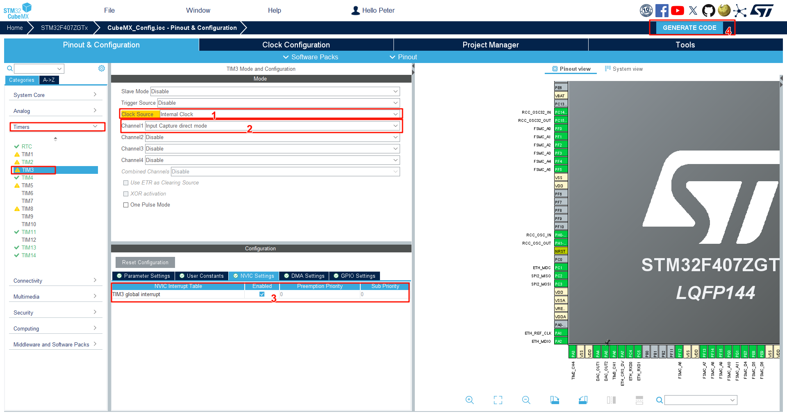
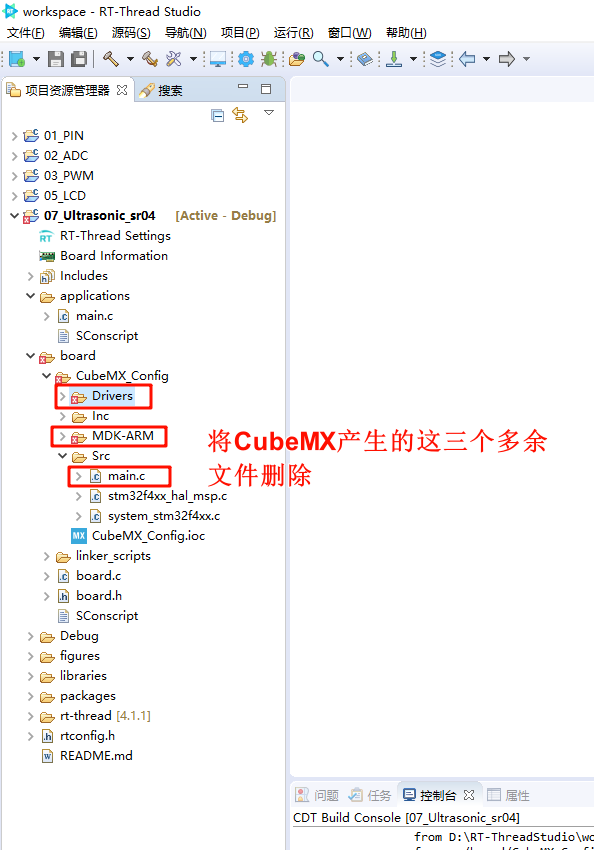
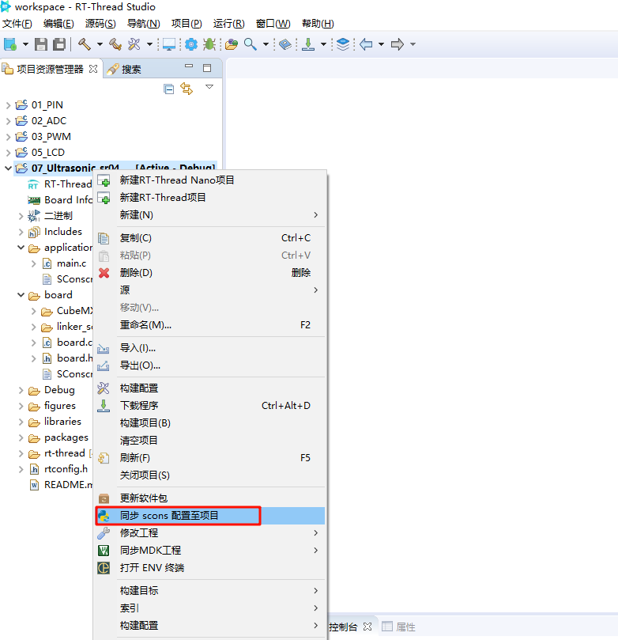
### 2.4注释main函数 编写新的Ultrasonic_sr04 超声波测距程序
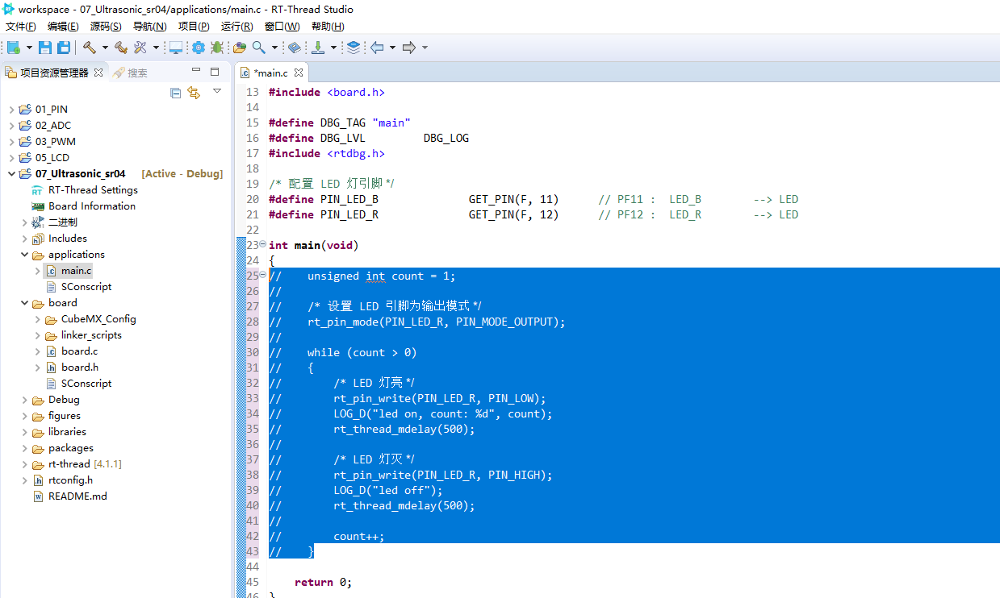
编写Ultrasonic_sr04 超声波测距程序
```C
#include <stdio.h>
#include <board.h>
#include <rtthread.h>
#include <rtdevice.h>

#define PIN_LED_B GET_PIN(F, 12)
#define PIN_TRIG GET_PIN(A, 5)

TIM_HandleTypeDef htim3;
static rt_sem_t ultrasonic_sem = RT_NULL;
static void MX_TIM3_Init(void)
{
    __HAL_RCC_GPIOA_CLK_ENABLE();

    TIM_ClockConfigTypeDef sClockSourceConfig = {0};
    TIM_MasterConfigTypeDef sMasterConfig = {0};
    TIM_IC_InitTypeDef sConfigIC = {0};

    htim3.Instance = TIM3;
    htim3.Init.Prescaler = 83;
    htim3.Init.CounterMode = TIM_COUNTERMODE_UP;
    htim3.Init.Period = 65535;
    htim3.Init.ClockDivision = TIM_CLOCKDIVISION_DIV1;
    htim3.Init.AutoReloadPreload = TIM_AUTORELOAD_PRELOAD_DISABLE;
    if (HAL_TIM_Base_Init(&htim3) != HAL_OK)
    {
        Error_Handler();
    }
    sClockSourceConfig.ClockSource = TIM_CLOCKSOURCE_INTERNAL;
    if (HAL_TIM_ConfigClockSource(&htim3, &sClockSourceConfig) != HAL_OK)
    {
        Error_Handler();
    }
    if (HAL_TIM_IC_Init(&htim3) != HAL_OK)
    {
        Error_Handler();
    }
    sMasterConfig.MasterOutputTrigger = TIM_TRGO_RESET;
    sMasterConfig.MasterSlaveMode = TIM_MASTERSLAVEMODE_DISABLE;
    if (HAL_TIMEx_MasterConfigSynchronization(&htim3, &sMasterConfig) != HAL_OK)
    {
        Error_Handler();
    }
    sConfigIC.ICPolarity = TIM_INPUTCHANNELPOLARITY_RISING;
    sConfigIC.ICSelection = TIM_ICSELECTION_DIRECTTI;
    sConfigIC.ICPrescaler = TIM_ICPSC_DIV1;
    sConfigIC.ICFilter = 0;
    if (HAL_TIM_IC_ConfigChannel(&htim3, &sConfigIC, TIM_CHANNEL_1) != HAL_OK)
    {
        Error_Handler();
    }
    HAL_TIM_Base_Start_IT(&htim3);              // 打开定时器中断
    HAL_TIM_IC_Start_IT(&htim3, TIM_CHANNEL_1); // 打开输入捕获
}

int SR04_int(void)
{
    rt_pin_mode(PIN_LED_B, PIN_MODE_OUTPUT);
    rt_pin_mode(PIN_TRIG, PIN_MODE_OUTPUT);
    rt_pin_write(PIN_LED_B, PIN_HIGH);
    rt_pin_write(PIN_TRIG, PIN_LOW);
    MX_TIM3_Init();
    ultrasonic_sem = rt_sem_create("usem", 0, RT_IPC_FLAG_PRIO);
    if (ultrasonic_sem == RT_NULL)
    {
        rt_kprintf("create ultrasonic semaphore failed.\n");
    }
    return 0;
}
INIT_APP_EXPORT(SR04_int);

uint8_t TIM3_CH1_Edge = 0; // 状态变化时，计数值
uint32_t TIM3_CH1_VAL = 0; // 储存计数器的记录值
uint32_t time;             // 高电平持续时间
float distance;            // 计数器溢出的个数

void HAL_TIM_IC_CaptureCallback(TIM_HandleTypeDef *htim)
{
    if (htim->Instance == TIM3)
    {
        if (TIM3_CH1_Edge == 0) // 打开输入捕获
        {
            TIM3_CH1_Edge++;                                                              // 进入捕获下降沿状态
            __HAL_TIM_SET_CAPTUREPOLARITY(&htim3, TIM_CHANNEL_1, TIM_ICPOLARITY_FALLING); // 设置捕获极性为下降沿
            __HAL_TIM_SET_COUNTER(&htim3, 0);                                             // 设置定时器CNT计数器的值为0
        }
        else // 关闭定时器3
        {
            HAL_TIM_IC_Stop_IT(&htim3, TIM_CHANNEL_1);                                   // 关闭定时器3
            TIM3_CH1_Edge++;                                                             // 进入到主函数状态
            TIM3_CH1_VAL = HAL_TIM_ReadCapturedValue(&htim3, TIM_CHANNEL_1);             // 读取捕获通道的值
            __HAL_TIM_SET_CAPTUREPOLARITY(&htim3, TIM_CHANNEL_1, TIM_ICPOLARITY_RISING); // 设置捕获极性为上降沿
        }
    }
}

void thread_entry(void *parameter)
{
    while (1)
    {
        rt_pin_write(PIN_TRIG, PIN_HIGH);
        rt_hw_us_delay(10);
        rt_pin_write(PIN_TRIG, PIN_LOW);

        rt_pin_write(PIN_LED_B, PIN_HIGH);
        rt_thread_delay(100);
        rt_pin_write(PIN_LED_B, PIN_LOW);
        rt_thread_delay(100);

        if (TIM3_CH1_Edge == 2)
        {
            TIM3_CH1_Edge = 0; // 复位状态计数值
            time = TIM3_CH1_VAL;
            distance = time * 342.62 / 2 / 10000; // distance=t*c/2 （c为室温在20摄氏度时声速）
            if (distance > 450)
                distance = 450;
            printf("The high leval last %u us    The distance=%.2f cm\r\n", time, distance);
            HAL_TIM_IC_Start_IT(&htim3, TIM_CHANNEL_1); // 打开输入捕获
        }
        else
        {
            rt_kprintf("The ultrasonic module is not connected or connected incorrectly.\r\n");
            rt_thread_delay(5000);
        }
        if (rt_sem_take(ultrasonic_sem, 5) == RT_EOK)
        {
            break;
        }
    }
}

void ultrasonic(int argc, char **argv)
{
    static rt_thread_t tid = RT_NULL;
    if (argc < 2)
    {
        rt_kprintf("Please input'ultrasonic <run|pause>'\n");
        return;
    }
    if (!rt_strcmp(argv[1], "run"))
    {
        if (!tid)
        {
            tid = rt_thread_create("ultrasonic",
                                   thread_entry, (void *)1,
                                   1024,
                                   25, 10);
            if (tid != RT_NULL)
                rt_thread_startup(tid);
        }
        else
        {
            rt_kprintf("ultrasonic is running!'\n");
        }
    }
    else if (!rt_strcmp(argv[1], "pause"))
    {
        rt_sem_release(ultrasonic_sem);
        tid = NULL;
    }
    else
    {
        rt_kprintf("Please input'ultrasonic <run|pause>'\n");
    }

}
MSH_CMD_EXPORT(ultrasonic, Test ultrasonic_ranging)
```
## 3.编译下载
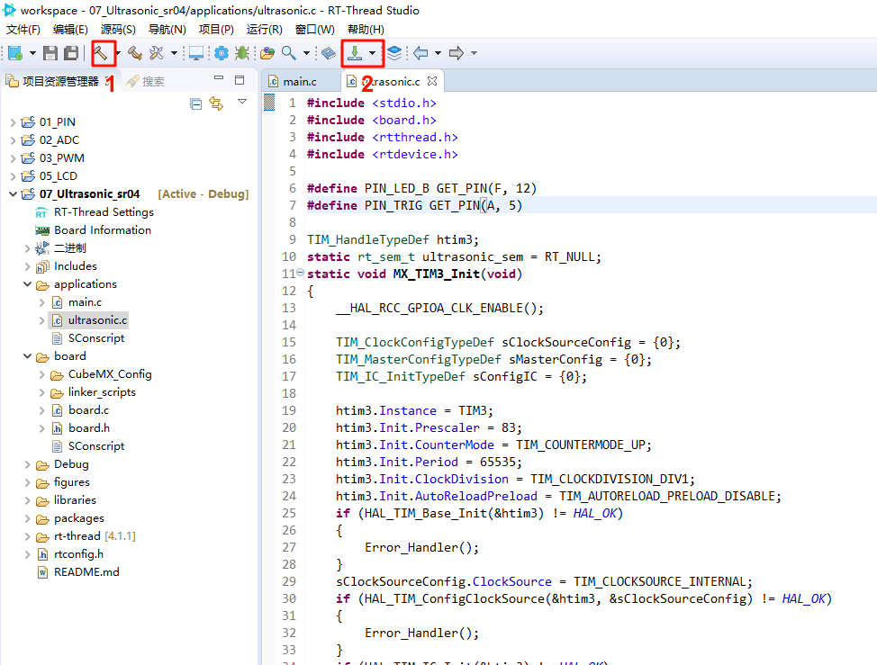
## 4.运行测试
