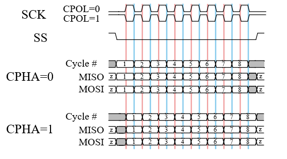

# SPI设备
## 1.SPI介绍
> SPI（Serial Peripheral Interface，串行外设接口）是一种高速、全双工、同步通信总线，常用于短距离通讯，主要应用于 EEPROM、FLASH、实时时钟、AD 转换器、还有数字信号处理器和数字信号解码器之间。SPI 一般使用 4 根线通信，如下图所示：
>    
MOSI –主机输出 / 从机输入数据线（SPI Bus Master Output/Slave Input）。  
MISO –主机输入 / 从机输出数据线（SPI Bus Master Input/Slave Output）。  
SCLK –串行时钟线（Serial Clock），主设备输出时钟信号至从设备。  
CS –从设备选择线 (Chip select)。也叫 SS、CSB、CSN、EN 等，主设备输出片选信号至从设备。 
SPI 以主从方式工作，通常有一个主设备和一个或多个从设备。通信由主设备发起，主设备通过 CS 选择要通信的从设备，然后通过 SCLK 给从设备提供时钟信号，数据通过 MOSI 输出给从设备，同时通过 MISO 接收从设备发送的数据。  
如下图所示芯片有 2 个 SPI 控制器，SPI 控制器对应 SPI 主设备，每个 SPI 控制器可以连接多个 SPI 从设备。挂载在同一个 SPI 控制器上的从设备共享 3 个信号引脚：SCK、MISO、MOSI，但每个从设备的 CS 引脚是独立的。   
>    
主设备通过控制 CS 引脚对从设备进行片选，一般为低电平有效。任何时刻，一个 SPI 主设备上只有一个 CS 引脚处于有效状态，与该有效 CS 引脚连接的从设备此时可以与主设备通信。  
从设备的时钟由主设备通过 SCLK 提供，MOSI、MISO 则基于此脉冲完成数据传输。SPI 的工作时序模式由 CPOL（Clock Polarity，时钟极性）和 CPHA（Clock Phase，时钟相位）之间的相位关系决定，CPOL 表示时钟信号的初始电平的状态，CPOL 为 0 表示时钟信号初始状态为低电平，为 1 表示时钟信号的初始电平是高电平。CPHA 表示在哪个时钟沿采样数据，CPHA 为 0 表示在首个时钟变化沿采样数据，而 CPHA 为 1 则表示在第二个时钟变化沿采样数据。根据 CPOL 和 CPHA 的不同组合共有 4 种工作时序模式：①CPOL=0，CPHA=0、②CPOL=0，CPHA=1、③CPOL=1，CPHA=0、④CPOL=1，CPHA=1。如下图所示：  
>    
QSPI: QSPI 是 Queued SPI 的简写，是 Motorola 公司推出的 SPI 接口的扩展，比 SPI 应用更加广泛。在 SPI 协议的基础上，Motorola 公司对其功能进行了增强，增加了队列传输机制，推出了队列串行外围接口协议（即 QSPI 协议）。使用该接口，用户可以一次性传输包含多达 16 个 8 位或 16 位数据的传输队列。一旦传输启动，直到传输结束，都不需要 CPU 干预，极大的提高了传输效率。与 SPI 相比，QSPI 的最大结构特点是以 80 字节的 RAM 代替了 SPI 的发送和接收数据寄存器。  
Dual SPI Flash: 对于 SPI Flash 而言全双工并不常用，可以发送一个命令字节进入 Dual 模式，让它工作在半双工模式，用以加倍数据传输。这样 MOSI 变成 SIO0（serial io 0），MISO 变成 SIO1（serial io 1）,这样一个时钟周期内就能传输 2 个 bit 数据，加倍了数据传输。  
Quad SPI Flash: 与 Dual SPI 类似，Quad SPI Flash增加了两根 I/O 线（SIO2,SIO3），目的是一个时钟内传输 4 个 bit 数据。  
所以对于 SPI Flash，有标准 SPI Flash，Dual SPI Flash, Quad SPI Flash 三种类型。在相同时钟下，线数越多传输速率越高。  
## 2. 基于Spark项目 SPI读取BMP280温度压力数据
### 2.1创建项目
>   
### 2.2打开RTT_Settings 进行配置  
>    
>后续需要输出浮点型 需要打开浮点数支持
>  
### 2.3CubeMX配置
>    
>    
>    
### 2.4注释main函数 编写新的SPI读取BMP280温度压力数据代码
```c
/**
 * Copyright (c) 2015 - present LibDriver All rights reserved
 * 
 * The MIT License (MIT)
 *
 * Permission is hereby granted, free of charge, to any person obtaining a copy
 * of this software and associated documentation files (the "Software"), to deal
 * in the Software without restriction, including without limitation the rights
 * to use, copy, modify, merge, publish, distribute, sublicense, and/or sell
 * copies of the Software, and to permit persons to whom the Software is
 * furnished to do so, subject to the following conditions:
 *
 * The above copyright notice and this permission notice shall be included in all
 * copies or substantial portions of the Software.
 *
 * THE SOFTWARE IS PROVIDED "AS IS", WITHOUT WARRANTY OF ANY KIND, EXPRESS OR
 * IMPLIED, INCLUDING BUT NOT LIMITED TO THE WARRANTIES OF MERCHANTABILITY,
 * FITNESS FOR A PARTICULAR PURPOSE AND NONINFRINGEMENT. IN NO EVENT SHALL THE
 * AUTHORS OR COPYRIGHT HOLDERS BE LIABLE FOR ANY CLAIM, DAMAGES OR OTHER
 * LIABILITY, WHETHER IN AN ACTION OF CONTRACT, TORT OR OTHERWISE, ARISING FROM,
 * OUT OF OR IN CONNECTION WITH THE SOFTWARE OR THE USE OR OTHER DEALINGS IN THE
 * SOFTWARE. 
 *
 * @file      driver_bmp280_interface_template.c
 * @brief     driver bmp280 interface template source file
 * @version   1.0.0
 * @author    Shifeng Li
 * @date      2024-01-15
 *
 * <h3>history</h3>
 * <table>
 * <tr><th>Date        <th>Version  <th>Author      <th>Description
 * <tr><td>2024/01/15  <td>1.0      <td>Shifeng Li  <td>first upload
 * </table>
 */

#include "driver_bmp280_interface.h"

static struct rt_spi_device *spi_bmp280 = RT_NULL;
#define bmp280_SPI_DEVICE_NAME "spi10"

/**
 * @brief  interface iic bus init
 * @return status code
 *         - 0 success
 *         - 1 iic init failed
 * @note   none
 */
uint8_t bmp280_interface_iic_init(void) {
    return 0;
}

/**
 * @brief  interface iic bus deinit
 * @return status code
 *         - 0 success
 *         - 1 iic deinit failed
 * @note   none
 */
uint8_t bmp280_interface_iic_deinit(void) {
    return 0;
}

/**
 * @brief      interface iic bus read
 * @param[in]  addr is the iic device write address
 * @param[in]  reg is the iic register address
 * @param[out] *buf points to a data buffer
 * @param[in]  len is the length of the data buffer
 * @return     status code
 *             - 0 success
 *             - 1 read failed
 * @note       none
 */
uint8_t bmp280_interface_iic_read(uint8_t addr, uint8_t reg, uint8_t *buf, uint16_t len) {
    return 0;
}

/**
 * @brief     interface iic bus write
 * @param[in] addr is the iic device write address
 * @param[in] reg is the iic register address
 * @param[in] *buf points to a data buffer
 * @param[in] len is the length of the data buffer
 * @return    status code
 *            - 0 success
 *            - 1 write failed
 * @note      none
 */
uint8_t bmp280_interface_iic_write(uint8_t addr, uint8_t reg, uint8_t *buf, uint16_t len) {
    return 0;
}

/**
 * @brief  interface spi bus init
 * @return status code
 *         - 0 success
 *         - 1 spi init failed
 * @note   none
 */
uint8_t bmp280_interface_spi_init(void) {
    static rt_bool_t initialnized = RT_FALSE;
    rt_err_t err;
    if (!initialnized) {
        initialnized = RT_TRUE;
        err = rt_hw_spi_device_attach("spi1", bmp280_SPI_DEVICE_NAME, GPIOA, GPIO_PIN_4);
        if (err) {
            rt_kprintf("attach device error\r\n");
            return err;
        }
    }
    spi_bmp280 = (struct rt_spi_device *) rt_device_find(bmp280_SPI_DEVICE_NAME);
    if (spi_bmp280 == RT_NULL) {
        rt_kprintf("find %s error\r\n", bmp280_SPI_DEVICE_NAME);
        return err;
    }
    struct rt_spi_configuration cfg = {
            .mode = RT_SPI_MASTER | RT_SPI_MODE_0 | RT_SPI_MSB,
            .data_width = 8,
            .max_hz = 1 * 1000 * 1000
    };
    err = rt_spi_configure(spi_bmp280, &cfg);
    if (err != RT_NULL) {
        rt_kprintf("spi configurate error\r\n");
        return err;
    }

    return 0;
}

/**
 * @brief  interface spi bus deinit
 * @return status code
 *         - 0 success
 *         - 1 spi deinit failed
 * @note   none
 */
uint8_t bmp280_interface_spi_deinit(void) {
    return 0;
}

/**
 * @brief      interface spi bus read
 * @param[in]  reg is the register address
 * @param[out] *buf points to a data buffer
 * @param[in]  len is the length of data buffer
 * @return     status code
 *             - 0 success
 *             - 1 read failed
 * @note       none
 */
uint8_t bmp280_interface_spi_read(uint8_t reg, uint8_t *buf, uint16_t len) {
    uint8_t send_buf[len + 1];
    uint8_t recv_buf[len + 1];

    // 初始化发送缓冲区
    send_buf[0] = reg;
    for (uint16_t i = 1; i < len + 1; i++) {
        send_buf[i] = 0xFF;  // 发送dummy字节
    }

    rt_spi_transfer(spi_bmp280, send_buf, recv_buf, len + 1);

    // 将接收到的数据复制到用户提供的缓冲区
    for (uint16_t i = 0; i < len; i++) {
        buf[i] = recv_buf[i + 1];
    }
    return 0;
}

/**
 * @brief     interface spi bus write
 * @param[in] reg is the register address
 * @param[in] *buf points to a data buffer
 * @param[in] len is the length of data buffer
 * @return    status code
 *            - 0 success
 *            - 1 write failed
 * @note      none
 */
uint8_t bmp280_interface_spi_write(uint8_t reg, uint8_t *buf, uint16_t len) {
    uint8_t send_buf[len + 1];

    // 初始化发送缓冲区
    send_buf[0] = reg;
    for (uint16_t i = 0; i < len; i++) {
        send_buf[i + 1] = buf[i];
    }
    rt_spi_send(spi_bmp280, send_buf, len + 1);

    return 0;
}

/**
 * @brief     interface delay ms
 * @param[in] ms
 * @note      none
 */
void bmp280_interface_delay_ms(uint32_t ms) {
    rt_thread_mdelay(ms);
}

/**
 * @brief     interface print format data
 * @param[in] fmt is the format data
 * @note      none
 */
void bmp280_interface_debug_print(const char *const fmt, ...) {
    return;
}
```
```c
/**
 * Copyright (c) 2015 - present LibDriver All rights reserved
 * 
 * The MIT License (MIT)
 *
 * Permission is hereby granted, free of charge, to any person obtaining a copy
 * of this software and associated documentation files (the "Software"), to deal
 * in the Software without restriction, including without limitation the rights
 * to use, copy, modify, merge, publish, distribute, sublicense, and/or sell
 * copies of the Software, and to permit persons to whom the Software is
 * furnished to do so, subject to the following conditions:
 *
 * The above copyright notice and this permission notice shall be included in all
 * copies or substantial portions of the Software.
 *
 * THE SOFTWARE IS PROVIDED "AS IS", WITHOUT WARRANTY OF ANY KIND, EXPRESS OR
 * IMPLIED, INCLUDING BUT NOT LIMITED TO THE WARRANTIES OF MERCHANTABILITY,
 * FITNESS FOR A PARTICULAR PURPOSE AND NONINFRINGEMENT. IN NO EVENT SHALL THE
 * AUTHORS OR COPYRIGHT HOLDERS BE LIABLE FOR ANY CLAIM, DAMAGES OR OTHER
 * LIABILITY, WHETHER IN AN ACTION OF CONTRACT, TORT OR OTHERWISE, ARISING FROM,
 * OUT OF OR IN CONNECTION WITH THE SOFTWARE OR THE USE OR OTHER DEALINGS IN THE
 * SOFTWARE. 
 *
 * @file      driver_bmp280_interface.h
 * @brief     driver bmp280 interface header file
 * @version   1.0.0
 * @author    Shifeng Li
 * @date      2024-01-15
 *
 * <h3>history</h3>
 * <table>
 * <tr><th>Date        <th>Version  <th>Author      <th>Description
 * <tr><td>2024/01/15  <td>1.0      <td>Shifeng Li  <td>first upload
 * </table>
 */

#ifndef DRIVER_BMP280_INTERFACE_H
#define DRIVER_BMP280_INTERFACE_H

#include "driver_bmp280.h"
#include <rtthread.h>
#include "drv_spi.h"

#ifdef __cplusplus
extern "C"{
#endif

/**
 * @defgroup bmp280_interface_driver bmp280 interface driver function
 * @brief    bmp280 interface driver modules
 * @ingroup  bmp280_driver
 * @{
 */

/**
 * @brief  interface iic bus init
 * @return status code
 *         - 0 success
 *         - 1 iic init failed
 * @note   none
 */
uint8_t bmp280_interface_iic_init(void);

/**
 * @brief  interface iic bus deinit
 * @return status code
 *         - 0 success
 *         - 1 iic deinit failed
 * @note   none
 */
uint8_t bmp280_interface_iic_deinit(void);

/**
 * @brief      interface iic bus read
 * @param[in]  addr is the iic device write address
 * @param[in]  reg is the iic register address
 * @param[out] *buf points to a data buffer
 * @param[in]  len is the length of the data buffer
 * @return     status code
 *             - 0 success
 *             - 1 read failed
 * @note       none
 */
uint8_t bmp280_interface_iic_read(uint8_t addr, uint8_t reg, uint8_t *buf, uint16_t len);

/**
 * @brief     interface iic bus write
 * @param[in] addr is the iic device write address
 * @param[in] reg is the iic register address
 * @param[in] *buf points to a data buffer
 * @param[in] len is the length of the data buffer
 * @return    status code
 *            - 0 success
 *            - 1 write failed
 * @note      none
 */
uint8_t bmp280_interface_iic_write(uint8_t addr, uint8_t reg, uint8_t *buf, uint16_t len);

/**
 * @brief  interface spi bus init
 * @return status code
 *         - 0 success
 *         - 1 spi init failed
 * @note   none
 */
uint8_t bmp280_interface_spi_init(void);

/**
 * @brief  interface spi bus deinit
 * @return status code
 *         - 0 success
 *         - 1 spi deinit failed
 * @note   none
 */
uint8_t bmp280_interface_spi_deinit(void);

/**
 * @brief      interface spi bus read
 * @param[in]  reg is the register address
 * @param[out] *buf points to a data buffer
 * @param[in]  len is the length of data buffer
 * @return     status code
 *             - 0 success
 *             - 1 read failed
 * @note       none
 */
uint8_t bmp280_interface_spi_read(uint8_t reg, uint8_t *buf, uint16_t len);

/**
 * @brief     interface spi bus write
 * @param[in] reg is the register address
 * @param[in] *buf points to a data buffer
 * @param[in] len is the length of data buffer
 * @return    status code
 *            - 0 success
 *            - 1 write failed
 * @note      none
 */
uint8_t bmp280_interface_spi_write(uint8_t reg, uint8_t *buf, uint16_t len);

/**
 * @brief     interface delay ms
 * @param[in] ms
 * @note      none
 */
void bmp280_interface_delay_ms(uint32_t ms);

/**
 * @brief     interface print format data
 * @param[in] fmt is the format data
 * @note      none
 */
void bmp280_interface_debug_print(const char *const fmt, ...);

/**
 * @}
 */


#ifdef __cplusplus
}
#endif

#endif
```
```c
/**
 * Copyright (c) 2015 - present LibDriver All rights reserved
 *
 * The MIT License (MIT)
 *
 * Permission is hereby granted, free of charge, to any person obtaining a copy
 * of this software and associated documentation files (the "Software"), to deal
 * in the Software without restriction, including without limitation the rights
 * to use, copy, modify, merge, publish, distribute, sublicense, and/or sell
 * copies of the Software, and to permit persons to whom the Software is
 * furnished to do so, subject to the following conditions:
 *
 * The above copyright notice and this permission notice shall be included in all
 * copies or substantial portions of the Software.
 *
 * THE SOFTWARE IS PROVIDED "AS IS", WITHOUT WARRANTY OF ANY KIND, EXPRESS OR
 * IMPLIED, INCLUDING BUT NOT LIMITED TO THE WARRANTIES OF MERCHANTABILITY,
 * FITNESS FOR A PARTICULAR PURPOSE AND NONINFRINGEMENT. IN NO EVENT SHALL THE
 * AUTHORS OR COPYRIGHT HOLDERS BE LIABLE FOR ANY CLAIM, DAMAGES OR OTHER
 * LIABILITY, WHETHER IN AN ACTION OF CONTRACT, TORT OR OTHERWISE, ARISING FROM,
 * OUT OF OR IN CONNECTION WITH THE SOFTWARE OR THE USE OR OTHER DEALINGS IN THE
 * SOFTWARE.
 *
 * @file      driver_bmp280.c
 * @brief     driver bmp280 source file
 * @version   1.0.0
 * @author    Shifeng Li
 * @date      2024-01-15
 *
 * <h3>history</h3>
 * <table>
 * <tr><th>Date        <th>Version  <th>Author      <th>Description
 * <tr><td>2024/01/15  <td>1.0      <td>Shifeng Li  <td>first upload
 * </table>
 */

#include "driver_bmp280.h"

/**
 * @brief chip information definition
 */
#define CHIP_NAME                 "Bosch BMP280"        /**< chip name */
#define MANUFACTURER_NAME         "Bosch"               /**< manufacturer name */
#define SUPPLY_VOLTAGE_MIN        1.71f                 /**< chip min supply voltage */
#define SUPPLY_VOLTAGE_MAX        3.6f                  /**< chip max supply voltage */
#define MAX_CURRENT               1.12f                 /**< chip max current */
#define TEMPERATURE_MIN           -40.0f                /**< chip min operating temperature */
#define TEMPERATURE_MAX           85.0f                 /**< chip max operating temperature */
#define DRIVER_VERSION            1000                  /**< driver version */

/**
 * @brief chip register definition
 */
#define BMP280_REG_NVM_PAR_T1_L        0x88        /**< NVM PAR T1 low register */
#define BMP280_REG_NVM_PAR_T1_H        0x89        /**< NVM PAR T1 high register */
#define BMP280_REG_NVM_PAR_T2_L        0x8A        /**< NVM PAR T2 low register */
#define BMP280_REG_NVM_PAR_T2_H        0x8B        /**< NVM PAR T2 high register */
#define BMP280_REG_NVM_PAR_T3_L        0x8C        /**< NVM PAR T3 low register */
#define BMP280_REG_NVM_PAR_T3_H        0x8D        /**< NVM PAR T3 high register */
#define BMP280_REG_NVM_PAR_P1_L        0x8E        /**< NVM PAR P1 low register */
#define BMP280_REG_NVM_PAR_P1_H        0x8F        /**< NVM PAR P1 high register */
#define BMP280_REG_NVM_PAR_P2_L        0x90        /**< NVM PAR P2 low register */
#define BMP280_REG_NVM_PAR_P2_H        0x91        /**< NVM PAR P2 high register */
#define BMP280_REG_NVM_PAR_P3_L        0x92        /**< NVM PAR P3 low register */
#define BMP280_REG_NVM_PAR_P3_H        0x93        /**< NVM PAR P3 high register */
#define BMP280_REG_NVM_PAR_P4_L        0x94        /**< NVM PAR P4 low register */
#define BMP280_REG_NVM_PAR_P4_H        0x95        /**< NVM PAR P4 high register */
#define BMP280_REG_NVM_PAR_P5_L        0x96        /**< NVM PAR P5 low register */
#define BMP280_REG_NVM_PAR_P5_H        0x97        /**< NVM PAR P5 high register */
#define BMP280_REG_NVM_PAR_P6_L        0x98        /**< NVM PAR P6 low register */
#define BMP280_REG_NVM_PAR_P6_H        0x99        /**< NVM PAR P6 high register */
#define BMP280_REG_NVM_PAR_P7_L        0x9A        /**< NVM PAR P7 low register */
#define BMP280_REG_NVM_PAR_P7_H        0x9B        /**< NVM PAR P7 high register */
#define BMP280_REG_NVM_PAR_P8_L        0x9C        /**< NVM PAR P8 low register */
#define BMP280_REG_NVM_PAR_P8_H        0x9D        /**< NVM PAR P8 high register */
#define BMP280_REG_NVM_PAR_P9_L        0x9E        /**< NVM PAR P9 low register */
#define BMP280_REG_NVM_PAR_P9_H        0x9F        /**< NVM PAR P9 high register */
#define BMP280_REG_TEMP_XLSB           0xFC        /**< temp xlsb register */
#define BMP280_REG_TEMP_LSB            0xFB        /**< temp lsb register */
#define BMP280_REG_TEMP_MSB            0xFA        /**< temp msb register */
#define BMP280_REG_PRESS_XLSB          0xF9        /**< press xlsb register */
#define BMP280_REG_PRESS_LSB           0xF8        /**< press lsb register */
#define BMP280_REG_PRESS_MSB           0xF7        /**< press msb register */
#define BMP280_REG_CONFIG              0xF5        /**< config register */
#define BMP280_REG_CTRL_MEAS           0xF4        /**< ctrl meas register */
#define BMP280_REG_STATUS              0xF3        /**< status register */
#define BMP280_REG_RESET               0xE0        /**< soft reset register */
#define BMP280_REG_ID                  0xD0        /**< chip id register */

/**
 * @brief      read multiple bytes
 * @param[in]  *handle points to a bmp280 handle structure
 * @param[in]  reg is the register address
 * @param[out] *buf points to a data buffer
 * @param[in]  len is the data length
 * @return     status code
 *             - 0 success
 *             - 1 iic spi read failed
 * @note       none
 */
static uint8_t a_bmp280_iic_spi_read(bmp280_handle_t *handle, uint8_t reg, uint8_t *buf, uint16_t len)
{
    if (handle->iic_spi == BMP280_INTERFACE_IIC)                           /* iic interface */
    {
        if (handle->iic_read(handle->iic_addr, reg, buf, len) != 0)        /* iic read */
        {
            return 1;                                                      /* return error */
        }

        return 0;                                                          /* success return 0 */
    }
    else                                                                   /* spi interface */
    {
        reg |= 1 << 7;                                                     /* set read mode */
        if (handle->spi_read(reg, buf, len) != 0)                          /* spi read */
        {
            return 1;                                                      /* return error */
        }

        return 0;                                                          /* success return 0 */
    }
}

/**
 * @brief     write multiple bytes
 * @param[in] *handle points to a bmp280 handle structure
 * @param[in] reg is the register address
 * @param[in] *buf points to a data buffer
 * @param[in] len is the data length
 * @return    status code
 *            - 0 success
 *            - 1 iic spi write failed
 * @note      none
 */
static uint8_t a_bmp280_iic_spi_write(bmp280_handle_t *handle, uint8_t reg, uint8_t *buf, uint16_t len)
{
    if (handle->iic_spi == BMP280_INTERFACE_IIC)                           /* iic interface */
    {
        if (handle->iic_write(handle->iic_addr, reg, buf, len) != 0)       /* iic write */
        {
            return 1;                                                      /* return error */
        }

        return 0;                                                          /* success return 0 */
    }
    else                                                                   /* spi interface */
    {
        reg &= ~(1 << 7);                                                  /* write mode */
        if (handle->spi_write(reg, buf, len) != 0)                         /* spi write */
        {
            return 1;                                                      /* return error */
        }

        return 0;                                                          /* success return 0 */
    }
}

/**
 * @brief     get nvm calibration
 * @param[in] *handle points to a bmp280 handle structure
 * @return    status code
 *            - 0 success
 *            - 1 get calibration data failed
 * @note      none
 */
static uint8_t a_bmp280_get_nvm_calibration(bmp280_handle_t *handle)
{
    uint8_t buf[2];

    if (a_bmp280_iic_spi_read(handle, BMP280_REG_NVM_PAR_T1_L, (uint8_t *)buf, 2) != 0)        /* read t1 */
    {
        handle->debug_print("bmp280: get calibration data failed.\n");                         /* get calibration data failed */

        return 1;                                                                              /* return error */
    }
    handle->t1 = (uint16_t)buf[1] << 8 | buf[0];                                               /* set t1 */
    if (a_bmp280_iic_spi_read(handle, BMP280_REG_NVM_PAR_T2_L, (uint8_t *)buf, 2) != 0)        /* read t2 */
    {
        handle->debug_print("bmp280: get calibration data failed.\n");                         /* get calibration data failed */

        return 1;                                                                              /* return error */
    }
    handle->t2 = (int16_t)((uint16_t)buf[1] << 8 | buf[0]);                                    /* set t2 */
    if (a_bmp280_iic_spi_read(handle, BMP280_REG_NVM_PAR_T3_L, (uint8_t *)buf, 2) != 0)        /* read t3 */
    {
        handle->debug_print("bmp280: get calibration data failed.\n");                         /* get calibration data failed */

        return 1;                                                                              /* return error */
    }
    handle->t3 = (int16_t)((uint16_t)buf[1] << 8 | buf[0]);                                    /* set t3 */
    if (a_bmp280_iic_spi_read(handle, BMP280_REG_NVM_PAR_P1_L, (uint8_t *)buf, 2) != 0)        /* read p1 */
    {
        handle->debug_print("bmp280: get calibration data failed.\n");                         /* get calibration data failed */

        return 1;                                                                              /* return error */
    }
    handle->p1 = (uint16_t)buf[1] << 8 | buf[0];                                               /* set p1 */
    if (a_bmp280_iic_spi_read(handle, BMP280_REG_NVM_PAR_P2_L, (uint8_t *)buf, 2) != 0)        /* read p2 */
    {
        handle->debug_print("bmp280: get calibration data failed.\n");                         /* get calibration data failed */

        return 1;                                                                              /* return error */
    }
    handle->p2 = (int16_t)((uint16_t)buf[1] << 8 | buf[0]);                                    /* set p2 */
    if (a_bmp280_iic_spi_read(handle, BMP280_REG_NVM_PAR_P3_L, (uint8_t *)buf, 2) != 0)        /* read p3 */
    {
        handle->debug_print("bmp280: get calibration data failed.\n");                         /* get calibration data failed */

        return 1;                                                                              /* return error */
    }
    handle->p3 = (int16_t)((uint16_t)buf[1] << 8 | buf[0]);                                    /* set p3 */
    if (a_bmp280_iic_spi_read(handle, BMP280_REG_NVM_PAR_P4_L, (uint8_t *)buf, 2) != 0)        /* read p4 */
    {
        handle->debug_print("bmp280: get calibration data failed.\n");                         /* get calibration data failed */

        return 1;                                                                              /* return error */
    }
    handle->p4 = (int16_t)((uint16_t)buf[1] << 8 | buf[0]);                                    /* set p4 */
    if (a_bmp280_iic_spi_read(handle, BMP280_REG_NVM_PAR_P5_L, (uint8_t *)buf, 2) != 0)        /* read p5 */
    {
        handle->debug_print("bmp280: get calibration data failed.\n");                         /* get calibration data failed */

        return 1;                                                                              /* return error */
    }
    handle->p5 = (int16_t)((uint16_t)buf[1] << 8 | buf[0]);                                    /* set p5 */
    if (a_bmp280_iic_spi_read(handle, BMP280_REG_NVM_PAR_P6_L, (uint8_t *)buf, 2) != 0)        /* read p6 */
    {
        handle->debug_print("bmp280: get calibration data failed.\n");                         /* get calibration data failed */

        return 1;                                                                              /* return error */
    }
    handle->p6 = (int16_t)((uint16_t)buf[1] << 8 | buf[0]);                                    /* set p6 */
    if (a_bmp280_iic_spi_read(handle, BMP280_REG_NVM_PAR_P7_L, (uint8_t *)buf, 2) != 0)        /* read p7 */
    {
        handle->debug_print("bmp280: get calibration data failed.\n");                         /* get calibration data failed */

        return 1;                                                                              /* return error */
    }
    handle->p7 = (int16_t)((uint16_t)buf[1] << 8 | buf[0]);                                    /* set p7 */
    if (a_bmp280_iic_spi_read(handle, BMP280_REG_NVM_PAR_P8_L, (uint8_t *)buf, 2) != 0)        /* read p8 */
    {
        handle->debug_print("bmp280: get calibration data failed.\n");                         /* get calibration data failed */

        return 1;                                                                              /* return error */
    }
    handle->p8 = (int16_t)((uint16_t)buf[1] << 8 | buf[0]);                                    /* set p8 */
    if (a_bmp280_iic_spi_read(handle, BMP280_REG_NVM_PAR_P9_L, (uint8_t *)buf, 2) != 0)        /* read p9 */
    {
        handle->debug_print("bmp280: get calibration data failed.\n");                         /* get calibration data failed */

        return 1;                                                                              /* return error */
    }
    handle->p9 = (int16_t)((uint16_t)buf[1] << 8 | buf[0]);                                    /* set p9 */
    handle->t_fine = 0;                                                                        /* init 0 */

    return 0;                                                                                  /* success return 0 */
}

/**
 * @brief      compensate temperature
 * @param[in]  *handle points to a bmp280 handle structure
 * @param[in]  raw is the set raw
 * @param[out] *output points to an output buffer
 * @return     status code
 *             - 0 success
 *             - 1 compensate temperature failed
 * @note       none
 */
static uint8_t a_bmp280_compensate_temperature(bmp280_handle_t *handle, uint32_t raw, float *output)
{
    uint8_t res;
    float var1;
    float var2;
    float temperature;

    var1 = (((float)raw) / 16384.0f - ((float)handle->t1) / 1024.0f) * ((float)handle->t2);        /* set var1 */
    var2 = ((((float)raw) / 131072.0f - ((float)handle->t1) / 8192.0f) *
           (((float)raw) / 131072.0f - ((float)handle->t1) / 8192.0f)) *
           ((float)handle->t3);                                                                    /* set var2 */
    handle->t_fine = (int32_t)(var1 + var2);                                                       /* set t_fine */
    temperature = (var1 + var2) / 5120.0f;                                                         /* set temperature */
    res = 0;                                                                                       /* init 0 */
    if (temperature < -40.0f)                                                                      /* check temperature min */
    {
        temperature = -40.0f;                                                                      /* set min */
        res = 1;                                                                                   /* set failed */
    }
    if (temperature > 85.0f)                                                                       /* check temperature max */
    {
        temperature = 85.0f;                                                                       /* set max */
        res = 1;                                                                                   /* set failed */
    }
    (*output) = temperature;                                                                       /* set output temperature */

    return res;                                                                                    /* return result */
}

/**
 * @brief      compensate pressure
 * @param[in]  *handle points to a bmp280 handle structure
 * @param[in]  raw is the set raw
 * @param[out] *output points to an output buffer
 * @return     status code
 *             - 0 success
 *             - 1 compensate pressure failed
 * @note       none
 */
static uint8_t a_bmp280_compensate_pressure(bmp280_handle_t *handle, uint32_t raw, float *output)
{
    uint8_t res;
    float var1;
    float var2;
    float pressure;

    var1 = ((float)handle->t_fine / 2.0f) - 64000.0f;                             /* set var1 */
    var2 = var1 * var1 * ((float)handle->p6) / 32768.0f;                          /* set var2 */
    var2 = var2 + var1 * ((float)handle->p5) * 2.0f;                              /* set var2 */
    var2 = (var2 / 4.0f) + (((float)handle->p4) * 65536.0f);                      /* set var2 */
    var1 = (((float)handle->p3) * var1 * var1 / 524288.0f +
           ((float)handle->p2) * var1) / 524288.0f;                               /* set var1 */
    var1 = (1.0f + var1 / 32768.0f) * ((float)handle->p1);                        /* set var1 */
    pressure = 0.0f;                                                              /* init 0 */
    if (var1 < 0.0f || var1 > 0.0f)                                               /* check not zero */
    {
        pressure = 1048576.0f - (float)raw;                                       /* set pressure */
        pressure = (pressure - (var2 / 4096.0f)) * 6250.0f / var1;                /* set pressure */
        var1 = ((float)handle->p9) * pressure * pressure / 2147483648.0f;         /* set var1 */
        var2 = pressure * ((float)handle->p8) / 32768.0f;                         /* set var2 */
        pressure = pressure + (var1 + var2 + ((float)handle->p7)) / 16.0f;        /* set pressure */
        res = 0;                                                                  /* init 0 */
        if (pressure < 30000.0f)                                                  /* check pressure min */
        {
            pressure = 30000.0f;                                                  /* set pressure min */
            res = 1;                                                              /* set failed */
        }
        if (pressure > 110000.0f)                                                 /* check pressure max */
        {
            pressure = 110000.0f;                                                 /* set pressure max */
            res = 1;                                                              /* set failed */
        }

        (*output) = pressure;                                                     /* set pressure output */

        return res;                                                               /* return result */
    }
    else
    {
        res = 1;                                                                  /* set failed */
        (*output) = pressure;                                                     /* set pressure output */

        return res;                                                               /* return result */
    }
}

/**
 * @brief     set the iic address pin
 * @param[in] *handle points to a bmp280 handle structure
 * @param[in] addr_pin is the iic address pin
 * @return    status code
 *            - 0 success
 *            - 2 handle is NULL
 * @note      none
 */
uint8_t bmp280_set_addr_pin(bmp280_handle_t *handle, bmp280_address_t addr_pin)
{
    if (handle == NULL)                          /* check handle */
    {
        return 2;                                /* return error */
    }

    handle->iic_addr = (uint8_t)addr_pin;        /* set iic address */

    return 0;                                    /* success return 0 */
}

/**
 * @brief      get the iic address pin
 * @param[in]  *handle points to a bmp280 handle structure
 * @param[out] *addr_pin points to an iic address pin buffer
 * @return     status code
 *             - 0 success
 *             - 2 handle is NULL
 * @note       none
 */
uint8_t bmp280_get_addr_pin(bmp280_handle_t *handle, bmp280_address_t *addr_pin)
{
    if (handle == NULL)                                    /* check handle */
    {
        return 2;                                          /* return error */
    }

    *addr_pin = (bmp280_address_t)handle->iic_addr;        /* get iic address */

    return 0;                                              /* success return 0 */
}

/**
 * @brief     set the interface
 * @param[in] *handle points to a bmp280 handle structure
 * @param[in] interface is the chip interface
 * @return    status code
 *            - 0 success
 *            - 2 handle is NULL
 * @note      none
 */
uint8_t bmp280_set_interface(bmp280_handle_t *handle, bmp280_interface_t interface)
{
    if (handle == NULL)                        /* check handle */
    {
        return 2;                              /* return error */
    }

    handle->iic_spi = (uint8_t)interface;      /* set interface */

    return 0;                                  /* success return 0 */
}

/**
 * @brief      get the interface
 * @param[in]  *handle points to a bmp280 handle structure
 * @param[out] *interface points to a chip interface buffer
 * @return     status code
 *             - 0 success
 *             - 2 handle is NULL
 * @note       none
 */
uint8_t bmp280_get_interface(bmp280_handle_t *handle, bmp280_interface_t *interface)
{
    if (handle == NULL)                                        /* check handle */
    {
        return 2;                                              /* return error */
    }

    *interface = (bmp280_interface_t)(handle->iic_spi);        /* get interface */

    return 0;                                                  /* success return 0 */
}

/**
 * @brief     initialize the chip
 * @param[in] *handle points to a bmp280 handle structure
 * @return    status code
 *            - 0 success
 *            - 1 iic or spi initialization failed
 *            - 2 handle is NULL
 *            - 3 linked functions is NULL
 *            - 4 id is error
 *            - 5 get nvm calibration failed
 *            - 6 read calibration failed
 * @note      none
 */
uint8_t bmp280_init(bmp280_handle_t *handle)
{
    uint8_t id;
    uint8_t reg;

    if (handle == NULL)                                                              /* check handle */
    {
        return 2;                                                                    /* return error */
    }
    if (handle->debug_print == NULL)                                                 /* check debug_print */
    {
        return 3;                                                                    /* return error */
    }
    if (handle->iic_init == NULL)                                                    /* check iic_init */
    {
        handle->debug_print("bmp280: iic_init is null.\n");                          /* iic_init is nul */

        return 3;                                                                    /* return error */
    }
    if (handle->iic_deinit == NULL)                                                  /* check iic_deinit */
    {
        handle->debug_print("bmp280: iic_deinit is null.\n");                        /* iic_deinit is null */

        return 3;                                                                    /* return error */
    }
    if (handle->iic_read == NULL)                                                    /* check iic_read */
    {
        handle->debug_print("bmp280: iic_read is null.\n");                          /* iic_read is null */

        return 3;                                                                    /* return error */
    }
    if (handle->iic_write == NULL)                                                   /* check iic_write */
    {
        handle->debug_print("bmp280: iic_write is null.\n");                         /* iic_write is null */

        return 3;                                                                    /* return error */
    }
    if (handle->spi_init == NULL)                                                    /* check spi_init */
    {
        handle->debug_print("bmp280: spi_init is null.\n");                          /* spi_init is nul */

        return 3;                                                                    /* return error */
    }
    if (handle->spi_deinit == NULL)                                                  /* check spi_deinit */
    {
        handle->debug_print("bmp280: spi_deinit is null.\n");                        /* spi_deinit is nul */

        return 3;                                                                    /* return error */
    }
    if (handle->spi_read == NULL)                                                    /* check spi_read */
    {
        handle->debug_print("bmp280: spi_read is null.\n");                          /* spi_read is nul */

        return 3;                                                                    /* return error */
    }
    if (handle->spi_write == NULL)                                                   /* check spi_write */
    {
        handle->debug_print("bmp280: spi_write is null.\n");                         /* spi_write is nul */

        return 3;                                                                    /* return error */
    }
    if (handle->delay_ms == NULL)                                                    /* check delay_ms */
    {
        handle->debug_print("bmp280: delay_ms is null.\n");                          /* delay_ms is null */

        return 3;                                                                    /* return error */
    }

    if (handle->iic_spi == BMP280_INTERFACE_IIC)                                     /* iic interface */
    {
        if (handle->iic_init() != 0)                                                 /* iic init */
        {
            handle->debug_print("bmp280: iic init failed.\n");                       /* iic init failed */

            return 1;                                                                /* return error */
        }
    }
    else                                                                             /* spi interface */
    {
        if (handle->spi_init() != 0)                                                 /* spi init */
        {
            handle->debug_print("bmp280: spi init failed.\n");                       /* spi init failed */

            return 1;                                                                /* return error */
        }
    }

    if (a_bmp280_iic_spi_read(handle, BMP280_REG_ID, (uint8_t *)&id, 1) != 0)        /* read chip id */
    {
        handle->debug_print("bmp280: read id failed.\n");                            /* read id failed */
        (void)handle->iic_deinit();                                                  /* iic deinit */

        return 4;                                                                    /* return error */
    }
    if (id != 0x58)                                                                  /* check id */
    {
        handle->debug_print("bmp280: id is error.\n");                               /* id is error */
        (void)handle->iic_deinit();                                                  /* iic deinit */

        return 4;                                                                    /* return error */
    }
    reg = 0xB6;                                                                      /* set the reset value */
    if (a_bmp280_iic_spi_write(handle, BMP280_REG_RESET, &reg, 1) != 0)              /* reset the chip */
    {
        handle->debug_print("bmp280: reset failed.\n");                              /* reset failed */
        (void)handle->iic_deinit();                                                  /* iic deinit */

        return 5;                                                                    /* return error */
    }
    handle->delay_ms(5);                                                             /* delay 5ms */
    if (a_bmp280_get_nvm_calibration(handle) != 0)                                   /* get nvm calibration */
    {
        (void)handle->iic_deinit();                                                  /* iic deinit */

        return 6;                                                                    /* return error */
    }
    handle->inited = 1;                                                              /* flag finish initialization */

    return 0;                                                                        /* success return 0 */
}

/**
 * @brief     close the chip
 * @param[in] *handle points to a bmp280 handle structure
 * @return    status code
 *            - 0 success
 *            - 1 iic deinit failed
 *            - 2 handle is NULL
 *            - 3 handle is not initialized
 *            - 4 power down failed
 * @note      none
 */
uint8_t bmp280_deinit(bmp280_handle_t *handle)
{
    uint8_t prev;

    if (handle == NULL)                                                             /* check handle */
    {
        return 2;                                                                   /* return error */
    }
    if (handle->inited != 1)                                                        /* check handle initialization */
    {
        return 3;                                                                   /* return error */
    }

    if (a_bmp280_iic_spi_read(handle, BMP280_REG_CTRL_MEAS, &prev, 1) != 0)         /* read ctrl meas */
    {
        handle->debug_print("bmp280: read ctrl meas failed.\n");                    /* read ctrl meas failed */

        return 4;                                                                   /* return error */
    }
    prev &= ~(3 << 0);                                                              /* clear settings */
    prev |= 0 << 0;                                                                 /* set sleep mode */
    if (a_bmp280_iic_spi_write(handle, BMP280_REG_CTRL_MEAS, &prev, 1) != 0)        /* write ctrl meas */
    {
        handle->debug_print("bmp280: write ctrl meas failed.\n");                   /* write ctrl meas failed */

        return 4;                                                                   /* return error */
    }
    if (handle->iic_deinit() != 0)                                                  /* iic deinit */
    {
        handle->debug_print("bmp280: iic deinit failed.\n");                        /* iic deinit failed */

        return 1;                                                                   /* return error */
    }
    handle->inited = 0;                                                             /* flag close */

    return 0;                                                                       /* success return 0 */
}

/**
 * @brief     soft reset
 * @param[in] *handle points to a bmp280 handle structure
 * @return    status code
 *            - 0 success
 *            - 1 soft reset failed
 *            - 2 handle is NULL
 *            - 3 handle is not initialized
 * @note      none
 */
uint8_t bmp280_soft_reset(bmp280_handle_t *handle)
{
    uint8_t reg;

    if (handle == NULL)                                                        /* check handle */
    {
        return 2;                                                              /* return error */
    }
    if (handle->inited != 1)                                                   /* check handle initialization */
    {
        return 3;                                                              /* return error */
    }

    reg = 0xB6;                                                                /* set the reset value */
    if (a_bmp280_iic_spi_write(handle, BMP280_REG_RESET, &reg, 1) != 0)        /* reset the chip */
    {
        handle->debug_print("bmp280: reset failed.\n");                        /* reset failed */

        return 1;                                                              /* return error */
    }
    handle->delay_ms(5);                                                       /* delay 5ms */

    return 0;                                                                  /* success return 0 */
}

/**
 * @brief      get status
 * @param[in]  *handle points to a bmp280 handle structure
 * @param[out] *status points to a status buffer
 * @return     status code
 *             - 0 success
 *             - 1 get status failed
 *             - 2 handle is NULL
 *             - 3 handle is not initialized
 * @note       none
 */
uint8_t bmp280_get_status(bmp280_handle_t *handle, uint8_t *status)
{
    if (handle == NULL)                                                        /* check handle */
    {
        return 2;                                                              /* return error */
    }
    if (handle->inited != 1)                                                   /* check handle initialization */
    {
        return 3;                                                              /* return error */
    }

    if (a_bmp280_iic_spi_read(handle, BMP280_REG_STATUS, status, 1) != 0)      /* read status */
    {
        handle->debug_print("bmp280: read status failed.\n");                  /* read status failed */

        return 1;                                                              /* return error */
    }

    return 0;                                                                  /* success return 0 */
}

/**
 * @brief     set temperatue oversampling
 * @param[in] *handle points to a bmp280 handle structure
 * @param[in] oversampling is the temperatue oversampling
 * @return    status code
 *            - 0 success
 *            - 1 set temperatue oversampling failed
 *            - 2 handle is NULL
 *            - 3 handle is not initialized
 * @note      none
 */
uint8_t bmp280_set_temperatue_oversampling(bmp280_handle_t *handle, bmp280_oversampling_t oversampling)
{
    uint8_t prev;

    if (handle == NULL)                                                        /* check handle */
    {
        return 2;                                                              /* return error */
    }
    if (handle->inited != 1)                                                   /* check handle initialization */
    {
        return 3;                                                              /* return error */
    }

    if (a_bmp280_iic_spi_read(handle, BMP280_REG_CTRL_MEAS, &prev, 1) != 0)    /* read ctrl meas */
    {
        handle->debug_print("bmp280: read ctrl meas failed.\n");               /* read ctrl meas failed */

        return 1;                                                              /* return error */
    }
    prev &= ~(7 << 5);                                                         /* clear settings */
    prev |= oversampling << 5;                                                 /* set oversampling */
    if (a_bmp280_iic_spi_write(handle, BMP280_REG_CTRL_MEAS, &prev, 1) != 0)   /* write ctrl meas */
    {
        handle->debug_print("bmp280: write ctrl meas failed.\n");              /* write ctrl meas failed */

        return 1;                                                              /* return error */
    }

    return 0;                                                                  /* success return 0 */
}

/**
 * @brief      get temperatue oversampling
 * @param[in]  *handle points to a bmp280 handle structure
 * @param[out] *oversampling points to a oversampling buffer
 * @return     status code
 *             - 0 success
 *             - 1 get temperatue oversampling failed
 *             - 2 handle is NULL
 *             - 3 handle is not initialized
 * @note       none
 */
uint8_t bmp280_get_temperatue_oversampling(bmp280_handle_t *handle, bmp280_oversampling_t *oversampling)
{
    uint8_t prev;

    if (handle == NULL)                                                        /* check handle */
    {
        return 2;                                                              /* return error */
    }
    if (handle->inited != 1)                                                   /* check handle initialization */
    {
        return 3;                                                              /* return error */
    }

    if (a_bmp280_iic_spi_read(handle, BMP280_REG_CTRL_MEAS, &prev, 1) != 0)    /* read ctrl meas */
    {
        handle->debug_print("bmp280: read ctrl meas failed.\n");               /* read ctrl meas failed */

        return 1;                                                              /* return error */
    }
    *oversampling = (bmp280_oversampling_t)((prev >> 5) & 0x7);                /* set oversampling */

    return 0;                                                                  /* success return 0 */
}

/**
 * @brief     set pressure oversampling
 * @param[in] *handle points to a bmp280 handle structure
 * @param[in] oversampling is the pressure oversampling
 * @return    status code
 *            - 0 success
 *            - 1 set pressure oversampling failed
 *            - 2 handle is NULL
 *            - 3 handle is not initialized
 * @note      none
 */
uint8_t bmp280_set_pressure_oversampling(bmp280_handle_t *handle, bmp280_oversampling_t oversampling)
{
    uint8_t prev;

    if (handle == NULL)                                                        /* check handle */
    {
        return 2;                                                              /* return error */
    }
    if (handle->inited != 1)                                                   /* check handle initialization */
    {
        return 3;                                                              /* return error */
    }

    if (a_bmp280_iic_spi_read(handle, BMP280_REG_CTRL_MEAS, &prev, 1) != 0)    /* read ctrl meas */
    {
        handle->debug_print("bmp280: read ctrl meas failed.\n");               /* read ctrl meas failed */

        return 1;                                                              /* return error */
    }
    prev &= ~(7 << 2);                                                         /* clear settings */
    prev |= oversampling << 2;                                                 /* set oversampling */
    if (a_bmp280_iic_spi_write(handle, BMP280_REG_CTRL_MEAS, &prev, 1) != 0)   /* write ctrl meas */
    {
        handle->debug_print("bmp280: write ctrl meas failed.\n");              /* write ctrl meas failed */

        return 1;                                                              /* return error */
    }

    return 0;                                                                  /* success return 0 */
}

/**
 * @brief      get pressure oversampling
 * @param[in]  *handle points to a bmp280 handle structure
 * @param[out] *oversampling points to a oversampling buffer
 * @return     status code
 *             - 0 success
 *             - 1 get pressure oversampling failed
 *             - 2 handle is NULL
 *             - 3 handle is not initialized
 * @note       none
 */
uint8_t bmp280_get_pressure_oversampling(bmp280_handle_t *handle, bmp280_oversampling_t *oversampling)
{
    uint8_t prev;

    if (handle == NULL)                                                        /* check handle */
    {
        return 2;                                                              /* return error */
    }
    if (handle->inited != 1)                                                   /* check handle initialization */
    {
        return 3;                                                              /* return error */
    }

    if (a_bmp280_iic_spi_read(handle, BMP280_REG_CTRL_MEAS, &prev, 1) != 0)    /* read ctrl meas */
    {
        handle->debug_print("bmp280: read ctrl meas failed.\n");               /* read ctrl meas failed */

        return 1;                                                              /* return error */
    }
    *oversampling = (bmp280_oversampling_t)((prev >> 2) & 0x7);                /* set oversampling */

    return 0;                                                                  /* success return 0 */
}

/**
 * @brief     set mode
 * @param[in] *handle points to a bmp280 handle structure
 * @param[in] mode is the set mode
 * @return    status code
 *            - 0 success
 *            - 1 set mode failed
 *            - 2 handle is NULL
 *            - 3 handle is not initialized
 * @note      none
 */
uint8_t bmp280_set_mode(bmp280_handle_t *handle, bmp280_mode_t mode)
{
    uint8_t prev;

    if (handle == NULL)                                                             /* check handle */
    {
        return 2;                                                                   /* return error */
    }
    if (handle->inited != 1)                                                        /* check handle initialization */
    {
        return 3;                                                                   /* return error */
    }

    if (a_bmp280_iic_spi_read(handle, BMP280_REG_CTRL_MEAS, &prev, 1) != 0)         /* read ctrl meas */
    {
        handle->debug_print("bmp280: read ctrl meas failed.\n");                    /* read ctrl meas failed */

        return 1;                                                                   /* return error */
    }
    prev &= ~(3 << 0);                                                              /* clear settings */
    prev |= mode << 0;                                                              /* set mode */
    if (a_bmp280_iic_spi_write(handle, BMP280_REG_CTRL_MEAS, &prev, 1) != 0)        /* write ctrl meas */
    {
        handle->debug_print("bmp280: write ctrl meas failed.\n");                   /* write ctrl meas failed */

        return 1;                                                                   /* return error */
    }

    return 0;                                                                       /* success return 0 */
}

/**
 * @brief      get mode
 * @param[in]  *handle points to a bmp280 handle structure
 * @param[out] *mode points to a mode buffer
 * @return     status code
 *             - 0 success
 *             - 1 get mode failed
 *             - 2 handle is NULL
 *             - 3 handle is not initialized
 * @note       none
 */
uint8_t bmp280_get_mode(bmp280_handle_t *handle, bmp280_mode_t *mode)
{
    uint8_t prev;

    if (handle == NULL)                                                        /* check handle */
    {
        return 2;                                                              /* return error */
    }
    if (handle->inited != 1)                                                   /* check handle initialization */
    {
        return 3;                                                              /* return error */
    }

    if (a_bmp280_iic_spi_read(handle, BMP280_REG_CTRL_MEAS, &prev, 1) != 0)    /* read ctrl meas */
    {
        handle->debug_print("bmp280: read ctrl meas failed.\n");               /* read ctrl meas failed */

        return 1;                                                              /* return error */
    }
    *mode = (bmp280_mode_t)((prev >> 0) & 0x3);                                /* set mode */

    return 0;                                                                  /* success return 0 */
}

/**
 * @brief     set standby time
 * @param[in] *handle points to a bmp280 handle structure
 * @param[in] standby_time is the set standby time
 * @return    status code
 *            - 0 success
 *            - 1 set standby time failed
 *            - 2 handle is NULL
 *            - 3 handle is not initialized
 * @note      none
 */
uint8_t bmp280_set_standby_time(bmp280_handle_t *handle, bmp280_standby_time_t standby_time)
{
    uint8_t prev;

    if (handle == NULL)                                                          /* check handle */
    {
        return 2;                                                                /* return error */
    }
    if (handle->inited != 1)                                                     /* check handle initialization */
    {
        return 3;                                                                /* return error */
    }

    if (a_bmp280_iic_spi_read(handle, BMP280_REG_CONFIG, &prev, 1) != 0)         /* read config */
    {
        handle->debug_print("bmp280: read config failed.\n");                    /* read config failed */

        return 1;                                                                /* return error */
    }
    prev &= ~(7 << 5);                                                           /* clear settings */
    prev |= standby_time << 5;                                                   /* set standby time */
    if (a_bmp280_iic_spi_write(handle, BMP280_REG_CONFIG, &prev, 1) != 0)        /* write config */
    {
        handle->debug_print("bmp280: write config failed.\n");                   /* write config failed */

        return 1;                                                                /* return error */
    }

    return 0;                                                                    /* success return 0 */
}

/**
 * @brief      get standby time
 * @param[in]  *handle points to a bmp280 handle structure
 * @param[out] *standby_time points to a standby time buffer
 * @return     status code
 *             - 0 success
 *             - 1 get standby time failed
 *             - 2 handle is NULL
 *             - 3 handle is not initialized
 * @note       none
 */
uint8_t bmp280_get_standby_time(bmp280_handle_t *handle, bmp280_standby_time_t *standby_time)
{
    uint8_t prev;

    if (handle == NULL)                                                         /* check handle */
    {
        return 2;                                                               /* return error */
    }
    if (handle->inited != 1)                                                    /* check handle initialization */
    {
        return 3;                                                               /* return error */
    }

    if (a_bmp280_iic_spi_read(handle, BMP280_REG_CONFIG, &prev, 1) != 0)        /* read config */
    {
        handle->debug_print("bmp280: read config failed.\n");                   /* read config failed */

        return 1;                                                               /* return error */
    }
    *standby_time = (bmp280_standby_time_t)((prev >> 5) & 0x7);                 /* get standby time */

    return 0;                                                                   /* success return 0 */
}

/**
 * @brief     set filter
 * @param[in] *handle points to a bmp280 handle structure
 * @param[in] filter is the set filter
 * @return    status code
 *            - 0 success
 *            - 1 set filter failed
 *            - 2 handle is NULL
 *            - 3 handle is not initialized
 * @note      none
 */
uint8_t bmp280_set_filter(bmp280_handle_t *handle, bmp280_filter_t filter)
{
    uint8_t prev;

    if (handle == NULL)                                                          /* check handle */
    {
        return 2;                                                                /* return error */
    }
    if (handle->inited != 1)                                                     /* check handle initialization */
    {
        return 3;                                                                /* return error */
    }

    if (a_bmp280_iic_spi_read(handle, BMP280_REG_CONFIG, &prev, 1) != 0)         /* read config */
    {
        handle->debug_print("bmp280: read config failed.\n");                    /* read config failed */

        return 1;                                                                /* return error */
    }
    prev &= ~(7 << 2);                                                           /* clear settings */
    prev |= (filter & 0x07) << 2;                                                /* set filter */
    if (a_bmp280_iic_spi_write(handle, BMP280_REG_CONFIG, &prev, 1) != 0)        /* write config */
    {
        handle->debug_print("bmp280: write config failed.\n");                   /* write config failed */

        return 1;                                                                /* return error */
    }

    return 0;                                                                    /* success return 0 */
}

/**
 * @brief      get filter
 * @param[in]  *handle points to a bmp280 handle structure
 * @param[out] *filter points to a filter buffer
 * @return     status code
 *             - 0 success
 *             - 1 get filter failed
 *             - 2 handle is NULL
 *             - 3 handle is not initialized
 * @note       none
 */
uint8_t bmp280_get_filter(bmp280_handle_t *handle, bmp280_filter_t *filter)
{
    uint8_t prev;

    if (handle == NULL)                                                          /* check handle */
    {
        return 2;                                                                /* return error */
    }
    if (handle->inited != 1)                                                     /* check handle initialization */
    {
        return 3;                                                                /* return error */
    }

    if (a_bmp280_iic_spi_read(handle, BMP280_REG_CONFIG, &prev, 1) != 0)         /* read config */
    {
        handle->debug_print("bmp280: read config failed.\n");                    /* read config failed */

        return 1;                                                                /* return error */
    }
    *filter = (bmp280_filter_t)((prev >> 2) & 0x07);                             /* set filter */

    return 0;                                                                    /* success return 0 */
}

/**
 * @brief     set spi wire
 * @param[in] *handle points to a bmp280 handle structure
 * @param[in] spi is the spi wire
 * @return    status code
 *            - 0 success
 *            - 1 set spi wire failed
 *            - 2 handle is NULL
 *            - 3 handle is not initialized
 * @note      none
 */
uint8_t bmp280_set_spi_wire(bmp280_handle_t *handle, bmp280_spi_wire_t spi)
{
    uint8_t prev;

    if (handle == NULL)                                                          /* check handle */
    {
        return 2;                                                                /* return error */
    }
    if (handle->inited != 1)                                                     /* check handle initialization */
    {
        return 3;                                                                /* return error */
    }

    if (a_bmp280_iic_spi_read(handle, BMP280_REG_CONFIG, &prev, 1) != 0)         /* read config */
    {
        handle->debug_print("bmp280: read config failed.\n");                    /* read config failed */

        return 1;                                                                /* return error */
    }
    prev &= ~(1 << 0);                                                           /* clear settings */
    prev |= spi << 0;                                                            /* set spi wire */
    if (a_bmp280_iic_spi_write(handle, BMP280_REG_CONFIG, &prev, 1) != 0)        /* write config */
    {
        handle->debug_print("bmp280: write config failed.\n");                   /* write config failed */

        return 1;                                                                /* return error */
    }

    return 0;                                                                    /* success return 0 */
}

/**
 * @brief      get spi wire
 * @param[in]  *handle points to a bmp280 handle structure
 * @param[out] *spi points to a spi wire buffer
 * @return     status code
 *             - 0 success
 *             - 1 get spi wire failed
 *             - 2 handle is NULL
 *             - 3 handle is not initialized
 * @note       none
 */
uint8_t bmp280_get_spi_wire(bmp280_handle_t *handle, bmp280_spi_wire_t *spi)
{
    uint8_t prev;

    if (handle == NULL)                                                          /* check handle */
    {
        return 2;                                                                /* return error */
    }
    if (handle->inited != 1)                                                     /* check handle initialization */
    {
        return 3;                                                                /* return error */
    }

    if (a_bmp280_iic_spi_read(handle, BMP280_REG_CONFIG, &prev, 1) != 0)         /* read config */
    {
        handle->debug_print("bmp280: read config failed.\n");                    /* read config failed */

        return 1;                                                                /* return error */
    }
    *spi = (bmp280_spi_wire_t)((prev >> 0) & 0x01);                              /* get spi */

    return 0;                                                                    /* success return 0 */
}

/**
 * @brief      read the pressure data
 * @param[in]  *handle points to a bmp280 handle structure
 * @param[out] *pressure_raw points to a raw pressure buffer
 * @param[out] *pressure_pa points to a converted pressure buffer
 * @return     status code
 *             - 0 success
 *             - 1 pressure read failed
 *             - 2 handle is NULL
 *             - 3 handle is not initialized
 *             - 4 compensate pressure failed
 *             - 5 read timeout
 * @note       none
 */
uint8_t bmp280_read_pressure(bmp280_handle_t *handle, uint32_t *pressure_raw, float *pressure_pa)
{
    uint8_t res;
    uint8_t prev;
    uint32_t timeout;
    uint32_t temperature_raw;
    float temperature_c;
    uint8_t buf[6];

    if (handle == NULL)                                                                        /* check handle */
    {
        return 2;                                                                              /* return error */
    }
    if (handle->inited != 1)                                                                   /* check handle initialization */
    {
        return 3;                                                                              /* return error */
    }

    if (a_bmp280_iic_spi_read(handle, BMP280_REG_CTRL_MEAS, &prev, 1) != 0)                    /* read ctrl meas */
    {
        handle->debug_print("bmp280: read ctrl meas failed.\n");                               /* read ctrl meas failed */

        return 1;                                                                              /* return error */
    }
    if ((prev & 0x3) == 3)                                                                     /* normal mode */
    {
        res = a_bmp280_iic_spi_read(handle, BMP280_REG_PRESS_MSB, buf, 6);                     /* read temperature and pressure */
        if (res != 0)
        {
            handle->debug_print("bmp280: read failed.\n");                                     /* read failed */

            return 1;                                                                          /* return error */
        }
        temperature_raw = ((((uint32_t)(buf[3])) << 12) |
                          (((uint32_t)(buf[4])) << 4) |
                          ((uint32_t)buf[5] >> 4));                                            /* set temperature raw */
        res = a_bmp280_compensate_temperature(handle, temperature_raw, &temperature_c);        /* compensate temperature */
        if (res != 0)
        {
            handle->debug_print("bmp280: compensate temperature failed.\n");                   /* compensate temperature failed */

            return 4;                                                                          /* return error */
        }
        *pressure_raw = ((((int32_t)(buf[0])) << 12) |
                        (((int32_t)(buf[1])) << 4) |
                        (((int32_t)(buf[2])) >> 4));                                           /* set pressure raw */
        res = a_bmp280_compensate_pressure(handle, *pressure_raw, pressure_pa);                /* compensate pressure */
        if (res != 0)
        {
            handle->debug_print("bmp280: compensate pressure failed.\n");                      /* compensate pressure failed */

            return 4;                                                                          /* return error */
        }
    }
    else                                                                                       /* forced mode */
    {
        if (a_bmp280_iic_spi_read(handle, BMP280_REG_CTRL_MEAS, &prev, 1) != 0)                /* read ctrl meas */
        {
            handle->debug_print("bmp280: read ctrl meas failed.\n");                           /* read ctrl meas failed */

            return 1;                                                                          /* return error */
        }
        prev &= ~(3 << 0);                                                                     /* clear settings */
        prev |= 0x01 << 0;                                                                     /* set forced mode */
        if (a_bmp280_iic_spi_write(handle, BMP280_REG_CTRL_MEAS, &prev, 1) != 0)               /* write ctrl meas */
        {
            handle->debug_print("bmp280: write ctrl meas failed.\n");                          /* write ctrl meas failed */

            return 1;                                                                          /* return error */
        }
        timeout = 10 * 1000;                                                                   /* set timeout */
        while (timeout != 0)                                                                   /* check timeout */
        {
            if (a_bmp280_iic_spi_read(handle, BMP280_REG_CTRL_MEAS, &prev, 1) != 0)            /* read ctrl meas */
            {
                handle->debug_print("bmp280: read ctrl meas failed.\n");                       /* read ctrl meas failed */

                return 1;                                                                      /* return error */
            }
            if ((prev & 0x03) == 0)                                                            /* if finished */
            {
                break;                                                                         /* break */
            }
            handle->delay_ms(1);                                                               /* delay 1ms */
            timeout--;                                                                         /* timeout-- */
        }
        if (timeout == 0)                                                                      /* check timeout */
        {
            handle->debug_print("bmp280: read timeout.\n");                                    /* read timeout */

            return 5;                                                                          /* return error */
        }
        res = a_bmp280_iic_spi_read(handle, BMP280_REG_PRESS_MSB, buf, 6);                     /* read temperature and pressure */
        if (res != 0)
        {
            handle->debug_print("bmp280: read failed.\n");                                     /* read failed */

            return 1;                                                                          /* return error */
        }
        temperature_raw = ((((uint32_t)(buf[3])) << 12) |
                          (((uint32_t)(buf[4])) << 4) |
                          ((uint32_t)buf[5] >> 4));                                            /* set temperature raw */
        res = a_bmp280_compensate_temperature(handle, temperature_raw, &temperature_c);        /* compensate temperature */
        if (res != 0)
        {
            handle->debug_print("bmp280: compensate temperature failed.\n");                   /* compensate temperature failed */

            return 4;                                                                          /* return error */
        }
        *pressure_raw = ((((int32_t)(buf[0])) << 12) |
                        (((int32_t)(buf[1])) << 4) |
                        (((int32_t)(buf[2])) >> 4));                                           /* set pressure raw */
        res = a_bmp280_compensate_pressure(handle, *pressure_raw, pressure_pa);                /* compensate pressure */
        if (res != 0)
        {
            handle->debug_print("bmp280: compensate pressure failed.\n");                      /* compensate pressure failed */

            return 4;                                                                          /* return error */
        }
    }

    return 0;                                                                                  /* success return 0 */
}

/**
 * @brief      read the temperature data
 * @param[in]  *handle points to a bmp280 handle structure
 * @param[out] *temperature_raw points to a raw temperature buffer
 * @param[out] *temperature_c points to a converted temperature buffer
 * @return     status code
 *             - 0 success
 *             - 1 temperature read failed
 *             - 2 handle is NULL
 *             - 3 handle is not initialized
 *             - 4 compensate pressure failed
 *             - 5 read timeout
 * @note       none
 */
uint8_t bmp280_read_temperature(bmp280_handle_t *handle, uint32_t *temperature_raw, float *temperature_c)
{
    uint8_t res;
    uint8_t prev;
    uint32_t timeout;
    uint8_t buf[6];

    if (handle == NULL)                                                                        /* check handle */
    {
        return 2;                                                                              /* return error */
    }
    if (handle->inited != 1)                                                                   /* check handle initialization */
    {
        return 3;                                                                              /* return error */
    }

    if (a_bmp280_iic_spi_read(handle, BMP280_REG_CTRL_MEAS, &prev, 1) != 0)                    /* read ctrl meas */
    {
        handle->debug_print("bmp280: read ctrl meas failed.\n");                               /* read ctrl meas failed */

        return 1;                                                                              /* return error */
    }
    if ((prev & 0x3) == 3)                                                                     /* normal mode */
    {
        res = a_bmp280_iic_spi_read(handle, BMP280_REG_PRESS_MSB, buf, 6);                     /* read temperature and pressure */
        if (res != 0)
        {
            handle->debug_print("bmp280: read failed.\n");                                     /* read failed */

            return 1;                                                                          /* return error */
        }
        *temperature_raw = ((((uint32_t)(buf[3])) << 12) |
                           (((uint32_t)(buf[4])) << 4) |
                           ((uint32_t)buf[5] >> 4));                                           /* set temperature raw */
        res = a_bmp280_compensate_temperature(handle, *temperature_raw, temperature_c);        /* compensate temperature */
        if (res != 0)
        {
            handle->debug_print("bmp280: compensate temperature failed.\n");                   /* compensate temperature failed */

            return 4;                                                                          /* return error */
        }
    }
    else                                                                                       /* forced mode */
    {
        if (a_bmp280_iic_spi_read(handle, BMP280_REG_CTRL_MEAS, &prev, 1) != 0)                /* read ctrl meas */
        {
            handle->debug_print("bmp280: read ctrl meas failed.\n");                           /* read ctrl meas failed */

            return 1;                                                                          /* return error */
        }
        prev &= ~(3 << 0);                                                                     /* clear settings */
        prev |= 0x01 << 0;                                                                     /* set forced mode */
        if (a_bmp280_iic_spi_write(handle, BMP280_REG_CTRL_MEAS, &prev, 1) != 0)               /* write ctrl meas */
        {
            handle->debug_print("bmp280: write ctrl meas failed.\n");                          /* write ctrl meas failed */

            return 1;                                                                          /* return error */
        }
        timeout = 10 * 1000;                                                                   /* set timeout */
        while (timeout != 0)                                                                   /* check timeout */
        {
            if (a_bmp280_iic_spi_read(handle, BMP280_REG_CTRL_MEAS, &prev, 1) != 0)            /* read ctrl meas */
            {
                handle->debug_print("bmp280: read ctrl meas failed.\n");                       /* read ctrl meas failed */

                return 1;                                                                      /* return error */
            }
            if ((prev & 0x03) == 0)                                                            /* if finished */
            {
                break;                                                                         /* break */
            }
            handle->delay_ms(1);                                                               /* delay 1ms */
            timeout--;                                                                         /* timeout-- */
        }
        if (timeout == 0)                                                                      /* check timeout */
        {
            handle->debug_print("bmp280: read timeout.\n");                                    /* read timeout */

            return 5;                                                                          /* return error */
        }
        res = a_bmp280_iic_spi_read(handle, BMP280_REG_PRESS_MSB, buf, 6);                     /* read temperature and pressure */
        if (res != 0)
        {
            handle->debug_print("bmp280: read failed.\n");                                     /* read failed */

            return 1;                                                                          /* return error */
        }
        *temperature_raw = ((((uint32_t)(buf[3])) << 12) |
                           (((uint32_t)(buf[4])) << 4) |
                           ((uint32_t)buf[5] >> 4));                                           /* set temperature raw */
        res = a_bmp280_compensate_temperature(handle, *temperature_raw, temperature_c);        /* compensate temperature */
        if (res != 0)
        {
            handle->debug_print("bmp280: compensate temperature failed.\n");                   /* compensate temperature failed */

            return 4;                                                                          /* return error */
        }
    }

    return 0;                                                                                  /* success return 0 */
}

/**
 * @brief      read the temperature and pressure data
 * @param[in]  *handle points to a bmp280 handle structure
 * @param[out] *temperature_raw points to a raw temperature buffer
 * @param[out] *temperature_c points to a converted temperature buffer
 * @param[out] *pressure_raw points to a raw pressure buffer
 * @param[out] *pressure_pa points to a converted pressure buffer
 * @return     status code
 *             - 0 success
 *             - 1 read failed
 *             - 2 handle is NULL
 *             - 3 handle is not initialized
 *             - 4 compensate pressure failed
 *             - 5 read timeout
 * @note       none
 */
uint8_t bmp280_read_temperature_pressure(bmp280_handle_t *handle, uint32_t *temperature_raw, float *temperature_c,
                                         uint32_t *pressure_raw, float *pressure_pa)
{
    uint8_t res;
    uint8_t prev;
    uint32_t timeout;
    uint8_t buf[6];

    if (handle == NULL)                                                                        /* check handle */
    {
        return 2;                                                                              /* return error */
    }
    if (handle->inited != 1)                                                                   /* check handle initialization */
    {
        return 3;                                                                              /* return error */
    }

    if (a_bmp280_iic_spi_read(handle, BMP280_REG_CTRL_MEAS, &prev, 1) != 0)                    /* read ctrl meas */
    {
        handle->debug_print("bmp280: read ctrl meas failed.\n");                               /* read ctrl meas failed */

        return 1;                                                                              /* return error */
    }
    if ((prev & 0x3) == 3)                                                                     /* normal mode */
    {
        res = a_bmp280_iic_spi_read(handle, BMP280_REG_PRESS_MSB, buf, 6);                     /* read temperature and pressure */
        if (res != 0)
        {
            handle->debug_print("bmp280: read failed.\n");                                     /* read failed */

            return 1;                                                                          /* return error */
        }
        *temperature_raw = ((((uint32_t)(buf[3])) << 12) |
                           (((uint32_t)(buf[4])) << 4) |
                           ((uint32_t)buf[5] >> 4));                                           /* set temperature raw */
        res = a_bmp280_compensate_temperature(handle, *temperature_raw, temperature_c);        /* compensate temperature */
        if (res != 0)
        {
            handle->debug_print("bmp280: compensate temperature failed.\n");                   /* compensate temperature failed */

            return 4;                                                                          /* return error */
        }
        *pressure_raw = ((((int32_t)(buf[0])) << 12) |
                        (((int32_t)(buf[1])) << 4) |
                        (((int32_t)(buf[2])) >> 4));                                           /* set pressure raw */
        res = a_bmp280_compensate_pressure(handle, *pressure_raw, pressure_pa);                /* compensate pressure */
        if (res != 0)
        {
            handle->debug_print("bmp280: compensate pressure failed.\n");                      /* compensate pressure failed */

            return 4;                                                                          /* return error */
        }
    }
    else                                                                                       /* forced mode */
    {
        if (a_bmp280_iic_spi_read(handle, BMP280_REG_CTRL_MEAS, &prev, 1) != 0)                /* read ctrl meas */
        {
            handle->debug_print("bmp280: read ctrl meas failed.\n");                           /* read ctrl meas failed */

            return 1;                                                                          /* return error */
        }
        prev &= ~(3 << 0);                                                                     /* clear settings */
        prev |= 0x01 << 0;                                                                     /* set forced mode */
        if (a_bmp280_iic_spi_write(handle, BMP280_REG_CTRL_MEAS, &prev, 1) != 0)               /* write ctrl meas */
        {
            handle->debug_print("bmp280: write ctrl meas failed.\n");                          /* write ctrl meas failed */

            return 1;                                                                          /* return error */
        }
        timeout = 10 * 1000;                                                                   /* set timeout */
        while (timeout != 0)                                                                   /* check timeout */
        {
            if (a_bmp280_iic_spi_read(handle, BMP280_REG_CTRL_MEAS, &prev, 1) != 0)            /* read ctrl meas */
            {
                handle->debug_print("bmp280: read ctrl meas failed.\n");                       /* read ctrl meas failed */

                return 1;                                                                      /* return error */
            }
            if ((prev & 0x03) == 0)                                                            /* if finished */
            {
                break;                                                                         /* break */
            }
            handle->delay_ms(1);                                                               /* delay 1ms */
            timeout--;                                                                         /* timeout-- */
        }
        if (timeout == 0)                                                                      /* check timeout */
        {
            handle->debug_print("bmp280: read timeout.\n");                                    /* read timeout */

            return 5;                                                                          /* return error */
        }
        res = a_bmp280_iic_spi_read(handle, BMP280_REG_PRESS_MSB, buf, 6);                     /* read temperature and pressure */
        if (res != 0)
        {
            handle->debug_print("bmp280: read failed.\n");                                     /* read failed */

            return 1;                                                                          /* return error */
        }
        *temperature_raw = ((((uint32_t)(buf[3])) << 12) |
                           (((uint32_t)(buf[4])) << 4) |
                           ((uint32_t)buf[5] >> 4));                                           /* set temperature raw */
        res = a_bmp280_compensate_temperature(handle, *temperature_raw, temperature_c);        /* compensate temperature */
        if (res != 0)
        {
            handle->debug_print("bmp280: compensate temperature failed.\n");                   /* compensate temperature failed */

            return 4;                                                                          /* return error */
        }
        *pressure_raw = ((((int32_t)(buf[0])) << 12) |
                        (((int32_t)(buf[1])) << 4) |
                        (((int32_t)(buf[2])) >> 4));                                           /* set pressure raw */
        res = a_bmp280_compensate_pressure(handle, *pressure_raw, pressure_pa);                /* compensate pressure */
        if (res != 0)
        {
            handle->debug_print("bmp280: compensate pressure failed.\n");                      /* compensate pressure failed */

            return 4;                                                                          /* return error */
        }
    }

    return 0;                                                                                  /* success return 0 */
}

/**
 * @brief     set the chip register
 * @param[in] *handle points to a bmp280 handle structure
 * @param[in] reg is the iic register address
 * @param[in] value is the data write to the register
 * @return    status code
 *            - 0 success
 *            - 1 write failed
 *            - 2 handle is NULL
 *            - 3 handle is not initialized
 * @note      none
 */
uint8_t bmp280_set_reg(bmp280_handle_t *handle, uint8_t reg, uint8_t value)
{
    if (handle == NULL)                                          /* check handle */
    {
        return 2;                                                /* return error */
    }
    if (handle->inited != 1)                                     /* check handle initialization */
    {
        return 3;                                                /* return error */
    }

    return a_bmp280_iic_spi_write(handle, reg, &value, 1);       /* write register */
}

/**
 * @brief      get the chip register
 * @param[in]  *handle points to a bmp280 handle structure
 * @param[in]  reg is the iic register address
 * @param[out] *value points to a read data buffer
 * @return     status code
 *             - 0 success
 *             - 1 read failed
 *             - 2 handle is NULL
 *             - 3 handle is not initialized
 * @note       none
 */
uint8_t bmp280_get_reg(bmp280_handle_t *handle, uint8_t reg, uint8_t *value)
{
    if (handle == NULL)                                        /* check handle */
    {
        return 2;                                              /* return error */
    }
    if (handle->inited != 1)                                   /* check handle initialization */
    {
        return 3;                                              /* return error */
    }

    return a_bmp280_iic_spi_read(handle, reg, value, 1);       /* read register */
}

/**
 * @brief      get chip's information
 * @param[out] *info points to a bmp280 info structure
 * @return     status code
 *             - 0 success
 *             - 2 handle is NULL
 * @note       none
 */
uint8_t bmp280_info(bmp280_info_t *info)
{
    if (info == NULL)                                               /* check handle */
    {
        return 2;                                                   /* return error */
    }

    memset(info, 0, sizeof(bmp280_info_t));                         /* initialize bmp280 info structure */
    strncpy(info->chip_name, CHIP_NAME, 32);                        /* copy chip name */
    strncpy(info->manufacturer_name, MANUFACTURER_NAME, 32);        /* copy manufacturer name */
    strncpy(info->interface, "IIC SPI", 8);                         /* copy interface name */
    info->supply_voltage_min_v = SUPPLY_VOLTAGE_MIN;                /* set minimal supply voltage */
    info->supply_voltage_max_v = SUPPLY_VOLTAGE_MAX;                /* set maximum supply voltage */
    info->max_current_ma = MAX_CURRENT;                             /* set maximum current */
    info->temperature_max = TEMPERATURE_MAX;                        /* set minimal temperature */
    info->temperature_min = TEMPERATURE_MIN;                        /* set maximum temperature */
    info->driver_version = DRIVER_VERSION;                          /* set driver version */

    return 0;                                                       /* success return 0 */
}

```
```c
/**
 * Copyright (c) 2015 - present LibDriver All rights reserved
 * 
 * The MIT License (MIT)
 *
 * Permission is hereby granted, free of charge, to any person obtaining a copy
 * of this software and associated documentation files (the "Software"), to deal
 * in the Software without restriction, including without limitation the rights
 * to use, copy, modify, merge, publish, distribute, sublicense, and/or sell
 * copies of the Software, and to permit persons to whom the Software is
 * furnished to do so, subject to the following conditions:
 *
 * The above copyright notice and this permission notice shall be included in all
 * copies or substantial portions of the Software.
 *
 * THE SOFTWARE IS PROVIDED "AS IS", WITHOUT WARRANTY OF ANY KIND, EXPRESS OR
 * IMPLIED, INCLUDING BUT NOT LIMITED TO THE WARRANTIES OF MERCHANTABILITY,
 * FITNESS FOR A PARTICULAR PURPOSE AND NONINFRINGEMENT. IN NO EVENT SHALL THE
 * AUTHORS OR COPYRIGHT HOLDERS BE LIABLE FOR ANY CLAIM, DAMAGES OR OTHER
 * LIABILITY, WHETHER IN AN ACTION OF CONTRACT, TORT OR OTHERWISE, ARISING FROM,
 * OUT OF OR IN CONNECTION WITH THE SOFTWARE OR THE USE OR OTHER DEALINGS IN THE
 * SOFTWARE. 
 *
 * @file      driver_bmp280.h
 * @brief     driver bmp280 header file
 * @version   1.0.0
 * @author    Shifeng Li
 * @date      2024-01-15
 *
 * <h3>history</h3>
 * <table>
 * <tr><th>Date        <th>Version  <th>Author      <th>Description
 * <tr><td>2024/01/15  <td>1.0      <td>Shifeng Li  <td>first upload
 * </table>
 */

#ifndef DRIVER_BMP280_H
#define DRIVER_BMP280_H

#include <stdio.h>
#include <stdint.h>
#include <string.h>

#ifdef __cplusplus
extern "C"{
#endif

/**
 * @defgroup bmp280_driver bmp280 driver function
 * @brief    bmp280 driver modules
 * @{
 */

/**
 * @addtogroup bmp280_base_driver
 * @{
 */

/**
 * @brief bmp280 interface enumeration definition
 */
typedef enum
{
    BMP280_INTERFACE_IIC = 0x00,        /**< iic interface */
    BMP280_INTERFACE_SPI = 0x01,        /**< spi interface */
} bmp280_interface_t;

/**
 * @brief bmp280 address enumeration definition
 */
typedef enum
{
    BMP280_ADDRESS_ADO_LOW  = (0x76 << 1),        /**< ADO is low */
    BMP280_ADDRESS_ADO_HIGH = (0x77 << 1),        /**< ADO is HIGH */
} bmp280_address_t;

/**
 * @brief bmp280 status enumeration definition
 */
typedef enum
{
    BMP280_STATUS_MEASURING = (1 << 3),        /**< measuring */
    BMP280_STATUS_IM_UPDATE = (1 << 0),        /**< im update */
} bmp280_status_t;

/**
 * @brief bmp280 oversampling enumeration definition
 */
typedef enum
{
    BMP280_OVERSAMPLING_SKIP = 0x00,        /**< oversampling x1 */
    BMP280_OVERSAMPLING_x1   = 0x01,        /**< oversampling x1 */
    BMP280_OVERSAMPLING_x2   = 0x02,        /**< oversampling x2 */
    BMP280_OVERSAMPLING_x4   = 0x03,        /**< oversampling x4 */
    BMP280_OVERSAMPLING_x8   = 0x04,        /**< oversampling x8 */
    BMP280_OVERSAMPLING_x16  = 0x05,        /**< oversampling x16 */
} bmp280_oversampling_t;

/**
 * @brief bmp280 mode enumeration definition
 */
typedef enum
{
    BMP280_MODE_SLEEP  = 0x00,        /**< sleep mode */
    BMP280_MODE_FORCED = 0x01,        /**< forced mode */
    BMP280_MODE_NORMAL = 0x03,        /**< normal mode */
} bmp280_mode_t;

/**
 * @brief bmp280 standby time enumeration definition
 */
typedef enum
{
    BMP280_STANDBY_TIME_0P5_MS  = 0x00,        /**< 0.5ms */
    BMP280_STANDBY_TIME_62P5_MS = 0x01,        /**< 62.5ms */
    BMP280_STANDBY_TIME_125_MS  = 0x02,        /**< 125ms */
    BMP280_STANDBY_TIME_250_MS  = 0x03,        /**< 250ms */
    BMP280_STANDBY_TIME_500_MS  = 0x04,        /**< 500ms */
    BMP280_STANDBY_TIME_1000_MS = 0x05,        /**< 1000ms */
    BMP280_STANDBY_TIME_2000_MS = 0x06,        /**< 2000ms */
    BMP280_STANDBY_TIME_4000_MS = 0x07,        /**< 4000ms */
} bmp280_standby_time_t;

/**
 * @brief bmp280 filter enumeration definition
 */
typedef enum
{
    BMP280_FILTER_OFF      = 0x00,        /**< off */
    BMP280_FILTER_COEFF_2  = 0x01,        /**< coeff 2 */
    BMP280_FILTER_COEFF_4  = 0x02,        /**< coeff 4 */
    BMP280_FILTER_COEFF_8  = 0x03,        /**< coeff 8 */
    BMP280_FILTER_COEFF_16 = 0x04,        /**< coeff 16 */
} bmp280_filter_t;

/**
 * @brief bmp280 spi wire enumeration definition
 */
typedef enum
{
    BMP280_SPI_WIRE_4 = 0x00,        /**< 4 wire */
    BMP280_SPI_WIRE_3 = 0x01,        /**< 3 wire */
} bmp280_spi_wire_t;

/**
 * @brief bmp280 handle structure definition
 */
typedef struct bmp280_handle_s
{
    uint8_t iic_addr;                                                                   /**< iic device address */
    uint8_t (*iic_init)(void);                                                          /**< point to an iic_init function address */
    uint8_t (*iic_deinit)(void);                                                        /**< point to an iic_deinit function address */
    uint8_t (*iic_read)(uint8_t addr, uint8_t reg, uint8_t *buf, uint16_t len);         /**< point to an iic_read function address */
    uint8_t (*iic_write)(uint8_t addr, uint8_t reg, uint8_t *buf, uint16_t len);        /**< point to an iic_write function address */
    uint8_t (*spi_init)(void);                                                          /**< point to a spi_init function address */
    uint8_t (*spi_deinit)(void);                                                        /**< point to a spi_deinit function address */
    uint8_t (*spi_read)(uint8_t reg, uint8_t *buf, uint16_t len);                       /**< point to a spi_read function address */
    uint8_t (*spi_write)(uint8_t reg, uint8_t *buf, uint16_t len);                      /**< point to a spi_write function address */
    void (*delay_ms)(uint32_t ms);                                                      /**< point to a delay_ms function address */
    void (*debug_print)(const char *const fmt, ...);                                    /**< point to a debug_print function address */
    uint8_t inited;                                                                     /**< inited flag */
    uint8_t iic_spi;                                                                    /**< iic spi interface */
    uint16_t t1;                                                                        /**< t1 register */
    int16_t t2;                                                                         /**< t2 register */
    int16_t t3;                                                                         /**< t3 register */
    uint16_t p1;                                                                        /**< p1 register */
    int16_t p2;                                                                         /**< p2 register */
    int16_t p3;                                                                         /**< p3 register */
    int16_t p4;                                                                         /**< p4 register */
    int16_t p5;                                                                         /**< p5 register */
    int16_t p6;                                                                         /**< p6 register */
    int16_t p7;                                                                         /**< p7 register */
    int16_t p8;                                                                         /**< p8 register */
    int16_t p9;                                                                         /**< p9 register */
    int32_t t_fine;                                                                     /**< inner register */
} bmp280_handle_t;

/**
 * @brief bmp280 information structure definition
 */
typedef struct bmp280_info_s
{
    char chip_name[32];                /**< chip name */
    char manufacturer_name[32];        /**< manufacturer name */
    char interface[8];                 /**< chip interface name */
    float supply_voltage_min_v;        /**< chip min supply voltage */
    float supply_voltage_max_v;        /**< chip max supply voltage */
    float max_current_ma;              /**< chip max current */
    float temperature_min;             /**< chip min operating temperature */
    float temperature_max;             /**< chip max operating temperature */
    uint32_t driver_version;           /**< driver version */
} bmp280_info_t;

/**
 * @}
 */

/**
 * @defgroup bmp280_link_driver bmp280 link driver function
 * @brief    bmp280 link driver modules
 * @ingroup  bmp280_driver
 * @{
 */

/**
 * @brief     initialize bmp280_handle_t structure
 * @param[in] HANDLE points to a bmp280 handle structure
 * @param[in] STRUCTURE is bmp280_handle_t
 * @note      none
 */
#define DRIVER_BMP280_LINK_INIT(HANDLE, STRUCTURE)          memset(HANDLE, 0, sizeof(STRUCTURE))

/**
 * @brief     link iic_init function
 * @param[in] HANDLE points to a bmp280 handle structure
 * @param[in] FUC points to an iic_init function address
 * @note      none
 */
#define DRIVER_BMP280_LINK_IIC_INIT(HANDLE, FUC)           (HANDLE)->iic_init = FUC

/**
 * @brief     link iic_deinit function
 * @param[in] HANDLE points to a bmp280 handle structure
 * @param[in] FUC points to an iic_deinit function address
 * @note      none
 */
#define DRIVER_BMP280_LINK_IIC_DEINIT(HANDLE, FUC)         (HANDLE)->iic_deinit = FUC

/**
 * @brief     link iic_read function
 * @param[in] HANDLE points to a bmp280 handle structure
 * @param[in] FUC points to an iic_read function address
 * @note      none
 */
#define DRIVER_BMP280_LINK_IIC_READ(HANDLE, FUC)           (HANDLE)->iic_read = FUC

/**
 * @brief     link iic_write function
 * @param[in] HANDLE points to a bmp280 handle structure
 * @param[in] FUC points to an iic_write function address
 * @note      none
 */
#define DRIVER_BMP280_LINK_IIC_WRITE(HANDLE, FUC)          (HANDLE)->iic_write = FUC

/**
 * @brief     link spi_init function
 * @param[in] HANDLE points to a bmp280 handle structure
 * @param[in] FUC points to a spi_init function address
 * @note      none
 */
#define DRIVER_BMP280_LINK_SPI_INIT(HANDLE, FUC)           (HANDLE)->spi_init = FUC

/**
 * @brief     link spi_deinit function
 * @param[in] HANDLE points to a bmp280 handle structure
 * @param[in] FUC points to a spi_deinit function address
 * @note      none
 */
#define DRIVER_BMP280_LINK_SPI_DEINIT(HANDLE, FUC)         (HANDLE)->spi_deinit = FUC

/**
 * @brief     link spi_read function
 * @param[in] HANDLE points to a bmp280 handle structure
 * @param[in] FUC points to a spi_read function address
 * @note      none
 */
#define DRIVER_BMP280_LINK_SPI_READ(HANDLE, FUC)           (HANDLE)->spi_read = FUC

/**
 * @brief     link spi_write function
 * @param[in] HANDLE points to a bmp280 handle structure
 * @param[in] FUC points to a spi_write function address
 * @note      none
 */
#define DRIVER_BMP280_LINK_SPI_WRITE(HANDLE, FUC)          (HANDLE)->spi_write = FUC

/**
 * @brief     link delay_ms function
 * @param[in] HANDLE points to a bmp280 handle structure
 * @param[in] FUC points to a delay_ms function address
 * @note      none
 */
#define DRIVER_BMP280_LINK_DELAY_MS(HANDLE, FUC)           (HANDLE)->delay_ms = FUC

/**
 * @brief     link debug_print function
 * @param[in] HANDLE points to a bmp280 handle structure
 * @param[in] FUC points to a debug_print function address
 * @note      none
 */
#define DRIVER_BMP280_LINK_DEBUG_PRINT(HANDLE, FUC)        (HANDLE)->debug_print = FUC

/**
 * @}
 */

/**
 * @defgroup bmp280_base_driver bmp280 base driver function
 * @brief    bmp280 base driver modules
 * @ingroup  bmp280_driver
 * @{
 */

/**
 * @brief      get chip's information
 * @param[out] *info points to a bmp280 info structure
 * @return     status code
 *             - 0 success
 *             - 2 handle is NULL
 * @note       none
 */
uint8_t bmp280_info(bmp280_info_t *info);

/**
 * @brief     set the interface
 * @param[in] *handle points to a bmp280 handle structure
 * @param[in] interface is the chip interface
 * @return    status code
 *            - 0 success
 *            - 2 handle is NULL
 * @note      none
 */
uint8_t bmp280_set_interface(bmp280_handle_t *handle, bmp280_interface_t interface);

/**
 * @brief      get the interface
 * @param[in]  *handle points to a bmp280 handle structure
 * @param[out] *interface points to a chip interface buffer
 * @return     status code
 *             - 0 success
 *             - 2 handle is NULL
 * @note       none
 */
uint8_t bmp280_get_interface(bmp280_handle_t *handle, bmp280_interface_t *interface);

/**
 * @brief     set the iic address pin
 * @param[in] *handle points to a bmp280 handle structure
 * @param[in] addr_pin is the iic address pin
 * @return    status code
 *            - 0 success
 *            - 2 handle is NULL
 * @note      none
 */
uint8_t bmp280_set_addr_pin(bmp280_handle_t *handle, bmp280_address_t addr_pin);

/**
 * @brief      get the iic address pin
 * @param[in]  *handle points to a bmp280 handle structure
 * @param[out] *addr_pin points to an iic address pin buffer
 * @return     status code
 *             - 0 success
 *             - 2 handle is NULL
 * @note       none
 */
uint8_t bmp280_get_addr_pin(bmp280_handle_t *handle, bmp280_address_t *addr_pin);

/**
 * @brief     initialize the chip
 * @param[in] *handle points to a bmp280 handle structure
 * @return    status code
 *            - 0 success
 *            - 1 iic or spi initialization failed
 *            - 2 handle is NULL
 *            - 3 linked functions is NULL
 *            - 4 id is error
 *            - 5 get nvm calibration failed
 *            - 6 read calibration failed
 * @note      none
 */
uint8_t bmp280_init(bmp280_handle_t *handle);

/**
 * @brief     close the chip
 * @param[in] *handle points to a bmp280 handle structure
 * @return    status code
 *            - 0 success
 *            - 1 iic deinit failed
 *            - 2 handle is NULL
 *            - 3 handle is not initialized
 *            - 4 power down failed
 * @note      none
 */
uint8_t bmp280_deinit(bmp280_handle_t *handle);

/**
 * @brief      read the temperature and pressure data
 * @param[in]  *handle points to a bmp280 handle structure
 * @param[out] *temperature_raw points to a raw temperature buffer
 * @param[out] *temperature_c points to a converted temperature buffer
 * @param[out] *pressure_raw points to a raw pressure buffer
 * @param[out] *pressure_pa points to a converted pressure buffer
 * @return     status code
 *             - 0 success
 *             - 1 read failed
 *             - 2 handle is NULL
 *             - 3 handle is not initialized
 *             - 4 compensate pressure failed
 *             - 5 read timeout
 * @note       none
 */
uint8_t bmp280_read_temperature_pressure(bmp280_handle_t *handle, uint32_t *temperature_raw, float *temperature_c, 
                                         uint32_t *pressure_raw, float *pressure_pa);

/**
 * @brief      read the pressure data
 * @param[in]  *handle points to a bmp280 handle structure
 * @param[out] *pressure_raw points to a raw pressure buffer
 * @param[out] *pressure_pa points to a converted pressure buffer
 * @return     status code
 *             - 0 success
 *             - 1 pressure read failed
 *             - 2 handle is NULL
 *             - 3 handle is not initialized
 *             - 4 compensate pressure failed
 *             - 5 read timeout
 * @note       none
 */
uint8_t bmp280_read_pressure(bmp280_handle_t *handle, uint32_t *pressure_raw, float *pressure_pa);

/**
 * @brief      read the temperature data
 * @param[in]  *handle points to a bmp280 handle structure
 * @param[out] *temperature_raw points to a raw temperature buffer
 * @param[out] *temperature_c points to a converted temperature buffer
 * @return     status code
 *             - 0 success
 *             - 1 temperature read failed
 *             - 2 handle is NULL
 *             - 3 handle is not initialized
 *             - 4 compensate pressure failed
 *             - 5 read timeout
 * @note       none
 */
uint8_t bmp280_read_temperature(bmp280_handle_t *handle, uint32_t *temperature_raw, float *temperature_c);

/**
 * @brief     soft reset
 * @param[in] *handle points to a bmp280 handle structure
 * @return    status code
 *            - 0 success
 *            - 1 soft reset failed
 *            - 2 handle is NULL
 *            - 3 handle is not initialized
 * @note      none
 */
uint8_t bmp280_soft_reset(bmp280_handle_t *handle);

/**
 * @brief      get status
 * @param[in]  *handle points to a bmp280 handle structure
 * @param[out] *status points to a status buffer
 * @return     status code
 *             - 0 success
 *             - 1 get status failed
 *             - 2 handle is NULL
 *             - 3 handle is not initialized
 * @note       none
 */
uint8_t bmp280_get_status(bmp280_handle_t *handle, uint8_t *status);

/**
 * @brief     set temperatue oversampling
 * @param[in] *handle points to a bmp280 handle structure
 * @param[in] oversampling is the temperatue oversampling
 * @return    status code
 *            - 0 success
 *            - 1 set temperatue oversampling failed
 *            - 2 handle is NULL
 *            - 3 handle is not initialized
 * @note      none
 */
uint8_t bmp280_set_temperatue_oversampling(bmp280_handle_t *handle, bmp280_oversampling_t oversampling);

/**
 * @brief      get temperatue oversampling
 * @param[in]  *handle points to a bmp280 handle structure
 * @param[out] *oversampling points to a oversampling buffer
 * @return     status code
 *             - 0 success
 *             - 1 get temperatue oversampling failed
 *             - 2 handle is NULL
 *             - 3 handle is not initialized
 * @note       none
 */
uint8_t bmp280_get_temperatue_oversampling(bmp280_handle_t *handle, bmp280_oversampling_t *oversampling);

/**
 * @brief     set pressure oversampling
 * @param[in] *handle points to a bmp280 handle structure
 * @param[in] oversampling is the pressure oversampling
 * @return    status code
 *            - 0 success
 *            - 1 set pressure oversampling failed
 *            - 2 handle is NULL
 *            - 3 handle is not initialized
 * @note      none
 */
uint8_t bmp280_set_pressure_oversampling(bmp280_handle_t *handle, bmp280_oversampling_t oversampling);

/**
 * @brief      get pressure oversampling
 * @param[in]  *handle points to a bmp280 handle structure
 * @param[out] *oversampling points to a oversampling buffer
 * @return     status code
 *             - 0 success
 *             - 1 get pressure oversampling failed
 *             - 2 handle is NULL
 *             - 3 handle is not initialized
 * @note       none
 */
uint8_t bmp280_get_pressure_oversampling(bmp280_handle_t *handle, bmp280_oversampling_t *oversampling);

/**
 * @brief     set mode
 * @param[in] *handle points to a bmp280 handle structure
 * @param[in] mode is the set mode
 * @return    status code
 *            - 0 success
 *            - 1 set mode failed
 *            - 2 handle is NULL
 *            - 3 handle is not initialized
 * @note      none
 */
uint8_t bmp280_set_mode(bmp280_handle_t *handle, bmp280_mode_t mode);

/**
 * @brief      get mode
 * @param[in]  *handle points to a bmp280 handle structure
 * @param[out] *mode points to a mode buffer
 * @return     status code
 *             - 0 success
 *             - 1 get mode failed
 *             - 2 handle is NULL
 *             - 3 handle is not initialized
 * @note       none
 */
uint8_t bmp280_get_mode(bmp280_handle_t *handle, bmp280_mode_t *mode);

/**
 * @brief     set standby time
 * @param[in] *handle points to a bmp280 handle structure
 * @param[in] standby_time is the set standby time
 * @return    status code
 *            - 0 success
 *            - 1 set standby time failed
 *            - 2 handle is NULL
 *            - 3 handle is not initialized
 * @note      none
 */
uint8_t bmp280_set_standby_time(bmp280_handle_t *handle, bmp280_standby_time_t standby_time);

/**
 * @brief      get standby time
 * @param[in]  *handle points to a bmp280 handle structure
 * @param[out] *standby_time points to a standby time buffer
 * @return     status code
 *             - 0 success
 *             - 1 get standby time failed
 *             - 2 handle is NULL
 *             - 3 handle is not initialized
 * @note       none
 */
uint8_t bmp280_get_standby_time(bmp280_handle_t *handle, bmp280_standby_time_t *standby_time);

/**
 * @brief     set filter
 * @param[in] *handle points to a bmp280 handle structure
 * @param[in] filter is the set filter
 * @return    status code
 *            - 0 success
 *            - 1 set filter failed
 *            - 2 handle is NULL
 *            - 3 handle is not initialized
 * @note      none
 */
uint8_t bmp280_set_filter(bmp280_handle_t *handle, bmp280_filter_t filter);

/**
 * @brief      get filter
 * @param[in]  *handle points to a bmp280 handle structure
 * @param[out] *filter points to a filter buffer
 * @return     status code
 *             - 0 success
 *             - 1 get filter failed
 *             - 2 handle is NULL
 *             - 3 handle is not initialized
 * @note       none
 */
uint8_t bmp280_get_filter(bmp280_handle_t *handle, bmp280_filter_t *filter);

/**
 * @brief     set spi wire
 * @param[in] *handle points to a bmp280 handle structure
 * @param[in] spi is the spi wire
 * @return    status code
 *            - 0 success
 *            - 1 set spi wire failed
 *            - 2 handle is NULL
 *            - 3 handle is not initialized
 * @note      none
 */
uint8_t bmp280_set_spi_wire(bmp280_handle_t *handle, bmp280_spi_wire_t spi);

/**
 * @brief      get spi wire
 * @param[in]  *handle points to a bmp280 handle structure
 * @param[out] *spi points to a spi wire buffer
 * @return     status code
 *             - 0 success
 *             - 1 get spi wire failed
 *             - 2 handle is NULL
 *             - 3 handle is not initialized
 * @note       none
 */
uint8_t bmp280_get_spi_wire(bmp280_handle_t *handle, bmp280_spi_wire_t *spi);

/**
 * @}
 */

/**
 * @defgroup bmp280_extern_driver bmp280 extern driver function
 * @brief    bmp280 extern driver modules
 * @ingroup  bmp280_driver
 * @{
 */

/**
 * @brief     set the chip register
 * @param[in] *handle points to a bmp280 handle structure
 * @param[in] reg is the iic register address
 * @param[in] value is the data write to the register
 * @return    status code
 *            - 0 success
 *            - 1 write failed
 *            - 2 handle is NULL
 *            - 3 handle is not initialized
 * @note      none
 */
uint8_t bmp280_set_reg(bmp280_handle_t *handle, uint8_t reg, uint8_t value);

/**
 * @brief      get the chip register
 * @param[in]  *handle points to a bmp280 handle structure
 * @param[in]  reg is the iic register address
 * @param[out] *value points to a read data buffer
 * @return     status code
 *             - 0 success
 *             - 1 read failed
 *             - 2 handle is NULL
 *             - 3 handle is not initialized
 * @note       none
 */
uint8_t bmp280_get_reg(bmp280_handle_t *handle, uint8_t reg, uint8_t *value);

/**
 * @}
 */

/**
 * @}
 */

#ifdef __cplusplus
}
#endif

#endif

```
```c
#include <rtthread.h>
#include "driver_bmp280_interface.h"

static void spi_bmp280_demo(void) {
    uint8_t res;
    uint32_t temperature_raw, pressure_raw;
    float temperature_c, pressure_pa;

    bmp280_handle_t bmp280 =
            {
                    .iic_init=bmp280_interface_iic_init,
                    .iic_deinit=bmp280_interface_iic_deinit,
                    .iic_read=bmp280_interface_iic_read,
                    .iic_write=bmp280_interface_iic_write,
                    .spi_init=bmp280_interface_spi_init,
                    .spi_deinit=bmp280_interface_spi_deinit,
                    .spi_read=bmp280_interface_spi_read,
                    .spi_write=bmp280_interface_spi_write,
                    .delay_ms=bmp280_interface_delay_ms,
                    .debug_print=bmp280_interface_debug_print
            };
    bmp280_set_interface(&bmp280, BMP280_INTERFACE_SPI);
    bmp280_init(&bmp280);
    bmp280_set_filter(&bmp280, BMP280_FILTER_COEFF_2);
    bmp280_set_temperatue_oversampling(&bmp280, BMP280_OVERSAMPLING_x1);
    bmp280_set_mode(&bmp280, BMP280_MODE_NORMAL);

    while (1) {
        rt_thread_mdelay(1000);

        res =bmp280_read_temperature_pressure(&bmp280,&temperature_raw,&temperature_c,
                                              &pressure_raw,&pressure_pa);
        if (res) {
            rt_kprintf("bmp280_read_temperature_pressure res=%d\r\n", res);
        }

        rt_kprintf("bmp280: temperature_raw is %d\n", temperature_raw);
        rt_kprintf("bmp280: temperature_c is %.2f\n", temperature_c);
        rt_kprintf("bmp280: pressure_raw is %d\n", pressure_raw);
        rt_kprintf("bmp280: pressure_pa is %.2f\n", pressure_pa);

    }
}

MSH_CMD_EXPORT(spi_bmp280_demo, bmp280_demo);
```
## 3.编译下载
>  
## 4.运行测试
> 